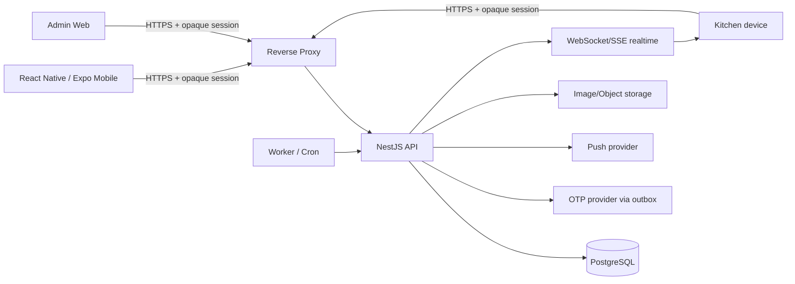

# IMeal v2 — Technical Requirements

## 1. Mục đích

Tài liệu này định nghĩa kiến trúc kỹ thuật đích cho IMeal v2 sau khi chuyển từ web Firebase/Firestore sang mobile + self-host backend.

## 2. System context



Production identity bootstrap is email OTP through allowlist A. The API, worker and
mobile/Admin Web use the environment contract documented in §8.2; no alternate
federated or local production login path exists.

| Layer               | Technology/decision                                                                |
| ------------------- | ---------------------------------------------------------------------------------- |
| Mobile              | React Native + Expo + TypeScript                                                   |
| Navigation          | Expo Router or equivalent Expo-native routing                                      |
| Client server-state | TanStack Query                                                                     |
| Auth                | Allowlist-A email OTP + opaque PostgreSQL-backed sessions                         |
| Backend             | NestJS (Fastify Adapter) + TypeScript                                              |
| API validation      | Zod or Nest-compatible schema validation; one canonical contract strategy          |
| Database            | PostgreSQL + PgBouncer (for high-concurrency connection pooling)                   |
| ORM/migrations      | Prisma recommended; migration files checked into source                            |
| Realtime Kitchen    | WebSocket preferred; SSE acceptable for one-way log/count updates                  |
| Jobs                | Linux worker/cron process; persisted `job_runs`                                    |
| Reverse proxy       | Caddy or Nginx                                                                     |
| Packaging           | Docker Compose                                                                     |
| Admin Web           | Next.js/React recommended, using the same NestJS API                               |
| Image storage       | File/object storage (MinIO/NAS/Cloudinary-equivalent), DB stores metadata/URL only |
| Push                | Expo Push default; persisted notification inbox is authoritative                   |

## 3. Target stack

| Layer               | Technology/decision                                                                |
| ------------------- | ---------------------------------------------------------------------------------- |
| Mobile              | React Native + Expo + TypeScript                                                   |
| Navigation          | Expo Router or equivalent Expo-native routing                                      |
| Client server-state | TanStack Query                                                                     |
| Local UI state      | Zustand (ultra-fast, lightweight) to avoid React context re-render bloat           |
| Auth                | Allowlist-A email OTP + opaque PostgreSQL-backed sessions                         |
| Backend             | NestJS (Fastify Adapter) + TypeScript                                              |
| API validation      | Zod or Nest-compatible schema validation; one canonical contract strategy          |
| Database            | PostgreSQL + PgBouncer (for high-concurrency connection pooling)                   |
| ORM/migrations      | Prisma recommended; migration files checked into source                            |
| Realtime Kitchen    | WebSocket preferred; SSE acceptable for one-way log/count updates                  |
| Jobs                | Linux worker/cron process; persisted `job_runs`                                    |
| Reverse proxy       | Caddy or Nginx                                                                     |
| Packaging           | Docker Compose                                                                     |
| Admin Web           | Next.js/React recommended, using the same NestJS API                               |
| Image storage       | File/object storage (MinIO/NAS/Cloudinary-equivalent), DB stores metadata/URL only |
| Push                | Expo Push default; persisted notification inbox is authoritative                   |

## 4. Repository shape

Recommended monorepo:

```text
apps/
├── mobile/
├── api/
├── admin-web/
└── worker/
packages/
├── contracts/
├── domain/
└── config/
infra/
├── docker/
├── reverse-proxy/
└── scripts/
```

Shared packages may contain API DTO/types and pure domain helpers, but backend remains authoritative for security-sensitive rules.

## 5. Authentication architecture

### 5.1 Allowlist-A email OTP

- Production authentication accepts only an administrator-provisioned, active
  allowlist-A email for `SESSION_LOGIN`.
- Unknown, non-allowlisted, disabled and expired-email attempts return the same
  non-disclosing response; the API never confirms whether an address exists.
- OTP verifiers are hashed; clear codes are single-use, bounded by expiry/attempt,
  resend and per-address/client rate limits, and are never logged or persisted.
- OTP delivery is transactional outbox work. Provider payloads are encrypted until
  the worker reaches the final delivery boundary and contain only destination,
  purpose and clear code.
- Successful verification creates only a high-entropy opaque session token. The
  database stores its one-way hash, expiry/revocation metadata and minimized
  hashed device/IP/user-agent metadata.
- Every protected request resolves current account status, roles and permissions
  from PostgreSQL. Logout, disable, compromise, replay, explicit revocation and
  expiry invalidate sessions.

### 5.2 Non-production harness boundary

The only bypass is the explicit test harness combination
`NODE_ENV=test` and `REQUIRE_AUTH=false`. It injects a synthetic test principal
for automated/controller tests, is not an end-user login flow, must not share
production credentials or authorization data, and is rejected by production
configuration validation. `AUTH_MODE=otp` remains mandatory outside that harness.

### 5.3 Account and roster provisioning

Allowlist records, employee identity, role/permission assignments, account status
and employee-to-location roster assignments are administrator-managed PostgreSQL
data. Email domain, display name, client claims, employee code supplied by a
client, GPS and QR payloads never grant identity, authorization or location.
Exactly four real locations must be imported and approved outside source control
before production; this repository contains no fabricated names, coordinates,
addresses, employees or assignments.

`kitchen` is a server-side assignment independent of `staff`; `admin` is not
grantable through Admin Web. Account disable previews and atomically cancels
future commitments, revokes active delegations, and revokes sessions.
## 6. Authorization

- RBAC data stored in PostgreSQL.
- Every protected API resolves latest roles/account status server-side.
- Mobile navigation is UX only, never security boundary.
- `staff`: own data/delegation/registration.
- `kitchen`: menu + serving operations protected by explicit permissions; it does not inherit `staff` capabilities.
- `admin`: user/account + `staff`/`kitchen` role management, penalty/audit/jobs; Admin-role lifecycle is outside Admin Web.
- Sensitive capabilities are explicit permissions: at minimum `penalty.read`, `penalty.resolve`.
- `admin` does not imply Kitchen serving permission; callers need the exact role/permission required by each operation.
- Admin Web may manage `staff`/`kitchen` assignments but cannot grant or revoke
  `admin`; any Admin-role lifecycle remains a separately audited server-side
  operation. Account disable is one atomic workflow: preview future commitments,
  require confirmation, cancel/revoke them, persist audit and revoke sessions.
- API/worker provider calls use outbound HTTPS with secrets injected at runtime;
  clients never call a federated identity service as part of this contract.
- Account disable is one atomic Admin workflow: preview all unserved registrations/delegations from the current business date onward, require explicit confirmation, set account disabled, cancel those registrations with `account_disabled`, revoke active delegations and persist audit/notifications. These cancellations never enter preparation totals, no-show or penalty processing.

## 7. Network topology

### 7.1 Normal API path

Staff, Kitchen, and Admin Web clients use the normal HTTPS API path:

```text
Client
  ↓ HTTPS 443
api.imeal.<org-domain>
  ↓
Reverse proxy
  ↓
NestJS
```

The API remains reachable through its configured HTTPS entry point, while authentication, explicit permissions, and server-side business validation protect every operation.

Requirements:

- PostgreSQL port 5432: not publicly exposed and preferably not exposed to general LAN.
- API/worker provider calls use outbound HTTPS with secrets injected at runtime;
  clients never call a federated identity service as part of this contract.
- Kitchen menu management and Admin Web always require their explicit server-side role/permission checks.
- Pickup resolve/confirm always require an active authenticated Kitchen principal with `kitchen.serve` permission plus QR, pickup-session, serving-window, and database eligibility validation.

The retained /v1/internal/pickup route name does not imply client network-location authorization.

## 8. Core API catalog

Canonical v2 endpoint semantics:

| Method     | Path                                        | Role/permission         | Purpose                                                                                                                                             |
| ---------- | ------------------------------------------- | ---------------------- | --------------------------------------------------------------------------------------------------------------------------------------------------- |
| POST       | `/auth/otp/request`                       | public                 | Non-disclosing allowlist-A OTP request; response never contains the code                                                                      |
| POST       | `/auth/otp/verify`                        | public                 | Atomically consume OTP and return opaque session token + expiry + safe user profile                                                            |
| POST       | `/auth/logout`                            | signed-in              | Revoke the current opaque session                                                                                                              |
| GET        | `/auth/me`                                | signed-in              | Resolve current account status/roles/permissions from PostgreSQL                                                                                |
| GET        | `/v1/me`                                    | signed-in              | Profile/roles/account state                                                                                                                         |
| GET        | `/v1/menu/weeks/:weekStart`                 | signed-in              | Published menu + registration state                                                                                                                 |
| PUT        | `/v1/me/registrations/week`                 | staff                  | Batch tick/untick weekly registrations                                                                                                              |
| GET        | `/v1/me/pickup-options`                     | staff                  | Load own + accepted-delegation items eligible for today's pickup intent                                                                             |
| POST       | `/v1/me/qr`                                 | staff                  | Validate selected registration IDs and issue/refresh 5s signed pickup QR                                                                            |
| GET        | `/v1/me/delegations`                        | staff                  | Incoming/outgoing delegation list                                                                                                                   |
| GET        | `/v1/me/history`                            | staff                  | Own registration/serving history with menu snapshot                                                                                                 |
| GET        | `/v1/me/penalties`                          | staff                  | Own read-only penalty history/detail                                                                                                                |
| GET        | `/api/notifications`                       | signed-in owner       | Structured persisted inbox; cursor pagination (`limit` 1–50, default 20) and unread count |
| GET        | `/api/notifications/:id`                   | notification owner    | Owner-scoped structured notification detail                                             |
| PATCH      | `/api/notifications/:id/read`              | notification owner    | Idempotently mark own inbox item read                                                   |
| GET/PATCH   | `/api/notifications/preferences`            | signed-in owner       | Shared reminder opt-out and `vi|en` locale preference                                    |
| POST       | `/api/notifications/push-devices`           | signed-in owner       | Register own Expo push device with `{ token, platform: ios|android }`                    |
| DELETE     | `/api/notifications/push-devices`           | signed-in owner       | Revoke own Expo push device with `{ token }` only                                         |
| POST       | `/v1/delegations`                           | staff                  | Owner requests delegate                                                                                                                             |
| POST       | `/v1/delegations/:id/accept`                | delegate               | Accept request                                                                                                                                      |
| POST       | `/v1/delegations/:id/decline`               | delegate               | Decline request                                                                                                                                     |
| POST       | `/v1/delegations/:id/revoke`                | owner                  | Revoke before serving                                                                                                                               |
| GET/PUT    | `/v1/kitchen/menu/weeks/:weekStart`         | kitchen                | Draft/edit weekly menu                                                                                                                              |
| POST       | `/v1/kitchen/menu/weeks/:weekStart/publish` | kitchen                | Publish weekly menu                                                                                                                                 |
| POST       | `/v1/internal/pickup/resolve`               | kitchen               | Verify 5s QR and resolve eligible pickup items                                                                                                      |
| POST       | `/v1/internal/pickup/confirm`               | kitchen               | Confirm one/more actual servings transactionally                                                                                                    |
| GET        | `/v1/kitchen/days/:date/dashboard`          | kitchen                | Total/served/remaining/list snapshot                                                                                                                |
| GET/WS     | `/v1/kitchen/days/:date/events`             | kitchen                | Realtime serving log/update                                                                                                                         |
| POST/PATCH | `/v1/admin/users/*`                         | admin                  | Independent Staff/Kitchen roles + account lifecycle; disable requires preview and confirmed future-commitment cleanup; no Admin-role grant endpoint |
| GET/PATCH  | `/v1/admin/penalties/*`                     | `penalty.read/resolve` | Penalty reporting/resolve                                                                                                                           |
| GET        | `/v1/admin/audit/*`                         | admin                  | Audit lookup                                                                                                                                        |

Exact path spelling may change only with the shared API contract. Mobile, Admin Web, API and worker consume the same versioned contract.

### 8.1 API-wide contract

- JSON success envelope: `{ data, meta?: { requestId, pagination? } }`.
- JSON error envelope: `{ error: { code, message, details? }, requestId }`; clients branch on stable `code`, never localized `message`.
- Every request receives/returns `X-Request-Id`; server replaces malformed/untrusted values.
- Mutations requiring retry safety use `Idempotency-Key`; the same caller/key/body returns the original result, while key reuse with a different body returns `IDEMPOTENCY_CONFLICT`. Multi-item confirm persists one request-level record; successful servings and success result commit atomically, while deterministic rejection commits zero servings plus its result.
- Canonical conflict codes include `CUTOFF_PASSED`, `ACCOUNT_DISABLED`, `REGISTRATION_CONFLICT`, `DELEGATION_CONFLICT`, `PICKUP_SESSION_EXPIRED`, `PICKUP_STATE_CHANGED`, `ALREADY_SERVED`, `REQUEST_IN_PROGRESS` and `OUTSIDE_SERVING_WINDOW`.
- List APIs use cursor pagination with a bounded server maximum; no unbounded Admin export endpoint.
- Realtime events carry `{ eventId, eventType, mealDate, occurredAt, requestId, payload }`; clients deduplicate by `eventId` and re-fetch snapshot after reconnect.

### 8.2 Runtime environment contract

Production startup is fail-closed. API validation requires `DATABASE_URL`,
`AUTH_MODE=otp`, `REQUIRE_AUTH=true`, `QR_SIGNING_SECRET`, `OTP_HASH_SECRET`,
`OTP_DELIVERY_ENCRYPTION_KEY`, `OTP_PROVIDER_URL` (HTTPS),
`OTP_PROVIDER_API_KEY`, and the production sender identity
`OTP_PROVIDER_FROM`, all OTP expiry/resend/attempt/rate-limit settings,
`SESSION_HASH_SECRET`, `SESSION_IDLE_TIMEOUT_SECONDS` and
`SESSION_ABSOLUTE_TIMEOUT_SECONDS`.

The same API validation requires positive GPS policy bounds:
`GPS_DEFAULT_GEOFENCE_RADIUS_METERS`, `GPS_DEFAULT_MAX_FIX_AGE_SECONDS` and
`GPS_DEFAULT_MAX_ACCURACY_METERS`. These are policy defaults/guards only; the
four real location records and their coordinates/policies are imported through
authorized operations, not seeded from this repository.

The serving contract is fixed and validated at startup:
`SERVING_TIME_ZONE=Asia/Ho_Chi_Minh`, `SERVING_WINDOW_START=10:30`,
`SERVING_WINDOW_END=13:30`, `NO_SHOW_PROCESSING_TIME=13:45`,
`QR_TTL_SECONDS=5`, `QR_CLOCK_SKEW_SECONDS=2` and
`PICKUP_SESSION_TTL_SECONDS=30`.

Worker startup additionally requires `DATABASE_URL`, the encrypted OTP delivery
key, HTTPS provider settings and every `OTP_DELIVERY_*` batch/retry/claim setting.
It validates the same serving invariants. Test-only defaults are available to
unit tests, never to production.

Mobile uses only `EXPO_PUBLIC_API_URL` (plus the optional
`EXPO_PACKAGER_PROXY_URL` for remote Metro sessions); Admin Web uses `VITE_API_URL`.
Neither client receives secrets, provider keys, GPS policy coordinates or
authorization claims.

### 8.3 Staff notification contract

The notification contract is structured and owner-scoped. Each persisted item is:

```text
{
  id: UUID,
  kind: LEGACY_MESSAGE | REGISTRATION_OPENED | REGISTRATION_REMINDER |
        PICKUP_REMINDER | DELEGATION_REQUESTED | DELEGATION_ACCEPTED |
        DELEGATION_DECLINED | DELEGATION_REVOKED | PROXY_PICKUP_COMPLETED |
        REGISTERED_MENU_CHANGED | NO_SHOW_PENALTY_CREATED,
  payload: strict kind-specific JSON,
  copy: { vi: { title, body }, en: { title, body } },
  readAt: UTC ISO timestamp | null,
  createdAt: UTC ISO timestamp
}
```

IDs/cursors are UUIDs, timestamps are UTC ISO strings ending in `Z`, and meal dates are
`YYYY-MM-DD`. Payload schemas are strict:

- `REGISTRATION_OPENED`: `{ weekStart, weekEnd }`.
- `REGISTRATION_REMINDER`: `{ weekStart, weekEnd, remainingMealDates }`.
- `PICKUP_REMINDER`: `{ mealDate, registrationIds, registrationCount }`, with count equal
  to the ID array length.
- `DELEGATION_REQUESTED|ACCEPTED|DECLINED`: `{ delegationId, registrationId, mealDate,
  counterpartName }`.
- `DELEGATION_REVOKED`: the same fields plus `reason`, exactly `OWNER_REVOKED` or
  `REGISTRATION_CANCELLED`.
- `PROXY_PICKUP_COMPLETED`: `{ servingId, registrationId, mealDate, delegateName }`.
- `REGISTERED_MENU_CHANGED`: `{ dailyMenuRevisionId, mealDate }`.
- `NO_SHOW_PENALTY_CREATED`: `{ penaltyId, registrationId, mealDate, amount }`.

The exact matrix is:

| Kind | Trigger/timing | Recipient |
| ---- | -------------- | --------- |
| `REGISTRATION_OPENED` | First publish of a weekly menu; missing revisions are initialized and `publishedAt` is set. Repeated/concurrent publish is a no-op. | Every active Staff user, regardless of reminder preference. |
| `REGISTRATION_REMINDER` | Sunday 10:00 (`Asia/Ho_Chi_Minh`) for the next Monday-start published menu; one/user/week. | Active Staff with an enabled non-holiday date lacking an `ACTIVE` registration and `remindersEnabled=true`. |
| `PICKUP_REMINDER` | Daily 11:30 VN for today's active, unserved registrations. | Accepted delegate, otherwise owner; grouped per recipient/date and omitted when reminders are disabled. |
| `DELEGATION_REQUESTED` | Owner creates pending delegation. | Delegate. |
| `DELEGATION_ACCEPTED` / `DELEGATION_DECLINED` | Delegate responds. | Registration owner. |
| `DELEGATION_REVOKED` | Owner revokes, or registration cancellation revokes active delegation in the same transaction. | Delegate; reason identifies `OWNER_REVOKED` vs `REGISTRATION_CANCELLED`. |
| `PROXY_PICKUP_COMPLETED` | Accepted delegated serving commits and pickup user differs from owner. | Owner only; self pickup emits none. |
| `REGISTERED_MENU_CHANGED` | Actual tracked edit to an already-published date (content, meal type, holiday, enabled). | Active registered Staff for that date. No-op edit emits none. |
| `NO_SHOW_PENALTY_CREATED` | No-show transaction at 13:45 VN after the 13:30 service end. | Registration owner. |

`REGISTRATION_OPENED` is never reused for a published-menu edit. Admin account-disable
notification is out of this implementation and belongs to a future account-disable subsystem,
not a dormant notification kind. `LEGACY_MESSAGE` is migration read-only only.

The notification endpoints are owner-scoped even when a caller supplies another user's UUID:
missing and foreign detail/read IDs return `NOTIFICATION_NOT_FOUND`. List uses
`GET /api/notifications?cursor=<UUID>&limit=<1..50>` (default 20), ordered by
`createdAt DESC, id DESC`, and returns `{ data, meta: { nextCursor, hasNextPage, unreadCount } }`.
Detail/read are `GET /api/notifications/:id` and `PATCH /api/notifications/:id/read`.
Preferences are `GET/PATCH /api/notifications/preferences` with
`{ remindersEnabled, locale: 'vi'|'en' }`; PATCH requires at least one field.
`POST /api/notifications/push-devices` registers `{ token, platform: 'ios'|'android' }`;
`DELETE /api/notifications/push-devices` revokes `{ token }` only. Both routes validate the
Expo token format, while revocation never accepts a platform field.

Publishers render and persist both Vietnamese and English copy at write time. Dates use
`Asia/Ho_Chi_Minh`; dispatch selects stored copy using `User.notificationLocale` (default
`vi`). Counterpart display-name fallback is name → email → neutral fallback. Copy never
contains QR, auth, or session data. `remindersEnabled` defaults to `true` and is one shared
opt-out for both scheduled reminders; transactional event notifications remain enabled.

### 8.4 Notification persistence and delivery

API producers and worker producers insert/upsert the `notifications` row and a
`NOTIFICATION_CREATED` `outbox_events` row in the same PostgreSQL transaction. Notification
dedupe is global by `dedupeKey`; the outbox dedupe key is
`notification-delivery:<notificationId>`. Replay is a no-op and never resets `readAt` or
delivery state.

The worker runs dispatch every 15 seconds. Stage 1 claims due pending outbox rows with
`FOR UPDATE SKIP LOCKED`, creates one `notification_deliveries` row per non-revoked
`push_device`, and marks the outbox processed. Stage 2 claims due `PENDING` deliveries
and `PROCESSING` deliveries older than five minutes, sends Expo chunks with stored localized
copy, `sound=default`, Android channel `imeal-default`, and data URL
`imeal://notifications/<notificationId>`. Inbox persistence is mandatory; system push is
best effort.

Accepted tickets become `SENT`. `DeviceNotRegistered` revokes the device and permanently
fails that delivery; `MessageTooBig`, `MismatchSenderId`, and `InvalidCredentials` are
permanent failures. Network errors, HTTP 429/5xx, and `MessageRateExceeded` retry after
1, 5, and 15 minutes; after the fourth failed attempt status is `FAILED`. Recover stale
processing after five minutes. Sanitize provider errors and log only notification/delivery
IDs, attempt, provider code, and sanitized error; never log token or copy body.

### 8.5 Permission and navigation requirements

On the first authenticated native session, mobile shows a one-time contextual explainer.
Only `Enable` calls the OS permission prompt; `Not now` marks it seen. A denied permission
does not trigger automatic prompts; the Enable/Settings CTA opens system settings. Web does
no push work, simulators explain that a physical device is required, and missing EAS
configuration reports a clear registration error while inbox/API remain usable. Push taps
validate the UUID in `imeal://notifications/<id>` and navigate to NotificationDetail;
registration/menu kinds go to Calendar, pickup kinds to Pickup Intent, and delegation kinds
to Delegation. No-show, legacy, and other readable items remain available in the inbox.


## 9. Weekly registration processing

- One request may contain up to the working days displayed for the selected week.
- Backend evaluates each meal date using the same server-side VN clock snapshot.
- Validate: menu published, date valid, cutoff not passed, registration transition allowed.
- Valid changes are written transactionally/with controlled per-date results.
- Database constraint `UNIQUE(user_id, meal_date)` is the final duplicate guard.
- Response returns authoritative result for every requested day.
- Client preserves failed-day draft and reconciles successful days.
- Registration mutation is allowed only when one server clock snapshot is strictly earlier than 14:00 on the preceding day; exactly 14:00 is locked.
- Cancel atomically revokes `pending|accepted` delegation for that registration, writes audit/events and creates persisted notifications.

## 10. Dynamic QR, presenter GPS and pickup session

### 10.1 QR requirements

The server signs an exact sorted, unique, non-empty pickup intent:

```text
imeal:v2:{presenterUserId}:{mealDate}:{registrationIds}:{exp}:{nonce}:{sig}
```

The intent is not an entitlement. Current PostgreSQL state always wins.

- TTL is exactly 5 seconds; accepted clock skew is at most 2 seconds.
- The server rejects a wrong meal date, invalid signature, malformed ordering,
  expired/future-abnormal expiry, stale/ineligible registration or changed
  presenter/delegation state without substituting another item.
- If one eligible item exists, mobile auto-selects it. With multiple items,
  presenter mobile requires explicit selection, sorts IDs, and preserves that
  exact set through QR, resolve and confirm.
- Refresh reissues the same selected intent only after a new presenter fix.
  Selection, focus, eligibility, delegation or GPS-state changes clear the QR.

### 10.2 Presenter-only foreground GPS

Before each QR generation/refresh, the presenter requests a fresh foreground
Expo location fix and sends `capturedAt`, latitude, longitude and accuracy. The
server resolves the employee's fixed roster location and evaluates the imported
location policy for freshness, accuracy and geofence. Client coordinates never
select a different site or grant serving entitlement.

GPS is collected only while the presenter pickup flow is focused and actively
generating/refreshing. Collection stops on blur, cancellation, completion or
unmount. Owner GPS is not collected merely because a delegation exists.
Kitchen resolve and confirm send no GPS.

Unavailable, denied, stale, inaccurate and outside-geofence results expose only
safe `Retry` or `Refresh` recovery. There is no manual bypass, silent fallback,
automatic site substitution or alternate item set.

### 10.3 Why scan and confirm are separate

The QR may expire while Kitchen reviews the exact set:

1. Mobile loads `/me/pickup-options`; one eligible item is selected
   automatically, while multiple items require explicit presenter selection.
2. Mobile calls `POST /me/qr` with sorted selected registration IDs and fresh
   presenter evidence; the server validates location/evidence and issues the
   signed 5-second QR.
3. Kitchen calls resolve with only the raw QR and an authenticated Kitchen
   session. The API validates QR and revalidates every registration in the
   exact intent.
4. Server creates a resolved pickup session lasting exactly 30 seconds with
   presenter identity, immutable exact registration set and verification context.
5. Kitchen reviews presenter/names/count and confirms; Kitchen cannot add, remove
   or replace registrations.
6. Kitchen confirms with only `pickupSessionId` and an idempotency key. The API
   rechecks account/delegation/registration/location/GPS/window state in the
   all-or-nothing transaction.

`pickupSession` never bypasses current DB validation. Resolve and confirm are
allowed only during 10:30–13:30 of the meal date, and Kitchen has no GPS path.
## 11. Serving concurrency and idempotency

Core serving algorithm:

```text
BEGIN
  resolve selected registration(s)
  SELECT registration/delegation rows FOR UPDATE
  verify exact pickup intent/session and presenter verification context
  verify still eligible
  verify no existing serving
  insert final serving
  insert immutable meal event
  mark delegation consumed when proxy
COMMIT
publish realtime event after commit
```

Required protections:

- Unique constraint: exactly zero or one serving row per registration; core v2 has no reversal/re-serve flow.
- Request idempotency key for confirm/retry.
- Database row locking on serving-critical rows.
- Duplicate scan returns existing serving metadata instead of second serving.
- If owner and delegate appear at two counters concurrently, only one serving can commit.
- If revoke races with proxy serving, transaction order determines exactly one valid outcome.
- Multi-item confirm is all-or-nothing: any invalid selected registration rolls back the entire batch and returns `PICKUP_STATE_CHANGED` with safe per-item conflict details.
- Successful serving confirmation is final. Kitchen confirms only after checking the Staff-selected set and sufficient trays; any immediate tray shortage is completed physically without rewriting serving history.

## 12. Realtime Kitchen dashboard

- PostgreSQL is source of truth. Dashboard counters are `total_registered` (non-canceled/non-quarantined), `served_total`, `remaining = total_registered - served_total` during service, and `no_show_total` after reconciliation.
- After successful commit, API emits event to connected Kitchen clients.
- UI updates `served/total/remaining` and log.
- Reconnect performs fresh snapshot before consuming new events.
- Realtime transport failure must not lose serving because DB commit happens first.
- No Kafka/Redis PubSub required at 200–300 users on one API instance.

## 13. Jobs

At minimum:

- Menu lock/snapshot at 14:00 on the preceding day.
- Delegation expiry after service end.
- No-show processing from 13:45 after the 13:30 service end.
- Penalty creation idempotent.
- Notification dispatch/retry.
- Reminder scheduling.
- Data reconciliation/health checks.

Every execution writes `job_runs` with run ID, type, status, started/finished time, summary and sanitized error.

## 14. PostgreSQL requirements

- Migration-driven schema.
- UUID primary keys recommended.
- UTC timestamps for instants; explicit `DATE` for meal date; convert/display using `Asia/Ho_Chi_Minh` business rules.
- Unique constraints for business identities.
- Foreign keys for relational integrity.
- Index at least `(meal_date, status)` or query-equivalent on registrations and serving lookup keys.
- No binary meal image data in PostgreSQL.
- Connection pool bounded for single-host deployment.

## 15. Linux deployment

### 15.1 Minimum target

For current 200–300 user workload:

```text
2 vCPU
4 GB RAM
50 GB SSD
1 Gbps LAN preferred
Linux LTS
```

This is a minimum operating target, not a performance guarantee.

### 15.2 Recommended production baseline

```text
4 vCPU
8 GB RAM
100 GB SSD
1 Gbps LAN
Linux LTS
```

Single-server Docker Compose:

```text
reverse-proxy
api
worker
postgres
pgbouncer
# optional object storage, monitoring agents
```

Do not add Kubernetes, Kafka or Redis solely for the baseline 200–300 users.

## 16. Data retention

- Meal lifecycle/history data (`registrations`, delegations, servings, penalties, notifications, job/audit history and related immutable revisions/events) has a canonical retention period of **1 year**.
- Active identity/configuration rows are not deleted merely because they are older than one year.
- During the 1-year window, serving/audit evidence remains append-oriented/immutable under normal operations.
- A scheduled retention job purges expired historical data in dependency-safe order and records its own `job_runs`/audit summary.

## 17. Backup and recovery

- PostgreSQL backup on schedule with retention.
- Backup copy must exist on a different physical storage/server/NAS than primary DB disk.
- Restore procedure must be tested, not only backup creation.
- Image/object storage backup policy documented separately.
- Before production rollout: PostgreSQL backup/checkpoint and tested restore.
- Rollback covers compatible application/API version rollback, backward-compatible schema strategy and PostgreSQL restore; it never rolls data back to Firebase.

## 18. Security and privacy requirements

- HTTPS everywhere; secrets are injected through an environment/secret manager,
  never committed to the repository or shipped to mobile/Admin Web.
- Production accepts only allowlist-A email OTP and opaque server sessions.
  `REQUIRE_AUTH=false` is rejected outside the test harness.
- Rate limit/auth abuse protection covers OTP request/verify and public APIs.
- OTP clear codes, session secrets, QR payloads, provider payloads and raw
  coordinates are not logged; retained verification evidence is minimized,
  access-controlled and audited.
- Serving endpoints require an active opaque session, explicit permission and
  all server-side QR/session/window/registration/delegation invariants.
- Only the presenter device supplies foreground GPS during QR generation/refresh.
  GPS does not grant entitlement or replace authorization; Kitchen sends no GPS.
- Disabled accounts are rejected after authoritative server-side status lookup on
  every protected API. Roles, status, employee code and location are never client
  claims.
- Exactly four real location records and administrator roster assignments are
  imported/approved outside source control before production. No fabricated
  names, addresses, coordinates, employees or assignments are permitted.
- Input schema validation applies to every mutation; all-or-nothing serving and
  request idempotency prevent partial or duplicate handover.
## 19. Performance/NFR

Baseline scale: 200–300 users, <= ~1,500 weekday registration choices/week and hundreds of serving events/day.

Targets:

- Weekly registration P95 API <1s under expected load.
- Serving confirm P95 <1s under expected load.
- Zero duplicate serving under concurrency tests.
- Realtime dashboard converges to DB state after reconnect.
- No-show/penalty job idempotent under retry.

## 20. Observability

Production **must** provide centralized server logging, health monitoring and alerting for API, worker/jobs and PostgreSQL. Alert destination and detailed log retention may remain deployment-time configuration, but monitoring itself is not optional.

- Structured JSON logs with request/run/correlation ID.
- API latency, error code, auth failure, serving result.
- Metrics: total registration, serving latency, duplicate attempt, no-show count, job failure/lag.
- Health endpoints do not leak secrets.
- Kitchen serving log is business audit, not a replacement for technical logs.

## 21. Clean-slate cutover

- Firebase Auth/Firestore/Vercel Cron/Cloud Functions contain demo-pitching data only and are deleted/decommissioned at the **start of re-development**.
- Legacy Firebase data is not retained for v2: do not export, map, transform, reconcile, dual-write or import it.
- Dev, staging and production v2 start with fresh PostgreSQL datasets. Before
  production, administrators import/approve exactly four real locations and the
  employee allowlist/roster through audited operations; source control contains
  no fabricated operational records.
- All rollback/recovery is within the v2 application/PostgreSQL stack; there is no Firebase rollback path.
