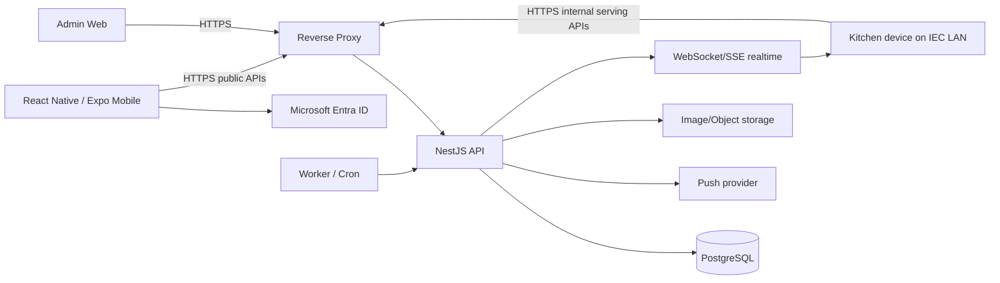

# IMeal v2 — Technical Requirements

## 1. Mục đích

Tài liệu này định nghĩa kiến trúc kỹ thuật đích cho IMeal v2 sau khi chuyển từ web Firebase/Firestore sang mobile + self-host backend.

## 2. System context



## 3. Target stack

| Layer               | Technology/decision                                                                |
| ------------------- | ---------------------------------------------------------------------------------- |
| Mobile              | React Native + Expo + TypeScript                                                   |
| Navigation          | Expo Router or equivalent Expo-native routing                                      |
| Client server-state | TanStack Query                                                                     |
| Local UI state      | Zustand (ultra-fast, lightweight) to avoid React context re-render bloat           |
| Auth                | Microsoft Entra ID, OAuth2/OIDC Authorization Code + PKCE                          |
| Backend             | NestJS (Fastify Adapter) + TypeScript                                              |
| API validation      | Zod or Nest-compatible schema validation; one canonical contract strategy          |
| Database            | PostgreSQL + PgBouncer (for high-concurrency connection pooling)                   |
| ORM/migrations      | Prisma recommended; migration files checked into source                            |
| Realtime Kitchen    | WebSocket preferred; SSE acceptable for one-way log/count updates                  |
| Jobs                | Linux worker/cron process; persisted `job_runs`                                    |
| Reverse proxy       | Caddy or Nginx                                                                     |
| Packaging           | Docker Compose                                                                     |
| Admin Web           | Next.js/React recommended, using the same NestJS API                               |
| Image storage       | File/object storage (MinIO/NAS/Cloudinary-equivalent), DB stores metadata/URL only |
| Push                | Expo Push default; persisted notification inbox is authoritative                   |

## 4. Repository shape

Recommended monorepo:

```text
apps/
├── mobile/
├── api/
├── admin-web/
└── worker/
packages/
├── contracts/
├── domain/
└── config/
infra/
├── docker/
├── reverse-proxy/
└── scripts/
```

Shared packages may contain API DTO/types and pure domain helpers, but backend remains authoritative for security-sensitive rules.

## 5. Authentication architecture

### 5.1 Microsoft Entra

- IMeal is registered in the organization Microsoft Entra tenant.
- Application access is **single-tenant**.
- Mobile is a public client: no client secret is embedded in the app.
- Mobile uses Authorization Code + PKCE.
- API validates token signature, issuer, audience, tenant and expiry.
- Canonical user identity: `entra_tenant_id + entra_object_id`.
- Email/UPN is display/profile data, not immutable authorization identity.

### 5.2 App registrations

Preferred topology:

- `IMeal Mobile` app registration.
- `IMeal API` app registration exposing the API scope/audience.
- Redirect URI(s) configured for Android/iOS mobile callback.
- Entra administrator supplies Tenant ID, Client ID(s), redirect URI registration and consent/config required by organization policy. **Concrete IEC values are intentionally TBD until the Entra administrator provisions them.**

### 5.3 Auto provisioning

On first successful API-authenticated login:

1. Validate Entra tenant/token.
2. Find user by tenant/object ID.
3. If absent, create user with `status=active` and role `staff`.
4. Update safe profile fields such as display name/email/last login.
5. Never overwrite IMeal role, employee code or account status from client claims.

`kitchen` is a server-side/manual assignment that Admin Web may manage. `admin` is never grantable from Admin Web; Admin-role lifecycle uses an audited server-side operation bound to explicit Entra identity.

## 6. Authorization

- RBAC data stored in PostgreSQL.
- Every protected API resolves latest roles/account status server-side.
- Mobile navigation is UX only, never security boundary.
- `staff`: own data/delegation/registration.
- `kitchen`: menu + internal serving operations only; it does not inherit `staff` capabilities.
- `admin`: user/account + `staff`/`kitchen` role management, penalty/audit/jobs; Admin-role lifecycle is outside Admin Web.
- Sensitive capabilities are explicit permissions: at minimum `penalty.read`, `penalty.resolve`.
- `admin` does not imply Kitchen serving permission; callers need the exact role/permission required by each operation.
- Admin Web may manage `staff`/`kitchen` assignments but cannot grant or revoke `admin`. First/future Admin-role lifecycle is handled outside Admin Web by an audited server-side operation bound to explicit Entra tenant/object ID.
- Account disable is one atomic Admin workflow: preview all unserved registrations/delegations from the current business date onward, require explicit confirmation, set account disabled, cancel those registrations with `account_disabled`, revoke active delegations and persist audit/notifications. These cancellations never enter preparation totals, no-show or penalty processing.

## 7. Network topology

### 7.1 Public/general API

Needed so Staff can register while outside IEC:

```text
Internet
  ↓ HTTPS 443
api.imeal.<org-domain>
  ↓
Reverse proxy
  ↓
NestJS
```

### 7.2 Internal serving API

Serving/check-in endpoints must only be routable/accepted from IEC internal network.

Recommended:

```text
attendance.imeal.<org-domain>
  → internal DNS / trusted gateway / firewall
  → NestJS internal serving routes
```

Requirements:

- Public Internet → internal serving route: deny.
- IEC LAN → serving route: allow HTTPS.
- PostgreSQL port 5432: not publicly exposed and preferably not exposed to general LAN.
- API server → Microsoft Entra endpoints: outbound HTTPS allowed.
- Mobile → Microsoft Entra: Internet access required for login/token renewal.
- Internal-network check does not replace valid Entra token + Kitchen role.
- Internal serving uses a separate hostname/listener and firewall/private routing; no public fallback route exists.
- Application trusts forwarded client/network headers only from an allowlisted reverse proxy. Direct or untrusted `X-Forwarded-For` is ignored.
- Kitchen menu management and Admin Web may use public HTTPS but always require their explicit server-side role/permission checks.

## 8. Core API catalog

Canonical v2 endpoint semantics:

| Method     | Path                                        | Role/network           | Purpose                                                                                                                                             |
| ---------- | ------------------------------------------- | ---------------------- | --------------------------------------------------------------------------------------------------------------------------------------------------- |
| GET        | `/v1/me`                                    | signed-in              | Profile/roles/account state                                                                                                                         |
| GET        | `/v1/menu/weeks/:weekStart`                 | signed-in              | Published menu + registration state                                                                                                                 |
| PUT        | `/v1/me/registrations/week`                 | staff                  | Batch tick/untick weekly registrations                                                                                                              |
| GET        | `/v1/me/pickup-options`                     | staff                  | Load own + accepted-delegation items eligible for today's pickup intent                                                                             |
| POST       | `/v1/me/qr`                                 | staff                  | Validate selected registration IDs and issue/refresh 5s signed pickup QR                                                                            |
| GET        | `/v1/me/delegations`                        | staff                  | Incoming/outgoing delegation list                                                                                                                   |
| GET        | `/v1/me/history`                            | staff                  | Own registration/serving history with menu snapshot                                                                                                 |
| GET        | `/v1/me/penalties`                          | staff                  | Own read-only penalty history/detail                                                                                                                |
| GET        | `/v1/me/notifications`                      | signed-in              | Persisted inbox with cursor pagination                                                                                                              |
| PATCH      | `/v1/me/notifications/:id/read`             | notification owner     | Mark own inbox item read                                                                                                                            |
| POST       | `/v1/delegations`                           | staff                  | Owner requests delegate                                                                                                                             |
| POST       | `/v1/delegations/:id/accept`                | delegate               | Accept request                                                                                                                                      |
| POST       | `/v1/delegations/:id/decline`               | delegate               | Decline request                                                                                                                                     |
| POST       | `/v1/delegations/:id/revoke`                | owner                  | Revoke before serving                                                                                                                               |
| GET/PUT    | `/v1/kitchen/menu/weeks/:weekStart`         | kitchen                | Draft/edit weekly menu                                                                                                                              |
| POST       | `/v1/kitchen/menu/weeks/:weekStart/publish` | kitchen                | Publish weekly menu                                                                                                                                 |
| POST       | `/v1/internal/pickup/resolve`               | kitchen + LAN          | Verify 5s QR and resolve eligible pickup items                                                                                                      |
| POST       | `/v1/internal/pickup/confirm`               | kitchen + LAN          | Confirm one/more actual servings transactionally                                                                                                    |
| GET        | `/v1/kitchen/days/:date/dashboard`          | kitchen                | Total/served/remaining/list snapshot                                                                                                                |
| GET/WS     | `/v1/kitchen/days/:date/events`             | kitchen                | Realtime serving log/update                                                                                                                         |
| POST/PATCH | `/v1/admin/users/*`                         | admin                  | Independent Staff/Kitchen roles + account lifecycle; disable requires preview and confirmed future-commitment cleanup; no Admin-role grant endpoint |
| GET/PATCH  | `/v1/admin/penalties/*`                     | `penalty.read/resolve` | Penalty reporting/resolve                                                                                                                           |
| GET        | `/v1/admin/audit/*`                         | admin                  | Audit lookup                                                                                                                                        |

Exact path spelling may change only with the shared API contract. Mobile, Admin Web, API and worker consume the same versioned contract.

### 8.1 API-wide contract

- JSON success envelope: `{ data, meta?: { requestId, pagination? } }`.
- JSON error envelope: `{ error: { code, message, details? }, requestId }`; clients branch on stable `code`, never localized `message`.
- Every request receives/returns `X-Request-Id`; server replaces malformed/untrusted values.
- Mutations requiring retry safety use `Idempotency-Key`; the same caller/key/body returns the original result, while key reuse with a different body returns `IDEMPOTENCY_CONFLICT`. Multi-item confirm persists one request-level record; successful servings and success result commit atomically, while deterministic rejection commits zero servings plus its result.
- Canonical conflict codes include `CUTOFF_PASSED`, `ACCOUNT_DISABLED`, `REGISTRATION_CONFLICT`, `DELEGATION_CONFLICT`, `PICKUP_SESSION_EXPIRED`, `PICKUP_STATE_CHANGED`, `ALREADY_SERVED`, `REQUEST_IN_PROGRESS`, `OUTSIDE_SERVING_WINDOW` and `INTERNAL_NETWORK_REQUIRED`.
- List APIs use cursor pagination with a bounded server maximum; no unbounded Admin export endpoint.
- Realtime events carry `{ eventId, eventType, mealDate, occurredAt, requestId, payload }`; clients deduplicate by `eventId` and re-fetch snapshot after reconnect.

## 9. Weekly registration processing

- One request may contain up to the working days displayed for the selected week.
- Backend evaluates each meal date using the same server-side VN clock snapshot.
- Validate: menu published, date valid, cutoff not passed, registration transition allowed.
- Valid changes are written transactionally/with controlled per-date results.
- Database constraint `UNIQUE(user_id, meal_date)` is the final duplicate guard.
- Response returns authoritative result for every requested day.
- Client preserves failed-day draft and reconciles successful days.
- Registration mutation is allowed only when one server clock snapshot is strictly earlier than 14:00 on the preceding day; exactly 14:00 is locked.
- Cancel atomically revokes `pending|accepted` delegation for that registration, writes audit/events and creates persisted notifications.

## 10. Dynamic QR and pickup session

### 10.1 QR requirements

Suggested logical payload:

```text
imeal:v2:{userId}:{mealDate}:{pickupIntent}:{exp}:{nonce}:{sig}
```

`pickupIntent` is a compact signed representation/reference of registration IDs the presenter selected on mobile. It is not an authorization grant; current DB state always wins.

- HMAC or asymmetric server signature.
- TTL: 5 seconds.
- Allowed clock skew: at most 2 seconds.
- Server rejects wrong meal date, invalid signature, expired/future-abnormal expiry.
- If only one eligible pickup item exists, mobile selects it by default; if multiple exist, Staff chooses intended items before presenting QR.
- QR should refresh automatically before/at expiry without losing the current pickup intent.

### 10.2 Why scan and confirm are separate

The QR may expire while Kitchen reads the resolved user and hands over the meal. Therefore:

1. Mobile loads `/me/pickup-options`; one eligible item is selected automatically, while multiple items are chosen by Staff.
2. Mobile calls `POST /me/qr` with the selected registration IDs; server validates that set and issues/refreshes the signed 5s QR.
3. `/pickup/resolve` validates the 5s QR and revalidates every registration in the signed pickup intent.
4. Server returns a signed `pickupSession` with TTL 30 seconds containing presenter identity and validated intended pickup items.
5. Kitchen checks the displayed names/count and confirms the Staff-selected set; Kitchen never re-selects items.
6. `/pickup/confirm` re-checks registrations/delegations/current serving state in DB and commits.

`pickupSession` is not sufficient to bypass current DB validation. Resolve and confirm are allowed only during 10:30–13:30 of the meal date.

## 11. Serving concurrency and idempotency

Core serving algorithm:

```text
BEGIN
  resolve selected registration(s)
  SELECT registration/delegation rows FOR UPDATE
  verify still eligible
  verify no existing serving
  insert final serving
  insert immutable meal event
  mark delegation consumed when proxy
COMMIT
publish realtime event after commit
```

Required protections:

- Unique constraint: exactly zero or one serving row per registration; core v2 has no reversal/re-serve flow.
- Request idempotency key for confirm/retry.
- Database row locking on serving-critical rows.
- Duplicate scan returns existing serving metadata instead of second serving.
- If owner and delegate appear at two counters concurrently, only one serving can commit.
- If revoke races with proxy serving, transaction order determines exactly one valid outcome.
- Multi-item confirm is all-or-nothing: any invalid selected registration rolls back the entire batch and returns `PICKUP_STATE_CHANGED` with safe per-item conflict details.
- Successful serving confirmation is final. Kitchen confirms only after checking the Staff-selected set and sufficient trays; any immediate tray shortage is completed physically without rewriting serving history.
- Employee-code recovery uses the same resolve/confirm transaction, requires reason and is rate-limited/audited; item selection is allowed here because this is a recovery path.

## 12. Realtime Kitchen dashboard

- PostgreSQL is source of truth. Dashboard counters are `total_registered` (non-canceled/non-quarantined), `served_total`, `remaining = total_registered - served_total` during service, and `no_show_total` after reconciliation.
- After successful commit, API emits event to connected Kitchen clients.
- UI updates `served/total/remaining` and log.
- Reconnect performs fresh snapshot before consuming new events.
- Realtime transport failure must not lose serving because DB commit happens first.
- No Kafka/Redis PubSub required at 200–300 users on one API instance.

## 13. Jobs

At minimum:

- Menu lock/snapshot at 14:00 on the preceding day.
- Delegation expiry after service end.
- No-show processing from 13:45 after the 13:30 service end.
- Penalty creation idempotent.
- Notification dispatch/retry.
- Reminder scheduling.
- Data reconciliation/health checks.

Every execution writes `job_runs` with run ID, type, status, started/finished time, summary and sanitized error.

## 14. PostgreSQL requirements

- Migration-driven schema.
- UUID primary keys recommended.
- UTC timestamps for instants; explicit `DATE` for meal date; convert/display using `Asia/Ho_Chi_Minh` business rules.
- Unique constraints for business identities.
- Foreign keys for relational integrity.
- Index at least `(meal_date, status)` or query-equivalent on registrations and serving lookup keys.
- No binary meal image data in PostgreSQL.
- Connection pool bounded for single-host deployment.

## 15. Linux deployment

### 15.1 Minimum target

For current 200–300 user workload:

```text
2 vCPU
4 GB RAM
50 GB SSD
1 Gbps LAN preferred
Linux LTS
```

This is a minimum operating target, not a performance guarantee.

### 15.2 Recommended production baseline

```text
4 vCPU
8 GB RAM
100 GB SSD
1 Gbps LAN
Linux LTS
```

Single-server Docker Compose:

```text
reverse-proxy
api
worker
postgres
pgbouncer
# optional object storage, monitoring agents
```

Do not add Kubernetes, Kafka or Redis solely for the baseline 200–300 users.

## 16. Data retention

- Meal lifecycle/history data (`registrations`, delegations, servings, penalties, notifications, job/audit history and related immutable revisions/events) has a canonical retention period of **1 year**.
- Active identity/configuration rows are not deleted merely because they are older than one year.
- During the 1-year window, serving/audit evidence remains append-oriented/immutable under normal operations.
- A scheduled retention job purges expired historical data in dependency-safe order and records its own `job_runs`/audit summary.

## 17. Backup and recovery

- PostgreSQL backup on schedule with retention.
- Backup copy must exist on a different physical storage/server/NAS than primary DB disk.
- Restore procedure must be tested, not only backup creation.
- Image/object storage backup policy documented separately.
- Before production rollout: PostgreSQL backup/checkpoint and tested restore.
- Rollback covers compatible application/API version rollback, backward-compatible schema strategy and PostgreSQL restore; it never rolls data back to Firebase.

## 18. Security requirements

- HTTPS everywhere, including LAN serving path.
- No Microsoft client secret in mobile binary.
- Rate limit/auth abuse protection for public APIs.
- Serving endpoints protected by network + token + role + DB invariants.
- Disabled account is rejected after authoritative server-side status lookup on every protected API.
- Log no access/refresh tokens, QR secrets or full sensitive token payload.
- Audit role changes, delegation lifecycle, serving and penalty resolution.
- Input schema validation on all mutations.
- Secrets injected through environment/secret manager, never repository.

## 19. Performance/NFR

Baseline scale: 200–300 users, <= ~1,500 weekday registration choices/week and hundreds of serving events/day.

Targets:

- Weekly registration P95 API <1s under expected load.
- Internal serving confirm P95 <1s under expected LAN conditions.
- Zero duplicate serving under concurrency tests.
- Realtime dashboard converges to DB state after reconnect.
- No-show/penalty job idempotent under retry.

## 20. Observability

Production **must** provide centralized server logging, health monitoring and alerting for API, worker/jobs and PostgreSQL. Alert destination and detailed log retention may remain deployment-time configuration, but monitoring itself is not optional.

- Structured JSON logs with request/run/correlation ID.
- API latency, error code, auth failure, serving result.
- Metrics: total registration, serving latency, duplicate attempt, no-show count, job failure/lag.
- Health endpoints do not leak secrets.
- Kitchen serving log is business audit, not a replacement for technical logs.

## 21. Clean-slate cutover

- Firebase Auth/Firestore/Vercel Cron/Cloud Functions contain demo-pitching data only and are deleted/decommissioned at the **start of re-development**.
- Legacy Firebase data is not retained for v2: do not export, map, transform, reconcile, dual-write or import it.
- Dev, staging and production v2 start with fresh PostgreSQL datasets and Entra auto-provisioned users.
- All rollback/recovery is within the v2 application/PostgreSQL stack; there is no Firebase rollback path.
