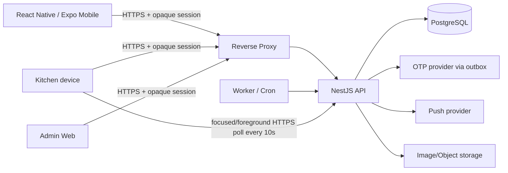

# IMeal v2 — Technical Requirements

## 1. Mục đích

Tài liệu này định nghĩa kiến trúc kỹ thuật đích cho IMeal v2 sau khi chuyển từ web Firebase/Firestore sang mobile + self-host backend.

## 2. System context



Production identity bootstrap is email OTP through allowlist A. The API, worker and
mobile/Admin Web use the environment contract documented in §8.2; no alternate
federated or local production login path exists.

The current check-in cutover is Staff self check-in. Kitchen serves only the
stable day/location QR and aggregate dashboard; Staff scans that QR, sends a
fresh foreground GPS sample to resolve, reviews their own registration, then
sends another fresh foreground GPS sample to confirm. No employee QR is
generated by Staff, no employee is scanned by Kitchen, and no delegation/proxy
check-in is active.

| Layer               | Technology/decision                                                                |
| ------------------- | ---------------------------------------------------------------------------------- |
| Mobile              | React Native + Expo + TypeScript                                                   |
| Navigation          | Expo Router or equivalent Expo-native routing                                      |
| Client server-state | TanStack Query                                                                     |
| Auth                | Allowlist-A email OTP + opaque PostgreSQL-backed sessions                         |
| Backend             | NestJS (Fastify Adapter) + TypeScript                                              |
| API validation      | Zod or Nest-compatible schema validation; one canonical contract strategy          |
| Database            | PostgreSQL + PgBouncer (for high-concurrency connection pooling)                   |
| ORM/migrations      | Prisma recommended; migration files checked into source                            |
| Kitchen dashboard   | HTTPS aggregate polling every 10 seconds while focused/foreground; retained stale snapshot; no SSE |
| Jobs                | Linux worker/cron process; persisted `job_runs`                                    |
| Reverse proxy       | Caddy or Nginx                                                                     |
| Packaging           | Docker Compose                                                                     |
| Admin Web           | Next.js/React recommended, using the same NestJS API                               |
| Image storage       | File/object storage (MinIO/NAS/Cloudinary-equivalent), DB stores metadata/URL only |
| Push                | Expo Push default; persisted notification inbox is authoritative                   |

## 3. Target stack

| Layer               | Technology/decision                                                                |
| ------------------- | ---------------------------------------------------------------------------------- |
| Mobile              | React Native + Expo + TypeScript                                                   |
| Navigation          | Expo Router or equivalent Expo-native routing                                      |
| Client server-state | TanStack Query                                                                     |
| Local UI state      | Zustand (ultra-fast, lightweight) to avoid React context re-render bloat           |
| Auth                | Allowlist-A email OTP + opaque PostgreSQL-backed sessions                         |
| Backend             | NestJS (Fastify Adapter) + TypeScript                                              |
| API validation      | Zod or Nest-compatible schema validation; one canonical contract strategy          |
| Database            | PostgreSQL + PgBouncer (for high-concurrency connection pooling)                   |
| ORM/migrations      | Prisma recommended; migration files checked into source                            |
| Kitchen dashboard   | HTTPS aggregate polling every 10 seconds while focused/foreground; retained stale snapshot; no SSE |
| Jobs                | Linux worker/cron process; persisted `job_runs`                                    |
| Reverse proxy       | Caddy or Nginx                                                                     |
| Packaging           | Docker Compose                                                                     |
| Admin Web           | Next.js/React recommended, using the same NestJS API                               |
| Image storage       | File/object storage (MinIO/NAS/Cloudinary-equivalent), DB stores metadata/URL only |
| Push                | Expo Push default; persisted notification inbox is authoritative                   |

## 4. Repository shape

Recommended monorepo:

```text
apps/
├── mobile/
├── api/
├── admin-web/
└── worker/
packages/
├── contracts/
├── domain/
└── config/
infra/
├── docker/
├── reverse-proxy/
└── scripts/
```

Shared packages may contain API DTO/types and pure domain helpers, but backend remains authoritative for security-sensitive rules.

## 5. Authentication architecture

### 5.1 Allowlist-A email OTP

- Production authentication accepts only an administrator-provisioned, active
  allowlist-A email for `SESSION_LOGIN`.
- Unknown, non-allowlisted, disabled and expired-email attempts return the same
  non-disclosing response; the API never confirms whether an address exists.
- OTP verifiers are hashed; clear codes are single-use, bounded by expiry/attempt,
  resend and per-address/client rate limits, and are never logged or persisted.
- OTP delivery is transactional outbox work. Provider payloads are encrypted until
  the worker reaches the final delivery boundary and contain only destination,
  purpose and clear code.
- Successful verification creates only a high-entropy opaque session token. The
  database stores its one-way hash, expiry/revocation metadata and minimized
  hashed device/IP/user-agent metadata.
- Every protected request resolves current account status, roles and permissions
  from PostgreSQL. Logout, disable, compromise, replay, explicit revocation and
  expiry invalidate sessions.

### 5.2 Non-production harness boundary

The only bypass is the explicit test harness combination
`NODE_ENV=test` and `REQUIRE_AUTH=false`. It injects a synthetic test principal
for automated/controller tests, is not an end-user login flow, must not share
production credentials or authorization data, and is rejected by production
configuration validation. `AUTH_MODE=otp` remains mandatory outside that harness.

### 5.3 Account and roster provisioning

Allowlist records, employee identity, role/permission assignments, account status
and employee-to-location roster assignments are administrator-managed PostgreSQL
data. Email domain, display name, client claims, employee code supplied by a
client, GPS and QR payloads never grant identity, authorization or location.
Exactly four real locations must be imported and approved outside source control
before production; this repository contains no fabricated names, coordinates,
addresses, employees or assignments.

`kitchen` is a server-side assignment independent of `staff`; `admin` is not
grantable through Admin Web. Account disable previews and atomically cancels
future commitments, quarantines retained historical delegation context, and
revokes sessions.

## 6. Authorization

- RBAC data stored in PostgreSQL.
- Every protected API resolves latest roles/account status server-side.
- Mobile navigation is UX only, never security boundary.
- `staff`: own registration, self check-in status/resolve/confirm, history and
  penalty data; no active proxy/delegation check-in.
- `kitchen`: menu management, stable shared check-in QR and aggregate dashboard
  protected by explicit `kitchen.serve`; it does not inherit `staff` and does
  not scan or confirm employees.
- `admin`: user/account + `staff`/`kitchen` role management, penalty/audit/jobs; Admin-role lifecycle is outside Admin Web.
- Sensitive capabilities are explicit permissions: at minimum `penalty.read`, `penalty.resolve`.
- `admin` does not imply Kitchen serving permission; callers need the exact role/permission required by each operation.
- Admin Web may manage `staff`/`kitchen` assignments but cannot grant or revoke
  `admin`; any Admin-role lifecycle remains a separately audited server-side
  operation. Account disable is one atomic workflow: preview future commitments,
  require confirmation, cancel/revoke them, persist audit and revoke sessions.
- API/worker provider calls use outbound HTTPS with secrets injected at runtime;
  clients never call a federated identity service as part of this contract.
- Account disable is one atomic Admin workflow: preview current/future
  `ACTIVE` registrations that are unserved and have no existing penalties,
  plus `PENDING|ACCEPTED` delegations in both owner and delegate directions;
  require explicit confirmation; set `users.is_active=false`; cancel
  actionable registrations with `ACCOUNT_DISABLED`; revoke active sessions with
  `ACCOUNT_DISABLED` and actionable delegations; persist audit/notifications.
  `ACCOUNT_DISABLED` cancellations are excluded from Kitchen
  preparation/dashboard totals and no-show/penalty selection. The transaction
  recomputes the authoritative actionable set after locks and reports actual
  mutation counts without partial cleanup. Account role replacement, enable
  and session revoke-all use the same PostgreSQL advisory lifecycle lock before
  target-row locking so reciprocal admin actions cannot deadlock.

## 7. Network topology

### 7.1 Normal API path

Staff, Kitchen, and Admin Web clients use the normal HTTPS API path:

```text
Client
  ↓ HTTPS 443
api.imeal.<org-domain>
  ↓
Reverse proxy
  ↓
NestJS
```

The API remains reachable through its configured HTTPS entry point, while authentication, explicit permissions, and server-side business validation protect every operation.

Requirements:

- PostgreSQL port 5432: not publicly exposed and preferably not exposed to general LAN.
- API/worker provider calls use outbound HTTPS with secrets injected at runtime;
  clients never call a federated identity service as part of this contract.
- Kitchen menu management and Admin Web always require their explicit server-side role/permission checks.
- Staff self resolve/confirm require an authenticated Staff principal and are
  always scoped to the caller's own registration. Kitchen QR/dashboard require
  `kitchen.serve` and use the caller's active roster location.
- The stable shared QR carries no employee identity. Kitchen sends no employee
  QR, GPS, registration ID or serving mutation; Staff sends a fresh foreground
  GPS sample on both resolve and confirm.

## 8. Core API catalog

Canonical v2 endpoint semantics:

| Method     | Path                                        | Role/permission         | Purpose                                                                                                                                             |
| ---------- | ------------------------------------------- | ---------------------- | --------------------------------------------------------------------------------------------------------------------------------------------------- |
| POST       | `/auth/otp/request`                       | public                 | Non-disclosing allowlist-A OTP request; response never contains the code                                                                      |
| POST       | `/auth/otp/verify`                        | public                 | Atomically consume OTP and return opaque session token + expiry + safe user profile                                                            |
| POST       | `/auth/logout`                            | signed-in              | Revoke the current opaque session                                                                                                              |
| GET        | `/auth/me`                                | signed-in              | Resolve current account status/roles/permissions from PostgreSQL                                                                                |
| GET        | `/v1/me`                                    | signed-in              | Profile/roles/account state                                                                                                                         |
| GET        | `/v1/menu/weeks/:weekStart`                 | signed-in              | Published menu + registration state                                                                                                                 |
| PUT        | `/v1/me/registrations/week`                 | staff                  | Batch tick/untick weekly registrations                                                                                                              |
| GET        | `/api/me/check-in`                     | staff                  | Authoritative current-day own-user check-in status reconciliation |
| POST       | `/api/me/check-in/resolve`             | staff                  | Resolve scanned shared Kitchen QR + fresh GPS into own employee/menu/location/registration/eligibility; eligible response includes scoped opaque `intentNonce`; no consumption |
| POST       | `/api/me/check-in/confirm`             | staff                  | Require non-empty `intentNonce` with matching session; validate caller/registration/location plus fresh GPS transactionally; create/replay one `MealServing` with idempotency |
| GET        | `/api/registrations/history`               | signed-in self         | Read-only own registration/serving history with immutable menu/location snapshots; page pagination (`page` default 1, `limit` default 20, max 100) |
| GET        | `/api/registrations/stats`                 | signed-in self         | Read-only own monthly counts (`booked`/`enjoyed`); defaults to the current Vietnam business month and accepts `month=YYYY-MM` |
| GET        | `/api/penalties`                           | signed-in self         | Read-only own penalty list; page pagination and optional status filter; no admin permission required |
| GET        | `/api/penalties/:id`                       | signed-in self         | Read-only owner-scoped penalty detail; foreign and missing IDs are indistinguishable; no admin permission required |
| GET        | `/api/notifications`                       | signed-in owner       | Structured persisted inbox; cursor pagination (`limit` 1–50, default 20) and unread count |
| GET        | `/api/notifications/:id`                   | notification owner    | Owner-scoped structured notification detail                                             |
| PATCH      | `/api/notifications/:id/read`              | notification owner    | Idempotently mark own inbox item read                                                   |
| GET/PATCH   | `/api/notifications/preferences`            | signed-in owner       | Shared reminder opt-out and `vi|en` locale preference                                    |
| POST       | `/api/notifications/push-devices`           | signed-in owner       | Register own Expo push device with `{ token, platform: ios|android }`                    |
| DELETE     | `/api/notifications/push-devices`           | signed-in owner       | Revoke own Expo push device with `{ token }` only                                         |
| GET        | `/v1/kitchen/menu/weeks/:weekStart`         | kitchen                | Draft/read weekly menu                                                                                                                              |
| PUT        | `/v1/kitchen/menu/weeks/:weekStart`         | kitchen                | Edit weekly menu                                                                                                                                    |
| POST       | `/v1/kitchen/menu/weeks/:weekStart/publish` | kitchen                | Publish weekly menu                                                                                                                                 |
| GET        | `/api/kitchen/check-in/qr`                  | `kitchen.serve`        | Lazily create/reuse stable day/location QR; no body; response includes `qr`, `date`, `location`, `activeFrom`, `expiresAt`                         |
| GET        | `/api/kitchen/check-in/dashboard?date=YYYY-MM-DD` | `kitchen.serve`   | Aggregate-only counts + `lastUpdated`; poll focused/foreground every 10 seconds, retain stale snapshot, no SSE                                     |
| POST/PATCH | `/v1/admin/users/*`                         | admin                  | Independent Staff/Kitchen roles + account lifecycle; disable requires preview and confirmed future-commitment cleanup; no Admin-role grant endpoint |
| GET/PATCH  | `/v1/admin/penalties/*`                     | `penalty.read/resolve` | Admin penalty reporting/resolve; existing explicit permissions remain unchanged |
| GET        | `/v1/admin/audit/*`                         | admin                  | Audit lookup                                                                                                                                        |

Exact path spelling may change only with the shared API contract. Mobile, Admin Web, API and worker consume the same versioned contract.

### 8.1 API-wide contract

- JSON success envelope: `{ data, meta?: { requestId, pagination? } }`.
- JSON error envelope: `{ error: { code, message, details? }, requestId }`; clients branch on stable `code`, never localized `message`.
- Every request receives/returns `X-Request-Id`; server replaces malformed/untrusted values.
- Retry-safe mutations use `Idempotency-Key`. For
  `POST /api/me/check-in/confirm`, the same authenticated caller/key/body
  replays the original committed result; key reuse with a different body is
  `IDEMPOTENCY_CONFLICT`. A lost response must reconcile with
  `GET /api/me/check-in` before presenting success.
- Resolve returns an opaque signed `intentNonce` when `eligibility=true`;
  it is nullable when `eligibility=false`. Confirm requires a non-empty nonce
  matching the same caller, `sessionId`, own registration and location.
- Check-in errors are stable codes:
  `INVALID_QR`, `INACTIVE_CHECKIN_SESSION`, `NO_REGISTRATION`,
  `REGISTRATION_CANCELLED`, `ALREADY_CHECKED_IN`,
  `OUTSIDE_CHECKIN_WINDOW`, `LOCATION_MISMATCH`, `GPS_REQUIRED`, `GPS_STALE`,
  `GPS_INACCURATE` and `OUTSIDE_GEOFENCE`. Clients branch on `code`, never
  localized `message`.
- Dashboard responses include server `lastUpdated`; Kitchen polls the aggregate
  endpoint every 10 seconds only while focused/foregrounded. Under healthy
  polling, the visible snapshot normally converges within approximately 15
  seconds; on refresh failure retain the last good snapshot indefinitely and
  mark it stale. There is no SSE or WebSocket acceptance requirement.

### 8.2 Runtime environment contract

Production startup is fail-closed. API validation requires `DATABASE_URL`,
`AUTH_MODE=otp`, `REQUIRE_AUTH=true`, `QR_SIGNING_SECRET`, `OTP_HASH_SECRET`,
`OTP_DELIVERY_ENCRYPTION_KEY`, `OTP_PROVIDER_URL` (HTTPS),
`OTP_PROVIDER_API_KEY`, and the production sender identity
`OTP_PROVIDER_FROM`, all OTP expiry/resend/attempt/rate-limit settings,
`SESSION_HASH_SECRET`, `SESSION_IDLE_TIMEOUT_SECONDS` and
`SESSION_ABSOLUTE_TIMEOUT_SECONDS`.

The same API validation requires positive GPS policy bounds:
`GPS_DEFAULT_GEOFENCE_RADIUS_METERS`, `GPS_DEFAULT_MAX_FIX_AGE_SECONDS` and
`GPS_DEFAULT_MAX_ACCURACY_METERS`. These are policy defaults/guards only; the
four real location records and their coordinates/policies are imported through
authorized operations, not seeded from this repository.

The serving/check-in contract is fixed and validated at startup:
`SERVING_TIME_ZONE=Asia/Ho_Chi_Minh`, `SERVING_WINDOW_START=10:30`,
`SERVING_WINDOW_END=13:30` and `NO_SHOW_PROCESSING_TIME=13:45`.

The current shared QR is stable for the active meal date/location window and
does not rotate per Staff. No `QR_TTL_SECONDS`, `QR_CLOCK_SKEW_SECONDS` or
`PICKUP_SESSION_TTL_SECONDS` environment setting is part of the current
contract. The practical day/location check-in session uses server-issued
`activeFrom`/`expiresAt`.

Worker startup additionally requires `DATABASE_URL`, the encrypted OTP delivery
key, HTTPS provider settings and every `OTP_DELIVERY_*` batch/retry/claim setting.
It validates the same serving invariants. Test-only defaults are available to
unit tests, never to production.

Mobile uses only `EXPO_PUBLIC_API_URL` (plus the optional
`EXPO_PACKAGER_PROXY_URL` for remote Metro sessions); Admin Web uses `VITE_API_URL`.
Neither client receives secrets, provider keys, GPS policy coordinates or
authorization claims.

### 8.3 Staff notification contract

The notification contract is structured and owner-scoped. Delegation/proxy
notification kinds remain readable for retained historical records but are not
emitted by the current own-user check-in flow. Each persisted item is:

```text
{
  id: UUID,
  kind: LEGACY_MESSAGE | REGISTRATION_OPENED | REGISTRATION_REMINDER |
        PICKUP_REMINDER | DELEGATION_REQUESTED | DELEGATION_ACCEPTED |
        DELEGATION_DECLINED | DELEGATION_REVOKED | PROXY_PICKUP_COMPLETED |
        REGISTERED_MENU_CHANGED | NO_SHOW_PENALTY_CREATED,
  payload: strict kind-specific JSON,
  copy: { vi: { title, body }, en: { title, body } },
  readAt: UTC ISO timestamp | null,
  createdAt: UTC ISO timestamp
}
```

IDs/cursors are UUIDs, timestamps are UTC ISO strings ending in `Z`, and meal dates are
`YYYY-MM-DD`. Payload schemas are strict:

- `REGISTRATION_OPENED`: `{ weekStart, weekEnd }`.
- `REGISTRATION_REMINDER`: `{ weekStart, weekEnd, remainingMealDates }`.
- `PICKUP_REMINDER`: `{ mealDate, registrationIds, registrationCount }`, with count equal
  to the ID array length.
- `DELEGATION_REQUESTED|ACCEPTED|DECLINED`: `{ delegationId, registrationId, mealDate,
  counterpartName }`.
- `DELEGATION_REVOKED`: the same fields plus `reason`, exactly `OWNER_REVOKED` or
  `REGISTRATION_CANCELLED`.
- `PROXY_PICKUP_COMPLETED`: `{ servingId, registrationId, mealDate, delegateName }`.
- `REGISTERED_MENU_CHANGED`: `{ dailyMenuRevisionId, mealDate }`.
- `NO_SHOW_PENALTY_CREATED`: `{ penaltyId, registrationId, mealDate, amount }`.

The exact matrix is:

| Kind | Trigger/timing | Recipient |
| ---- | -------------- | --------- |
| `REGISTRATION_OPENED` | First publish of a weekly menu; missing revisions are initialized and `publishedAt` is set. Repeated/concurrent publish is a no-op. | Every active Staff user, regardless of reminder preference. |
| `REGISTRATION_REMINDER` | Sunday 10:00 (`Asia/Ho_Chi_Minh`) for the next Monday-start published menu; one/user/week. | Active Staff with an enabled non-holiday date lacking an `ACTIVE` registration and `remindersEnabled=true`. |
| `PICKUP_REMINDER` | Daily 11:30 VN for today's active, unserved registrations. | Registration owner; omitted when reminders are disabled. |
| `DELEGATION_REQUESTED` **(Historical only)** | Retained legacy delegation request. | Historical delegate record; not emitted by current API. |
| `DELEGATION_ACCEPTED` / `DELEGATION_DECLINED` **(Historical only)** | Retained legacy delegation response. | Historical owner record; not emitted by current API. |
| `DELEGATION_REVOKED` **(Historical only)** | Retained legacy delegation revoke/cancellation record. | Historical delegate record; not emitted by current API. |
| `PROXY_PICKUP_COMPLETED` **(Historical only)** | Retained legacy proxy serving record. | Historical owner record; current check-in is own-user only. |
| `REGISTERED_MENU_CHANGED` | Actual tracked edit to an already-published date (content, meal type, holiday, enabled). | Active registered Staff for that date. No-op edit emits none. |
| `NO_SHOW_PENALTY_CREATED` | No-show transaction at 13:45 VN after the 13:30 service end. | Registration owner. |

`REGISTRATION_OPENED` is never reused for a published-menu edit. Admin account-disable
notification is out of this implementation and belongs to a future account-disable subsystem,
not a dormant notification kind. `LEGACY_MESSAGE` is migration read-only only.

The notification endpoints are owner-scoped even when a caller supplies another user's UUID:
missing and foreign detail/read IDs return `NOTIFICATION_NOT_FOUND`. List uses
`GET /api/notifications?cursor=<UUID>&limit=<1..50>` (default 20), ordered by
`createdAt DESC, id DESC`, and returns `{ data, meta: { nextCursor, hasNextPage, unreadCount } }`.
Detail/read are `GET /api/notifications/:id` and `PATCH /api/notifications/:id/read`.
Preferences are `GET/PATCH /api/notifications/preferences` with
`{ remindersEnabled, locale: 'vi'|'en' }`; PATCH requires at least one field.
`POST /api/notifications/push-devices` registers `{ token, platform: 'ios'|'android' }`;
`DELETE /api/notifications/push-devices` revokes `{ token }` only. Both routes validate the
Expo token format, while revocation never accepts a platform field.

Publishers render and persist both Vietnamese and English copy at write time. Dates use
`Asia/Ho_Chi_Minh`; dispatch selects stored copy using `User.notificationLocale` (default
`vi`). Counterpart display-name fallback is name → email → neutral fallback. Copy never
contains QR, auth, or session data. `remindersEnabled` defaults to `true` and is one shared
opt-out for both scheduled reminders; transactional event notifications remain enabled.

### 8.4 Notification persistence and delivery

API producers and worker producers insert/upsert the `notifications` row and a
`NOTIFICATION_CREATED` `outbox_events` row in the same PostgreSQL transaction. Notification
dedupe is global by `dedupeKey`; the outbox dedupe key is
`notification-delivery:<notificationId>`. Replay is a no-op and never resets `readAt` or
delivery state.

The worker runs dispatch every 15 seconds. Stage 1 claims due pending outbox rows with
`FOR UPDATE SKIP LOCKED`, creates one `notification_deliveries` row per non-revoked
`push_device`, and marks the outbox processed. Stage 2 claims due `PENDING` deliveries
and `PROCESSING` deliveries older than five minutes, sends Expo chunks with stored localized
copy, `sound=default`, Android channel `imeal-default`, and data URL
`imeal://notifications/<notificationId>`. Inbox persistence is mandatory; system push is
best effort.

Accepted tickets become `SENT`. `DeviceNotRegistered` revokes the device and permanently
fails that delivery; `MessageTooBig`, `MismatchSenderId`, and `InvalidCredentials` are
permanent failures. Network errors, HTTP 429/5xx, and `MessageRateExceeded` retry after
1, 5, and 15 minutes; after the fourth failed attempt status is `FAILED`. Recover stale
processing after five minutes. Sanitize provider errors and log only notification/delivery
IDs, attempt, provider code, and sanitized error; never log token or copy body.

### 8.5 Permission and navigation requirements

On the first authenticated native session, mobile shows a one-time contextual explainer.
Only `Enable` calls the OS permission prompt; `Not now` marks it seen. A denied permission
does not trigger automatic prompts; the Enable/Settings CTA opens system settings. Web does
no push work, simulators explain that a physical device is required, and missing EAS
configuration reports a clear registration error while inbox/API remain usable. Push taps
validate the UUID in `imeal://notifications/<id>` and navigate to NotificationDetail;
registration/menu kinds go to Calendar, `PICKUP_REMINDER` goes to current Staff
check-in, and delegation kinds remain readable historical records without a
current Delegation action. No-show, legacy, and other readable items remain
available in the inbox.


## 9. Weekly registration processing

- One request may contain up to the working days displayed for the selected week.
- Backend evaluates each meal date using the same server-side VN clock snapshot.
- Validate: menu published, date valid, cutoff not passed, registration transition allowed.
- Valid changes are written transactionally/with controlled per-date results.
- Database constraint `UNIQUE(user_id, meal_date)` is the final duplicate guard.
- Response returns authoritative result for every requested day.
- Client preserves failed-day draft and reconciles successful days.
- Registration mutation is allowed only when one server clock snapshot is strictly earlier than 14:00 on the preceding day; exactly 14:00 is locked.
- Cancel atomically revokes `pending|accepted` delegation for that registration, writes audit/events and creates persisted notifications.

## 10. Staff self check-in and shared QR

### 10.1 Kitchen shared QR

Kitchen calls:

```text
GET /api/kitchen/check-in/qr
```

The caller must have an active authenticated `kitchen.serve` permission. The
server resolves the caller's active roster assignment and current meal date;
there is no request body and no client-selected employee/location. The response
is:

```text
{
  data: {
    qr, date,
    location: { id, shortCode, displayName, servingPointName, address },
    activeFrom, expiresAt
  }
}
```

The server lazily creates or reuses one stable QR session per active
meal-date/location pair. The QR contains no employee identity and does not
rotate per Staff. `activeFrom`/`expiresAt` and the 10:30–13:30
`Asia/Ho_Chi_Minh` window are authoritative. Historical five-second
presenter/pickup QR settings do not define this flow.

### 10.2 Staff resolve and explicit confirm

Staff first obtains current state from:

```text
GET /api/me/check-in
```

The route is authenticated Staff self state and is the reconciliation authority
after scan, resolve, confirm, timeout or app restart. Staff scans the shared QR,
captures a fresh foreground GPS sample and calls:

```text
POST /api/me/check-in/resolve
{
  qr,
  gps: { capturedAt, latitude, longitude, accuracyMeters }
}
```

Resolve validates the QR/session, current window, active Staff assignment and
GPS freshness/accuracy/geofence, then returns only the caller's normalized
employee/menu/location/registration/eligibility. When `eligibility=true`, it
also returns an opaque signed `intentNonce` scoped to the caller,
registration, session and location; it is nullable when `eligibility=false`.
For an eligible resolve, persist a `VALID` `ServingVerification` bound to that
nonce/caller/registration/session/location; retain safe verification context
only. Resolve does not consume a registration and does not create a serving.

After reviewing the own-registration result, Staff captures another fresh
foreground GPS sample and calls:

```text
POST /api/me/check-in/confirm
{
  sessionId,
  intentNonce,
  idempotencyKey,
  gps: { capturedAt, latitude, longitude, accuracyMeters }
}

Confirm requires a non-empty `intentNonce` and validates it against the
persisted `VALID` `ServingVerification`, authenticated caller, session, own
registration and location before revalidating date/window and fresh GPS policy
transactionally. Success returns
`{ data: { status: "CHECKED_IN", registrationId, servingId, servedAt } }`.
The same authenticated caller, idempotency key and request body replays the
committed result; a different body for the same key is `IDEMPOTENCY_CONFLICT`.
On a lost response the client reconciles with `GET /api/me/check-in`, never
with a local success assumption.

The current flow is own-user only. There is no Staff-generated QR,
multi-registration intent, proxy/delegation authorization, Kitchen employee
scanner, Kitchen resolve/confirm path or manual-code bypass.

### 10.3 GPS and privacy

GPS is collected only while the focused/foreground Staff check-in screen is
resolving or confirming. Denied, unavailable, stale, inaccurate and
outside-geofence results expose only `Retry`/`Refresh`. Coordinates cannot
grant entitlement, switch location or bypass authentication, registration,
window or concurrency checks. Persist only the safe verification result,
verification timestamp, accuracy and resolved location ID; do not log or retain
raw latitude/longitude, QR payloads or session tokens as GPS history.

The stable error-code set is `INVALID_QR`, `INACTIVE_CHECKIN_SESSION`,
`NO_REGISTRATION`, `REGISTRATION_CANCELLED`, `ALREADY_CHECKED_IN`,
`OUTSIDE_CHECKIN_WINDOW`, `LOCATION_MISMATCH`, `GPS_REQUIRED`, `GPS_STALE`,
`GPS_INACCURATE` and `OUTSIDE_GEOFENCE`.

## 11. Serving concurrency and idempotency

Core self-check-in algorithm:

```text
BEGIN
  lock serving_confirm_request by authenticated caller + idempotency key
  replay the committed result or reject a different request body
  lock check-in session and the caller's registration
  revalidate session/date/location/window/fresh GPS and own registration
  verify no existing MealServing for the registration
  insert one immutable MealServing linked to CheckInSession
  insert the canonical Staff-confirmed meal event
  commit
END
```

Required protections:

- `MealServing.registrationId` is unique and remains the sole canonical
  serving/outcome source. `CheckInSession` and confirm metadata are additive
  compatibility context, not a second serving table.
- A duplicate confirm returns the existing checked-in outcome or replays the
  committed idempotency result; it never creates a second serving.
- Row locking and the unique registration constraint serialize concurrent
  confirms. Only one transaction can create the outcome.
- Resolve never consumes a registration. Confirm is all-or-nothing for the one
  caller-owned registration and final; there is no reversal/re-serve endpoint.
- Historical `pickup_sessions`, `pickup_delegations`, old serving context and
  related tables remain retained for history/compatibility. They are not active
  authorization paths for self check-in.
- The event is owned by the authenticated Staff caller. No raw GPS coordinate
  history is written; only safe verification context is associated with the
  serving.

## 12. Kitchen aggregate dashboard

Kitchen calls:

```text
GET /api/kitchen/check-in/dashboard?date=YYYY-MM-DD
```

The response is aggregate-only:

```text
{
  data: {
    date, location, window, lastUpdated,
    counts: { registered, checkedIn, pending, noShow, regular, vegetarian }
  }
}
```

`registered` excludes canceled/account-disabled rows, and the server preserves
`checkedIn + pending + noShow = registered` and
`regular + vegetarian = registered`. No employee names, private registration
rows, scanner events or delegation details are exposed.

The Kitchen client polls this endpoint every **10 seconds** only while the
dashboard is focused and the app is foregrounded. Under healthy polling, the
visible snapshot normally converges within approximately **15 seconds**. On a
temporary failure, retain the last good snapshot indefinitely, mark it stale
and never replace it with zeroes. Re-entering focus or foreground triggers an
immediate refresh. `lastUpdated` is the server snapshot timestamp. There is no
SSE/WebSocket acceptance requirement for this dashboard.

## 13. Jobs

At minimum:

- Menu lock/snapshot at 14:00 on the preceding day.
- No active delegation-expiry flow; retained historical delegation rows follow
  read-only retention/audit handling and do not authorize check-in.
- No-show processing from 13:45 after the 13:30 service end.
- Penalty creation idempotent.
- Notification dispatch/retry.
- Reminder scheduling.
- Data reconciliation/health checks.

Every execution writes `job_runs` with run ID, type, status, started/finished time, summary and sanitized error.

## 14. PostgreSQL requirements

- Migration-driven schema.
- UUID primary keys recommended.
- UTC timestamps for instants; explicit `DATE` for meal date; convert/display using `Asia/Ho_Chi_Minh` business rules.
- Unique constraints for business identities.
- Foreign keys for relational integrity.
- Index at least `(meal_date, status)` or query-equivalent on registrations and serving lookup keys.
- No binary meal image data in PostgreSQL.
- Connection pool bounded for single-host deployment.

## 15. Linux deployment

### 15.1 Minimum target

For current 200–300 user workload:

```text
2 vCPU
4 GB RAM
50 GB SSD
1 Gbps LAN preferred
Linux LTS
```

This is a minimum operating target, not a performance guarantee.

### 15.2 Recommended production baseline

```text
4 vCPU
8 GB RAM
100 GB SSD
1 Gbps LAN
Linux LTS
```

Single-server Docker Compose:

```text
reverse-proxy
api
worker
postgres
pgbouncer
# optional object storage, monitoring agents
```

Do not add Kubernetes, Kafka or Redis solely for the baseline 200–300 users.

## 16. Data retention

- Meal lifecycle/history data (`registrations`, delegations, servings, penalties, notifications, job/audit history and related immutable revisions/events) has a canonical retention period of **1 year**.
- Active identity/configuration rows are not deleted merely because they are older than one year.
- During the 1-year window, serving/audit evidence remains append-oriented/immutable under normal operations.
- A scheduled retention job purges expired historical data in dependency-safe order and records its own `job_runs`/audit summary.

## 17. Backup and recovery

- PostgreSQL backup on schedule with retention.
- Backup copy must exist on a different physical storage/server/NAS than primary DB disk.
- Restore procedure must be tested, not only backup creation.
- Image/object storage backup policy documented separately.
- Before production rollout: PostgreSQL backup/checkpoint and tested restore.
- Rollback covers compatible application/API version rollback, backward-compatible schema strategy and PostgreSQL restore; it never rolls data back to Firebase.

## 18. Security and privacy requirements

- HTTPS everywhere; secrets are injected through an environment/secret manager,
  never committed to the repository or shipped to mobile/Admin Web.
- Production accepts only allowlist-A email OTP and opaque server sessions.
  `REQUIRE_AUTH=false` is rejected outside the test harness.
- Rate limit/auth abuse protection covers OTP request/verify and public APIs.
- OTP clear codes, session secrets, QR payloads, provider payloads and raw
  coordinates are not logged; retained verification evidence is minimized,
  access-controlled and audited.
- Self check-in endpoints require an active opaque session, explicit Staff
  authorization, shared QR/check-in-session/window/own-registration validation
  and transactional idempotency. Kitchen QR/dashboard require explicit
  `kitchen.serve`.
- Staff sends a fresh foreground GPS sample on both resolve and confirm.
  GPS does not grant entitlement or replace authorization; Kitchen sends no GPS
  and no employee scan/confirm payload.
- Disabled accounts are rejected after authoritative server-side status lookup on
  every protected API. Roles, status, employee code and location are never client
  claims.
- Exactly four real location records and administrator roster assignments are
  imported/approved outside source control before production. No fabricated
  names, addresses, coordinates, employees or assignments are permitted.
- Input schema validation applies to every mutation; all-or-nothing serving and
  request idempotency prevent partial or duplicate handover.
## 19. Performance/NFR

Baseline scale: 200–300 users, <= ~1,500 weekday registration choices/week and hundreds of serving events/day.

Targets:

- Weekly registration P95 API <1s under expected load.
- Serving confirm P95 <1s under expected load.
- Zero duplicate serving under concurrency tests.
- Focused/foreground Kitchen dashboard polling every 10 seconds normally
  converges to the aggregate database snapshot within approximately 15 seconds;
  temporary failures retain the last good snapshot indefinitely with stale
  indicator and do not invent zero counts.
- No-show/penalty job idempotent under retry.

## 20. Observability

Production **must** provide centralized server logging, health monitoring and alerting for API, worker/jobs and PostgreSQL. Alert destination and detailed log retention may remain deployment-time configuration, but monitoring itself is not optional.

- Structured JSON logs with request/run/correlation ID.
- API latency, error code, auth failure, serving result.
- Metrics: total registration, serving latency, duplicate attempt, no-show count, job failure/lag.
- Health endpoints do not leak secrets.
- Kitchen aggregate dashboard data is an operational snapshot, not an
  employee-level serving log or a replacement for technical logs.

## 21. Clean-slate cutover

- Firebase Auth/Firestore/Vercel Cron/Cloud Functions contain demo-pitching data only and are deleted/decommissioned at the **start of re-development**.
- Legacy Firebase data is not retained for v2: do not export, map, transform, reconcile, dual-write or import it.
- Dev, staging and production v2 start with fresh PostgreSQL datasets. Before
  production, administrators import/approve exactly four real locations and the
  employee allowlist/roster through audited operations; source control contains
  no fabricated operational records.
- All rollback/recovery is within the v2 application/PostgreSQL stack; there is no Firebase rollback path.
