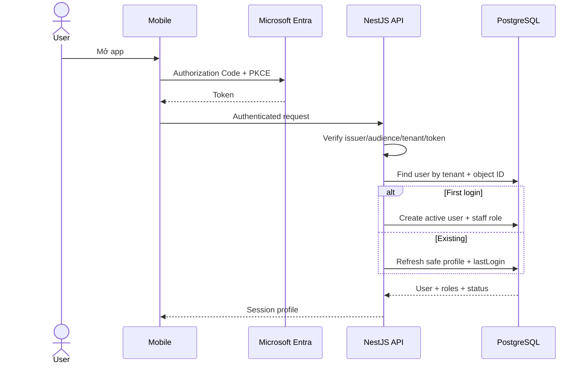
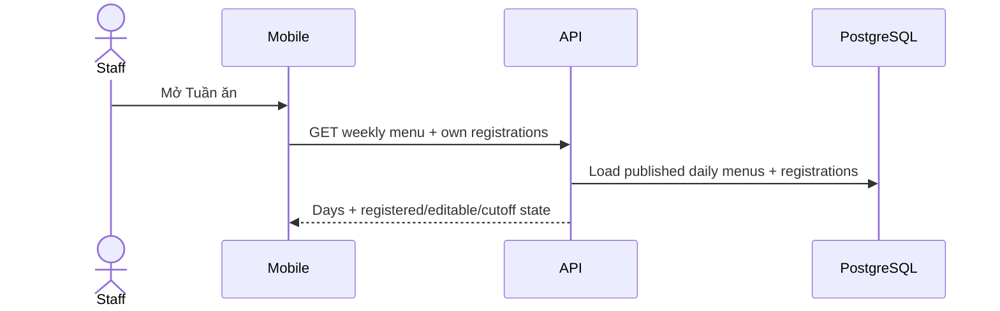
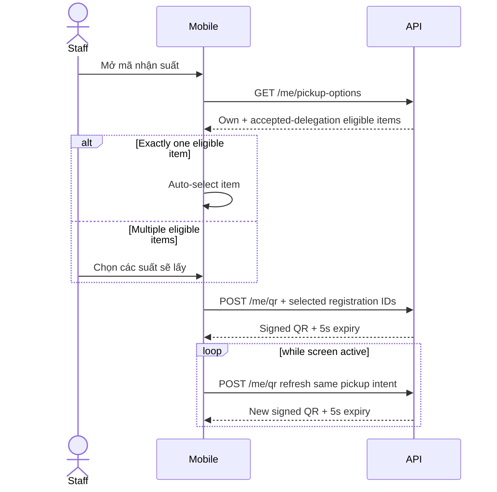
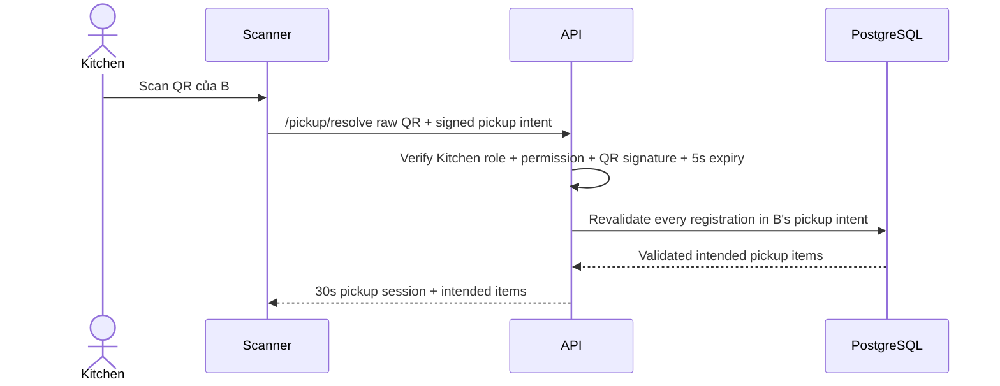
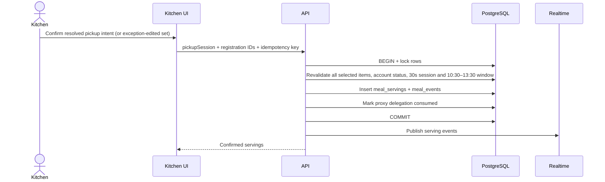

# IMeal v2 — Product Flows

## 1. Navigation model

IMeal v2 ưu tiên mobile cho Staff/Kitchen và Admin Web cho workflow quản trị.

### Mobile bottom navigation

Staff:

```text
Home | Tuần ăn | Thông báo | Tài khoản
```

Staff + Kitchen:

```text
Home | Tuần ăn | Check-in | Thông báo | Tài khoản
```

Kitchen role không thay thế hoặc kế thừa Staff role. Nhân sự Kitchen chỉ đăng ký suất của chính mình khi Admin cấp thêm role `staff`.

### Admin Web

```text
Dashboard
Users & Staff/Kitchen Roles
Penalties
Serving Audit
Delegations
Jobs / Health
```

## 2. App start and authentication



### Outcomes

| Condition                                      | Outcome                                            |
| ---------------------------------------------- | -------------------------------------------------- |
| Valid company Entra account, first login       | Auto-provision `staff`, open app                   |
| Valid existing active user                     | Load latest roles and open app                     |
| User disabled in IMeal                         | `ACCOUNT_DISABLED` screen                          |
| Wrong tenant/token                             | Access denied                                      |
| Entra login succeeds but IMeal API unreachable | Show server/network recovery, not “wrong password” |

## 3. Staff Home

Home summarizes current and next actions rather than duplicating all screens.

Suggested content:

```text
Xin chào, Minh

HÔM NAY
Cơm gà xối mỡ
✓ Bạn đã đăng ký
[ Mở mã nhận suất ]

TUẦN NÀY
4 / 5 ngày đã đăng ký
[ Quản lý tuần ăn ]

ỦY QUYỀN
1 yêu cầu đang chờ

Thông báo gần đây
```

If today is already served:

```text
✓ Suất hôm nay đã được nhận lúc 12:08
```

If served by delegate:

```text
✓ Nguyễn Văn B đã nhận hộ suất của bạn lúc 12:08
```

### 3.1 Staff history and penalties

`Tài khoản` links to meal history and penalties:

- History lists meal date, menu snapshot, registration state, owner/receiver and serving time.
- Penalties show `open|paid|waived`, amount, reason and resolution note/time.
- Staff may view but cannot mutate penalty state; support/dispute contact is an informational next action.

## 4. Weekly menu and registration flow

### 4.1 Load week



Weekly list example:

```text
17–21/08

✓ T2 · 17/08
  Cơm gà xối mỡ
  Đã khóa

✓ T3 · 18/08
  Bún bò Huế
  Có thể sửa đến 14:00 T2

□ T4 · 19/08
  Cơm sườn
  Có thể sửa đến 14:00 T3

[ Chọn cả tuần ]
[ Lưu thay đổi ]
```

### 4.2 Tick/untick

- Tick editable day → local draft `registered=true`.
- Untick registered editable day → local draft `registered=false`.
- Locked day does not toggle.
- Day without published menu is disabled and explains why.
- `Chọn cả tuần` only affects currently editable/published days.
- Unticking a registration with `pending|accepted` delegation warns that the delegation will also be revoked.

### 4.3 Save week

```mermaid
sequenceDiagram
    actor S as Staff
    participant M as Mobile
    participant API as NestJS
    participant DB as PostgreSQL

    S->>M: Bấm Lưu thay đổi
    M->>API: PUT weekly registration changes
    API->>API: Resolve VN server time
    API->>DB: Validate menu/cutoff/current state per date
    API->>DB: Apply valid changes; cancel also revokes active delegation atomically
    DB-->>API: Authoritative day results
    API-->>M: Success/failure per day
    M->>M: Reconcile server state, retain failed drafts
```

Possible result:

```text
✓ Đã lưu 4 ngày
⚠ Thứ Ba không thể thay đổi vì đã qua 14:00
```

Do not display success before server confirmation.

Cutoff boundary is strict: request snapshot `< 14:00` is editable; exactly `14:00:00` returns `CUTOFF_PASSED`.

## 5. Staff QR flow

### 5.1 Open QR

Preconditions:

- Today has active registration OR user has accepted delegation(s) eligible today.
- User account active.

Flow:



Before showing the QR, mobile builds a **pickup intent**:

- If B has exactly one eligible item, it is selected automatically; no extra tap is required.
- If B has multiple eligible items (own meal + accepted delegations), B selects the meals B intends to take **on B's phone**, not on the Kitchen scanner.

Example:

```text
Mã nhận suất
Nguyễn Văn B · NV105

Bạn sẽ nhận hôm nay:
☑ Suất của bạn
☑ Nhận hộ Nguyễn Văn A
☐ Nhận hộ Nguyễn Văn C

[ QR NHẬN 2 SUẤT ]

Tự làm mới mỗi 5 giây
```

The refreshed QR preserves the current pickup intent. The intent is signed/short-lived but never overrides current DB eligibility. If network fails, keep clear expired state and retry; never present an expired QR as valid.

QR validation allows at most 2 seconds clock skew. QR availability and serving are restricted to the 10:30–13:30 serving window.

## 6. Delegation / nhận hộ flow

### 6.1 A requests B

From A's selected meal date:

```text
Thứ Ba · 18/08
Bún bò Huế
✓ Đã đăng ký

[ Ủy quyền nhận hộ ]
```

A searches B by name/employee code and confirms:

```text
Nguyễn Văn B · NV105

[ Gửi yêu cầu ]
```

Backend checks:

- A owns active registration.
- Registration not served.
- B exists, active and is not A.
- No other active delegation for same registration.

Result: `pending`.

### 6.2 B receives request

Persisted notification/inbox item:

```text
Nguyễn Văn A muốn bạn nhận hộ suất ăn
Thứ Ba · 18/08 · Bún bò Huế

[ Từ chối ] [ Chấp nhận ]
```

- Accept → delegation `accepted`.
- Decline → `declined`.
- A receives updated notification/state.

### 6.3 A revokes

Before serving:

```text
Nguyễn Văn B sẽ nhận hộ
[ Hủy ủy quyền ]
```

Tapping `Hủy ủy quyền` opens a confirmation that names B and explains that B will immediately lose pickup permission. Backend then rechecks serving/delegation transactionally.

- Revoke wins first → B loses pickup permission.
- Serving already committed first → revoke returns `ALREADY_SERVED`.

### 6.4 Delegation constraints

- No delegation chain.
- One active delegate per registration.
- B cannot transfer A's registration to C.
- Accepted delegation does not itself mark meal received.

### 6.5 Owner cancels registration

If A unticks a registration that has `pending|accepted` delegation:

1. UI names B and asks A to confirm cancellation.
2. Backend locks registration/delegation and atomically sets registration `canceled` plus delegation `revoked`.
3. A and B receive authoritative state; B receives a persisted notification.
4. Accept committed first does not block cancellation: cancellation still atomically revokes the accepted delegation. Only a serving already committed first returns `ALREADY_SERVED`; no partial cancellation is shown.

## 7. Kitchen menu management

### 7.1 Weekly menu screen

Kitchen chooses week:

```text
← 17–21/08 →
Trạng thái: Nháp

T2 · 17/08
Tên món: [ Cơm gà xối mỡ ]
Mô tả:  [ ... ]
Ảnh:    [ upload ]

T3 · 18/08
Tên món: [ Bún bò Huế ]
...

[ Lưu nháp ] [ Công bố ]
```

Rules:

- One daily menu per date.
- Staff only sees published menu.
- Kitchen prepares/publishes the next week on the preceding Saturday–Sunday.
- First publish creates immutable revision 1 for each enabled daily menu.
- Kitchen can edit a published day only before 14:00 on the preceding day; every edit creates a revision and automatically notifies registered Staff.
- Cutoff-locked day is read-only/snapshotted.
- Publish validation identifies missing/invalid days rather than silently publishing broken data.
- Week starts Monday; every enabled Monday–Friday service date requires a valid menu, while holidays are explicitly disabled.
- Editing a published menu before cutoff creates a revision, preserves registrations and notifies registered Staff.
- Daily menu with active registrations cannot be unpublished/deleted.

## 8. Kitchen Check-in / Serving screen

This is the primary Kitchen operational screen.

### 8.1 Dashboard

```text
Cơm gà xối mỡ · 17/08

ĐÃ GIAO       CÒN LẠI
127 / 220        93
██████████░░   57.7%

[ CAMERA SCANNER ]

Đã nhận (127) | Chưa nhận (93) | Tất cả (220)

VỪA CHECK-IN
12:08:31  Nguyễn Văn A   Chính chủ
12:08:25  Trần Văn B     Nhận hộ A
12:08:13  Lê Văn C       Chính chủ
```

### 8.2 Serving state

Before 10:30 or at/after 13:30, scanner/confirm is disabled with `Ngoài khung giờ phục vụ 10:30–13:30`; menu/dashboard remain readable.

## 9. Kitchen QR resolve flow



### Normal case: one meal

```text
Nguyễn Văn B · NV105

1 SUẤT · CHÍNH CHỦ
Cơm gà

[ XÁC NHẬN GIAO 1 SUẤT ]
```

### Proxy/multi-item case

B already selected B + A on B's phone before presenting the QR:

```text
Nguyễn Văn B · NV105

2 SUẤT
• Nguyễn Văn B · Chính chủ
• Nguyễn Văn A · Nhận hộ

[ XÁC NHẬN GIAO 2 SUẤT ]
```

**Happy path:** Kitchen does not tick each item. Kitchen verifies presenter/names/count against the trays being handed over and presses one large confirm action.

Kitchen cannot add/remove items. If the employee changes intent, they update the selection on mobile and present a refreshed QR before resolve/confirm.

## 10. Kitchen serving confirmation



Confirmation is all-or-nothing. If any selected item changed after resolve, DB rolls back the whole batch and UI keeps context but disables handover until re-resolve.

### Outcomes

| Outcome                               | Kitchen UI                                                        |
| ------------------------------------- | ----------------------------------------------------------------- |
| Self serving success                  | Green success with owner/name/time                                |
| Proxy success                         | Green success: “B đã nhận hộ A”                                   |
| Already served                        | Warning with existing receiver/time                               |
| Delegation revoked                    | Error/re-resolve; do not serve                                    |
| QR expired at resolve                 | Ask user show refreshed QR                                        |
| Pickup session expired before confirm | Re-scan/re-resolve                                                |
| Any selected item changed             | `PICKUP_STATE_CHANGED`; no item committed; re-resolve whole batch |
| Outside 10:30–13:30                   | Disable serving and show canonical service window                 |
| Account disabled after resolve        | No serving; refresh authoritative account/pickup state            |
| Network/database failure              | No success display; allow safe retry with same idempotency key    |

## 11. Manual employee-code recovery

Kitchen can search employee code/name when QR/camera unavailable.

- This is a recovery path, not a bypass.
- Backend resolves the same eligible pickup items.
- Because the Staff pickup-intent QR is unavailable, Kitchen may select the actual recovery items here and then confirm.
- Event stores source=`EMPLOYEE_CODE` or equivalent.
- Kitchen must enter/select a recovery reason; endpoint is rate-limited and fully audited.

## 12. Kitchen lists and realtime log

### Chưa nhận

Registration owner has no active serving.

Search by name/code, paginate/filter as needed.

### Đã nhận

Show:

- Owner.
- Receiver.
- `SELF` / `PROXY`.
- Serving time.
- Kitchen actor/counter/device when available.

After no-show reconciliation, add a distinct `Vắng mặt` tab/count. Do not relabel users as absent while the serving window is still open.

### Realtime behavior

1. Initial snapshot from API/DB.
2. Subscribe to serving events.
3. After another device commits, append log and update count.
4. On reconnect, fetch fresh snapshot before continuing stream.

## 13. Serving finality

- Kitchen verifies presenter, selected items and tray count before pressing confirm.
- After a successful confirm, serving is final in core v2 and cannot be reversed from Kitchen or Admin UI.
- If fewer trays are immediately available than the confirmed count, Kitchen completes the physical handover by supplying the missing trays; it does not edit serving history.
- Original serving events remain immutable during the 1-year retention window.

## 14. End-of-day no-show

At **13:45** after the **13:30** service end:

```text
active registrations for date
    - registrations with valid serving
    = no-show candidates
```

For each candidate transactionally:

- Re-check no serving exists.
- Mark no-show.
- Create exactly one 50,000 VND penalty if none exists.
- Do not duplicate penalty on retry.

Delegation status does not replace serving: accepted but unused delegation can still result in owner no-show.

## 15. Admin flows

### Users / Staff-Kitchen Roles

- Search user.
- Show Entra/profile identity and IMeal roles.
- Manage `staff`/`kitchen` role assignments with actor audit; **Admin Web cannot grant or revoke `admin`**.
- Disable/enable IMeal account.
- Admin-role lifecycle is handled outside Admin Web by audited server-side operations.
- Admin does not gain Kitchen serving permission implicitly.
- Assign/revoke `penalty.read`, `penalty.resolve` with audit.
- Disable flow must preview future registrations/delegations and require Admin confirmation. The same workflow cancels them with `ACCOUNT_DISABLED`, excludes them from Kitchen totals and penalties, and preserves audit history.

### Penalties

- Filter date/status/search.
- Resolve open → paid/waived.
- Waive requires reason.
- Export if needed.

### Audit

Search by user/date to see:

```text
Registration owner: A
Delegated to: B
Requested: 10:21
Accepted: 10:23
Served to: B
Kitchen actor: C
Served: 12:08:31
```

### Jobs / Health

- View menu-lock, delegation-expiry, no-show, notification and reconciliation runs.
- Show status, started/finished time, attempt, sanitized error and retry chain.
- Manual retry requires confirmation naming job/date/scope and records actor/request ID.

## 16. Required interaction states

| State                  | Requirement                                                                   |
| ---------------------- | ----------------------------------------------------------------------------- |
| Loading                | Never render false empty/unchecked state                                      |
| Draft                  | Preserve weekly tick/delegation inputs until server response                  |
| Validation             | Show date/person/action-specific message                                      |
| Pending                | Disable duplicate submit but keep context visible                             |
| Success                | State server-confirmed, include date/person/outcome                           |
| Error                  | Safe message + concrete retry/recovery                                        |
| Expired QR             | Visually invalid; refresh/retry                                               |
| Offline                | Distinguish Entra/login/API connectivity failure                             |
| Destructive            | Revoke/role/waive/account-disable cleanup confirm where appropriate           |
| Realtime reconnect     | Re-fetch authoritative snapshot                                               |
| Account disabled       | Block protected actions and explain that Admin controls account state         |
| Batch pickup conflict  | Commit nothing; retain context, disable confirm and require re-resolve        |
| Outside service window | Keep dashboard readable; disable scanner/confirm with 10:30–13:30 explanation |

## 17. Acceptance tests

- Weekly tick/untick before/at/after cutoff for mixed week states.
- Exact cutoff boundary: 13:59:59 accepted, 14:00:00 denied using server clock.
- Two concurrent weekly saves do not create duplicate registration.
- QR valid/expired/forged/wrong-day.
- QR expires after resolve but Kitchen confirm succeeds only within valid pickup session.
- QR skew >2s rejected; pickup session succeeds before 30s and fails at/after expiry.
- A→B delegation pending/accept/decline/revoke/expire/consume.
- Prevent A→A and A→B→C chain.
- Owner vs delegate simultaneous pickup → exactly one serving.
- Two Kitchen scanners same registration → exactly one serving.
- Staff preselects multi-item pickup intent; Kitchen happy path confirms without ticking; one stale intended item → entire batch rolls back.
- Cancel registration with pending/accepted delegation atomically revokes it; cancel/accept/serve races have one valid winner.
- Disabled owner/receiver/actor cannot use protected API; disable requires preview + confirmed cleanup, and quarantined cancellations never become no-show/penalty.
- Menu revision preserves registration, sends persisted notification and cannot unpublish a registered day.
- Successful serving confirm is final; Kitchen verifies intended items/count before confirm and completes any missing physical handover without rewriting history.
- Realtime dashboard converges across multiple devices.
- A valid authenticated Kitchen caller with `kitchen.serve` can resolve and confirm regardless of client network location; QR, pickup-session, serving-window and database eligibility checks still apply.
- Public weekly/delegation APIs work outside IEC network with valid auth.
- No-show job skips served registrations and does not duplicate penalty.
- No-show starts 13:45, creates exactly one 50,000 VND penalty and never reopens paid/waived state.
