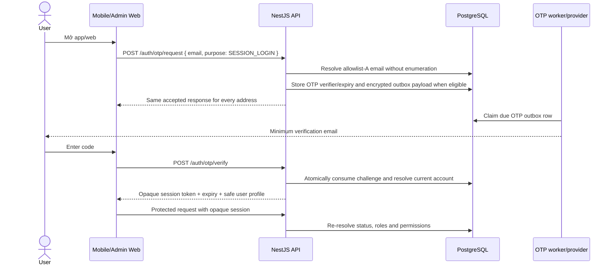
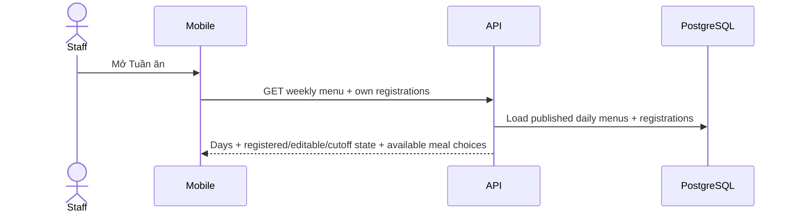
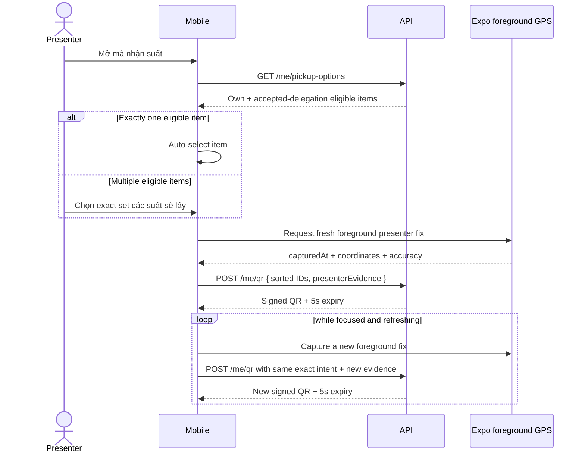
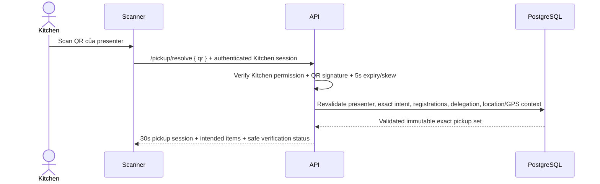
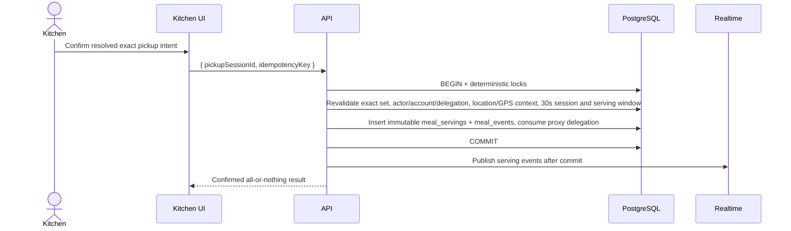

# IMeal v2 — Product Flows

## 1. Navigation model

IMeal v2 ưu tiên mobile cho Staff/Kitchen và Admin Web cho workflow quản trị.

### Mobile bottom navigation

Staff:

```text
Home | Tuần ăn | Thông báo | Tài khoản
```

Staff + Kitchen:

```text
Home | Tuần ăn | Check-in | Thông báo | Tài khoản
```

Kitchen-only:

```text
Dashboard | Máy quét | Tài khoản
```

Kitchen role không thay thế hoặc kế thừa Staff role. Nhân sự Kitchen chỉ đăng ký suất của chính mình khi Admin cấp thêm role `staff`.

### Admin Web

```text
Dashboard
Users & Staff/Kitchen Roles
Penalties
Serving Audit
Delegations
Jobs / Health
```

## 2. App start and authentication



OTP request never reveals whether an address is unknown, disabled or not
allowlisted. Clear OTP values are never shown in logs, responses or persisted
records. A successful verification creates only a server-backed opaque session;
logout, expiry, disable or revocation invalidates it.

### Outcomes

| Condition | Outcome |
| --- | --- |
| Active allowlist-A email and valid OTP | Create opaque session, load current permissions and open app |
| Unknown, disabled, expired or non-allowlisted email | Same generic accepted/request or invalid-code response; no session |
| Wrong/expired/replayed code | `OTP_INVALID_OR_EXPIRED`; no session |
| Disabled account after a prior session | `ACCOUNT_DISABLED`/session invalid; protected actions blocked |
| API/worker/provider unavailable | Safe server/network recovery; no alternate login path |

The only authentication bypass is `NODE_ENV=test` with `REQUIRE_AUTH=false` for
automated harness/controller tests. It is non-production, not a user login flow,
must not use production credentials or data, and is rejected by production
startup validation.
## 3. Staff Home

Home summarizes current and next actions rather than duplicating all screens.

Suggested content:

```text
Xin chào, Minh

HÔM NAY
Cơm gà xối mỡ
✓ Bạn đã đăng ký
[ Mở mã nhận suất ]

TUẦN NÀY
4 / 5 ngày đã đăng ký
[ Quản lý tuần ăn ]

ỦY QUYỀN
1 yêu cầu đang chờ

Thông báo gần đây
```

If today is already served:

```text
✓ Suất hôm nay đã được nhận lúc 12:08
```

If served by delegate:

```text
✓ Nguyễn Văn B đã nhận hộ suất của bạn lúc 12:08
```

### 3.1 Staff history and penalties

`Tài khoản` links to meal history and penalties:

- History lists meal date, menu snapshot, registration state, owner/receiver and serving time.
- Penalties show `open|paid|waived`, amount, reason and resolution note/time.
- Staff may view but cannot mutate penalty state; support/dispute contact is an informational next action.

## 4. Weekly menu and registration flow

### 4.1 Load week



Weekly list example:

```text
17–21/08

✓ T2 · 17/08
  Cơm gà xối mỡ
  Đã khóa

✓ T3 · 18/08
  Bún bò Huế
  Có thể sửa đến 14:00 T2

□ T4 · 19/08
  Cơm sườn
  Có thể sửa đến 14:00 T3

[ Chọn cả tuần ]
[ Lưu thay đổi ]
```

### 4.2 Tick/untick and meal choice

- Tick editable day → local draft `registered=true`; normal service date uses `REGULAR`.
- On lunar day 1 or 15, including a leap month, Staff may choose `REGULAR` or `VEGETARIAN`; no other date exposes `VEGETARIAN`.
- Untick registered editable day → local draft `registered=false`; the existing `meal_choice` remains stored for history.
- Locked day does not toggle or change its meal choice.
- Day without published menu is disabled and explains why.
- `Chọn cả tuần` only affects currently editable/published days and uses `REGULAR` unless the Staff chooses otherwise on an eligible lunar date.
- Unticking a registration with `pending|accepted` delegation warns that the delegation will also be revoked.

### 4.3 Save week

```mermaid
sequenceDiagram
    actor S as Staff
    participant M as Mobile
    participant API as NestJS
    participant DB as PostgreSQL

    S->>M: Bấm Lưu thay đổi
    M->>API: PUT weekly registration changes (status + meal choice)
    API->>API: Resolve VN server time
    API->>DB: Validate menu/cutoff/current state and meal-choice policy per date
    API->>DB: Apply valid changes; cancel also revokes active delegation atomically
    DB-->>API: Authoritative day results, including stored meal choice
    API-->>M: Success/failure per day
    M->>M: Reconcile server state, retain failed drafts
```

Possible result:

```text
✓ Đã lưu 4 ngày
⚠ Thứ Ba không thể thay đổi vì đã qua 14:00
```

Do not display success before server confirmation.

Cutoff boundary is strict: request snapshot `< 14:00` is editable; exactly `14:00:00` returns `CUTOFF_PASSED`.

## 5. Staff QR flow

### 5.1 Open and refresh QR

Preconditions:

- Today has an active registration or accepted delegation eligible today.
- The presenter account/session is active and current permissions allow pickup.
- Employee-to-location assignment and an effective imported location policy exist.

Flow:



Before showing the QR, mobile builds a **sorted, unique, non-empty exact pickup
intent**:

- One eligible item is selected automatically; no extra tap is required.
- Multiple eligible items require explicit selection on the presenter phone, not
  on the Kitchen scanner.
- Selection, focus, eligibility, delegation or GPS verification changes clear
  the QR. Refresh preserves the exact set only after a fresh presenter fix.

The server resolves the presenter's fixed roster location and evaluates
freshness, accuracy and geofence policy. Presenter coordinates cannot select a
different site or grant entitlement. Owner GPS is never collected merely because
the presenter is receiving a delegated item.

If GPS is unavailable, denied, stale, inaccurate or outside the geofence, the
screen exposes only **Retry** and **Refresh**. There is no manual bypass, silent
fallback, automatic site substitution or alternate item set. Collection stops
when the screen loses focus, QR generation completes/cancels, or the screen
unmounts.

The refreshed QR preserves the exact intent. QR TTL is exactly 5 seconds and
accepted clock skew is at most 2 seconds. QR availability and serving remain
restricted to the 10:30–13:30 `Asia/Ho_Chi_Minh` serving window.
## 6. Delegation / nhận hộ flow

### 6.1 A requests B

From A's selected meal date:

```text
Thứ Ba · 18/08
Bún bò Huế
✓ Đã đăng ký

[ Ủy quyền nhận hộ ]
```

A searches B by name/employee code and confirms:

```text
Nguyễn Văn B · NV105

[ Gửi yêu cầu ]
```

Backend checks:

- A owns active registration.
- Registration not served.
- B exists, active and is not A.
- No other active delegation for same registration.

Result: `pending`.

### 6.2 B receives request

Persisted notification/inbox item:

```text
Nguyễn Văn A muốn bạn nhận hộ suất ăn
Thứ Ba · 18/08 · Bún bò Huế

[ Từ chối ] [ Chấp nhận ]
```

- Accept → delegation `accepted`.
- Decline → `declined`.
- A receives updated notification/state.

### 6.3 A revokes

Before serving:

```text
Nguyễn Văn B sẽ nhận hộ
[ Hủy ủy quyền ]
```

Tapping `Hủy ủy quyền` opens a confirmation that names B and explains that B will immediately lose pickup permission. Backend then rechecks serving/delegation transactionally.

- Revoke wins first → B loses pickup permission.
- Serving already committed first → revoke returns `ALREADY_SERVED`.

### 6.4 Delegation constraints

- No delegation chain.
- One active delegate per registration.
- B cannot transfer A's registration to C.
- Accepted delegation does not itself mark meal received.

### 6.5 Owner cancels registration

If A unticks a registration that has `pending|accepted` delegation:

1. UI names B and asks A to confirm cancellation.
2. Backend locks registration/delegation and atomically sets registration `canceled` plus delegation `revoked`.
3. A and B receive authoritative state; B receives a persisted notification.
4. Accept committed first does not block cancellation: cancellation still atomically revokes the accepted delegation. Only a serving already committed first returns `ALREADY_SERVED`; no partial cancellation is shown.

## 6.6 Staff notification flow

Notification is created in the same transaction as the authoritative business change and
appears in the recipient's persisted inbox before any optional push delivery. The inbox item has
`{ id, kind, payload, copy: { vi: { title, body }, en: { title, body } }, readAt, createdAt }`;
IDs/cursors are UUIDs, dates are `YYYY-MM-DD`, and timestamps are UTC ISO strings. Detail and
read are owner-scoped; a foreign notification ID is indistinguishable from a missing one.

### Canonical event matrix

| Event | When | Who receives it | Flow destination |
| ----- | ---- | --------------- | ---------------- |
| `REGISTRATION_OPENED` | First publish only; initializes missing daily revisions and marks weekly menu published. | Every active Staff user, independent of reminder opt-out. | Calendar. |
| `REGISTRATION_REMINDER` | Sunday 10:00 VN for next Monday's published menu; one per Staff/week. | Active Staff missing at least one enabled, non-holiday registration and with reminders enabled. | Calendar. |
| `PICKUP_REMINDER` | Daily 11:30 VN for today's active unserved registrations. | Accepted delegate, otherwise owner; one grouped item per recipient/date when reminders enabled. | Pickup Intent. |
| `DELEGATION_REQUESTED` | Owner sends pending request. | Delegate. | Delegation. |
| `DELEGATION_ACCEPTED` / `DELEGATION_DECLINED` | Delegate responds. | Owner. | Delegation. |
| `DELEGATION_REVOKED` | Owner revokes, or owner cancellation revokes the active delegation. | Delegate, with reason `OWNER_REVOKED` or `REGISTRATION_CANCELLED`. | Delegation. |
| `PROXY_PICKUP_COMPLETED` | Accepted delegate successfully receives the meal for the owner. | Owner only; self pickup creates no notification. | Readable detail, no CTA. |
| `NO_SHOW_PENALTY_CREATED` | No-show worker at 13:45 VN after the 13:30 service end. | Registration owner. | Readable detail, no CTA. |

Published-menu edits use `REGISTERED_MENU_CHANGED`, never `REGISTRATION_OPENED`. Admin
account-disable notification is not a current flow; it remains part of a future
account-disable subsystem rather than a dormant kind.

### Inbox and push flow

1. API or worker publisher writes the structured notification and
   `NOTIFICATION_CREATED` outbox event atomically. Dedupe replay does not reset read state.
2. Mobile requests `GET /api/notifications` with cursor pagination (limit 20 by default,
   bounded to 1–50), opens owner-scoped detail, then marks read after detail load succeeds.
   `unreadCount` drives the Notifications tab badge.
3. The worker claims due outbox rows every 15 seconds, creates per-device deliveries for
   non-revoked devices, and sends Expo Push best-effort. Transient failures retry after
   1/5/15 minutes; the fourth failed attempt is `FAILED`, permanent device/provider errors
   fail immediately and an unregistered device is revoked. A stale `PROCESSING` delivery
   older than five minutes is recoverable.
4. Push data is `imeal://notifications/<UUID>`. A validated tap opens the persisted
   NotificationDetail; a notification remains readable if push fails or is unavailable.

### Locale, reminder preference, and permission onboarding

Both `vi` and `en` title/body are stored at publish time, so the inbox always retains both
copies. A mobile language change updates the local UI immediately and best-effort PATCHes
`locale` through `/api/notifications/preferences`; if that PATCH fails, the local language
and inbox remain usable, while only the locale used for future push delivery stays at the
previous server value. Push chooses the stored copy using the server locale (default `vi`),
and dates in copy use `Asia/Ho_Chi_Minh`. The one
`remindersEnabled` preference (default `true`) opts out of both weekly registration and
same-day pickup reminders; it does not suppress transactional delegation/menu/pickup/no-show
events. The reminder switch changes only after its PATCH succeeds.

After first authenticated native login, show one contextual explainer. `Enable` is the only
action that invokes the OS prompt; `Not now` dismisses and records the one-time state.
After denial, do not auto-prompt; the Settings CTA opens OS settings. Web does no push work,
and a simulator explains that a physical device is required. Missing push configuration must
not disable inbox use. A separate profile system-notification status/Settings CTA is not the
reminder switch.

### Deep-link destinations

- Registration/menu (`REGISTRATION_OPENED`, `REGISTRATION_REMINDER`, `REGISTERED_MENU_CHANGED`) → Calendar, with an optional meal date/week handoff.
- Pickup (`PICKUP_REMINDER`) → Pickup Intent.
- Delegation lifecycle → Delegation.
- No-show and migrated legacy items remain readable without claiming an unavailable action.


## 7. Kitchen menu management

### 7.1 Weekly menu screen

Kitchen chooses week:

```text
← 17–21/08 →
Trạng thái: Nháp

T2 · 17/08
Tên món: [ Cơm gà xối mỡ ]
Mô tả:  [ ... ]
Ảnh:    [ upload ]

T3 · 18/08
Tên món: [ Bún bò Huế ]
...

[ Lưu nháp ] [ Công bố ]
```

Rules:

- One daily menu per date.
- Staff only sees published menu.
- Kitchen prepares/publishes the next week on the preceding Saturday–Sunday.
- First publish creates immutable revision 1 for each enabled daily menu.
- Kitchen can edit a published day only before 14:00 on the preceding day; every edit creates a revision and automatically notifies registered Staff.
- Cutoff-locked day is read-only/snapshotted.
- Publish validation identifies missing/invalid days rather than silently publishing broken data.
- Week starts Monday; every enabled Monday–Friday service date requires a valid menu, while holidays are explicitly disabled.
- Editing a published menu before cutoff creates a revision, preserves registrations and notifies registered Staff.
- Daily menu with active registrations cannot be unpublished/deleted.

## 8. Kitchen Check-in / Serving screen

This is the primary Kitchen operational screen.

### 8.1 Dashboard

```text
Cơm gà xối mỡ · 17/08

ĐÃ GIAO       CÒN LẠI
127 / 220        93
██████████░░   57.7%

[ CAMERA SCANNER ]

Đã nhận (127) | Chưa nhận (93) | Tất cả (220)

VỪA CHECK-IN
12:08:31  Nguyễn Văn A   Chính chủ
12:08:25  Trần Văn B     Nhận hộ A
12:08:13  Lê Văn C       Chính chủ
```

### 8.2 Serving state

Before 10:30 or at/after 13:30, scanner/confirm is disabled with `Ngoài khung giờ phục vụ 10:30–13:30`; menu/dashboard remain readable.

## 9. Kitchen QR resolve flow



Kitchen sends only the raw QR to resolve and never sends GPS/evidence. A valid
resolve binds the exact sorted registration set, presenter, effective location,
GPS verification result and nonce to a pickup session lasting exactly 30 seconds.

### Normal case: one meal

```text
Nguyễn Văn B · NV105

1 SUẤT · CHÍNH CHỦ
Cơm gà

[ XÁC NHẬN GIAO 1 SUẤT ]
```

### Proxy/multi-item case

B selected the exact B + A set on B's phone before presenting the QR:

```text
Nguyễn Văn B · NV105

2 SUẤT
• Nguyễn Văn B · Chính chủ
• Nguyễn Văn A · Nhận hộ

[ XÁC NHẬN GIAO 2 SUẤT ]
```

**Happy path:** Kitchen verifies presenter/names/count against the trays being
handed over and presses one confirm action. Kitchen cannot tick, add, remove or
replace items. If intent changes, the presenter updates mobile selection and
shows a refreshed QR before resolve.
## 10. Kitchen serving confirmation



Confirm accepts only the resolved `pickupSessionId` and an idempotency key.
Kitchen sends no registration IDs, coordinates or GPS. The API loads the exact
session set and revalidates every item, current account/permission state,
delegation acceptance, registration/location snapshot, presenter verification,
30-second session and 10:30–13:30 `Asia/Ho_Chi_Minh` window.

Confirmation is all-or-nothing and idempotent. If any item is stale/ineligible,
the entire batch commits zero servings and returns a safe conflict; Kitchen must
resolve again. The same caller/key/body returns the original result, while key
reuse with another body/intent returns `IDEMPOTENCY_CONFLICT`.

### Outcomes

| Outcome | Kitchen UI |
| --- | --- |
| Self serving success | Green success with owner/name/time |
| Proxy success | Green success: “B đã nhận hộ A” |
| Already served/delegation revoked | Conflict; do not serve; resolve again |
| QR expired at resolve | Ask presenter to show refreshed QR |
| Pickup session expired before confirm | Re-scan/re-resolve |
| Any selected item changed | `PICKUP_STATE_CHANGED`; no item committed |
| GPS verification invalid | Safe Retry/Refresh status; Kitchen cannot bypass |
| Outside 10:30–13:30 | Disable serving and show canonical service window |
| Account disabled after resolve | No serving; refresh authoritative state |
| Network/database failure | No success display; retry same idempotency key |
## 11. Recovery boundaries

There is no employee-code, username/password, local-login or manual location
bypass in production. If QR/GPS verification fails, the presenter receives only
the approved Retry/Refresh recovery. If the exact intent becomes stale, the
presenter must select/refresh again; Kitchen cannot substitute an item.
## 12. Kitchen lists and realtime log

### Chưa nhận

Registration owner has no active serving.

Search by name/code, paginate/filter as needed.

### Đã nhận

Show:

- Owner.
- Receiver.
- `SELF` / `PROXY`.
- Serving time.
- Kitchen actor/counter/device when available.

After no-show reconciliation, add a distinct `Vắng mặt` tab/count. Do not relabel users as absent while the serving window is still open.

### Realtime behavior

1. Initial snapshot from API/DB.
2. Subscribe to serving events.
3. After another device commits, append log and update count.
4. On reconnect, fetch fresh snapshot before continuing stream.

## 13. Serving finality

- Kitchen verifies presenter, selected items and tray count before pressing confirm.
- After a successful confirm, serving is final in core v2 and cannot be reversed from Kitchen or Admin UI.
- If fewer trays are immediately available than the confirmed count, Kitchen completes the physical handover by supplying the missing trays; it does not edit serving history.
- Original serving events remain immutable during the 1-year retention window.

## 14. End-of-day no-show

At **13:45** after the **13:30** service end:

```text
active registrations for date
    - registrations with valid serving
    = no-show candidates
```

For each candidate transactionally:

- Re-check no serving exists.
- Mark no-show.
- Create exactly one 50,000 VND penalty if none exists.
- Do not duplicate penalty on retry.

Delegation status does not replace serving: accepted but unused delegation can still result in owner no-show.

## 15. Admin flows

### Users / Staff-Kitchen Roles

- Search user.
- Show normalized allowlist email/profile identity, current account status and
  server-resolved IMeal roles/permissions.
- Manage `staff`/`kitchen` role assignments with actor audit; **Admin Web cannot grant or revoke `admin`**.
- Disable/enable IMeal account.
- Manage only the four approved location records and their effective GPS
  policies; no seed action exists and real names/addresses/coordinates remain
  outside source control until organization approval/import.
- Preview and atomically commit roster imports that fix employee-to-location
  assignments; preserve effective assignment/location snapshots in history.
- Show redacted audit outcomes only; raw OTP/session/GPS evidence is not an
  operational dashboard.
- Admin-role lifecycle is handled outside Admin Web by audited server-side operations.
- Admin does not gain Kitchen serving permission implicitly.
- Assign/revoke `penalty.read`, `penalty.resolve` with audit.
- Disable flow must preview future registrations/delegations and require Admin confirmation. The same workflow cancels them with `ACCOUNT_DISABLED`, excludes them from Kitchen totals and penalties, and preserves audit history.

### Penalties

- Filter date/status/search.
- Resolve open → paid/waived.
- Waive requires reason.
- Export if needed.

### Audit

Search by user/date to see:

```text
Registration owner: A
Delegated to: B
Requested: 10:21
Accepted: 10:23
Served to: B
Kitchen actor: C
Served: 12:08:31
```

### Jobs / Health

- View menu-lock, delegation-expiry, no-show, notification and reconciliation runs.
- Show status, started/finished time, attempt, sanitized error and retry chain.
- Manual retry requires confirmation naming job/date/scope and records actor/request ID.

## 16. Required interaction states

| State                  | Requirement                                                                   |
| ---------------------- | ----------------------------------------------------------------------------- |
| Loading                | Never render false empty/unchecked state                                      |
| Draft                  | Preserve weekly tick/delegation inputs until server response                  |
| Validation             | Show date/person/action-specific message                                      |
| Pending                | Disable duplicate submit but keep context visible                             |
| Success                | State server-confirmed, include date/person/outcome                           |
| Error                  | Safe message + concrete retry/recovery                                        |
| Expired QR             | Visually invalid; refresh/retry                                               |
| Offline                | Distinguish OTP/session/API/provider connectivity failure                    |
| Destructive            | Revoke/role/waive/account-disable cleanup confirm where appropriate           |
| Realtime reconnect     | Re-fetch authoritative snapshot                                               |
| Account disabled       | Block protected actions and explain that Admin controls account state         |
| Batch pickup conflict  | Commit nothing; retain context, disable confirm and require re-resolve        |
| Outside service window | Keep dashboard readable; disable scanner/confirm with 10:30–13:30 explanation |

## 17. Acceptance tests

- Weekly tick/untick before/at/after cutoff for mixed week states.
- Exact cutoff boundary: 13:59:59 accepted, 14:00:00 denied using server clock.
- Two concurrent weekly saves do not create duplicate registration.
- QR valid/expired/forged/wrong-day.
- QR expires after resolve but Kitchen confirm succeeds only within valid pickup session.
- QR skew >2s rejected; pickup session succeeds before 30s and fails at/after expiry.
- A→B delegation pending/accept/decline/revoke/expire/consume.
- Prevent A→A and A→B→C chain.
- Owner vs delegate simultaneous pickup → exactly one serving.
- Two Kitchen scanners same registration → exactly one serving.
- Staff preselects multi-item pickup intent; Kitchen happy path confirms without ticking; one stale intended item → entire batch rolls back.
- Cancel registration with pending/accepted delegation atomically revokes it; cancel/accept/serve races have one valid winner.
- Disabled owner/receiver/actor cannot use protected API; disable requires preview + confirmed cleanup, and quarantined cancellations never become no-show/penalty.
- Menu revision preserves registration, sends persisted notification and cannot unpublish a registered day.
- Successful serving confirm is final; Kitchen verifies intended items/count before confirm and completes any missing physical handover without rewriting history.
- Realtime dashboard converges across multiple devices.
- A valid authenticated Kitchen caller with `kitchen.serve` can resolve and confirm regardless of client network location; QR, pickup-session, serving-window and database eligibility checks still apply.
- Public weekly/delegation APIs work outside IEC network with valid auth.
- No-show job skips served registrations and does not duplicate penalty.
- No-show starts 13:45, creates exactly one 50,000 VND penalty and never reopens paid/waived state.
