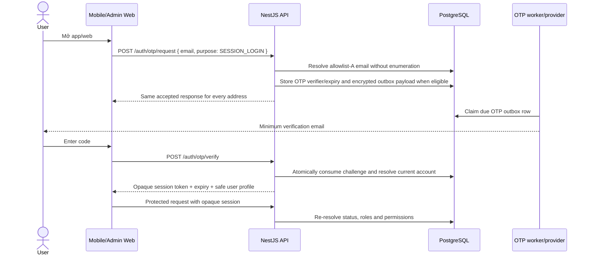
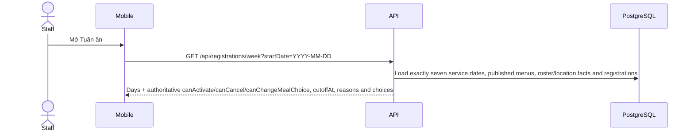
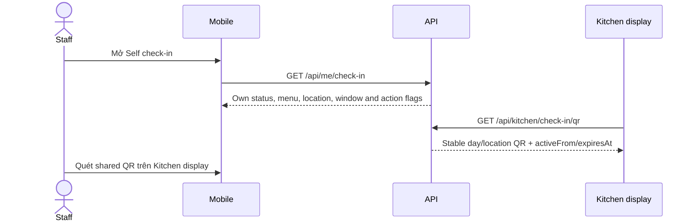
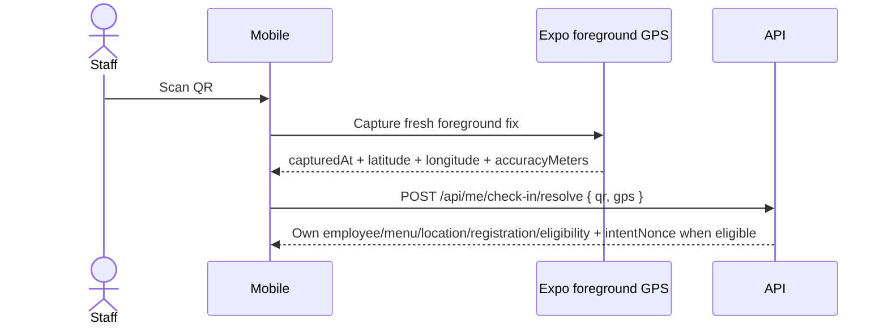
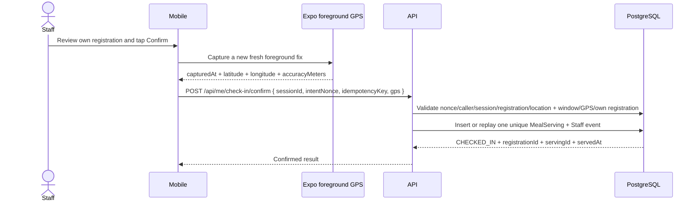
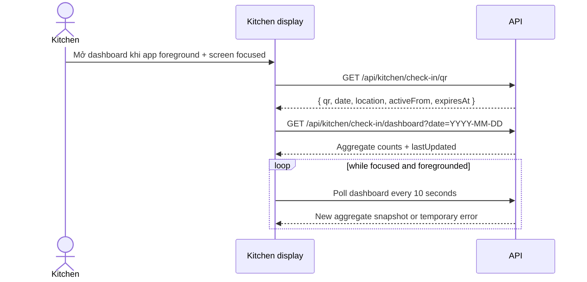
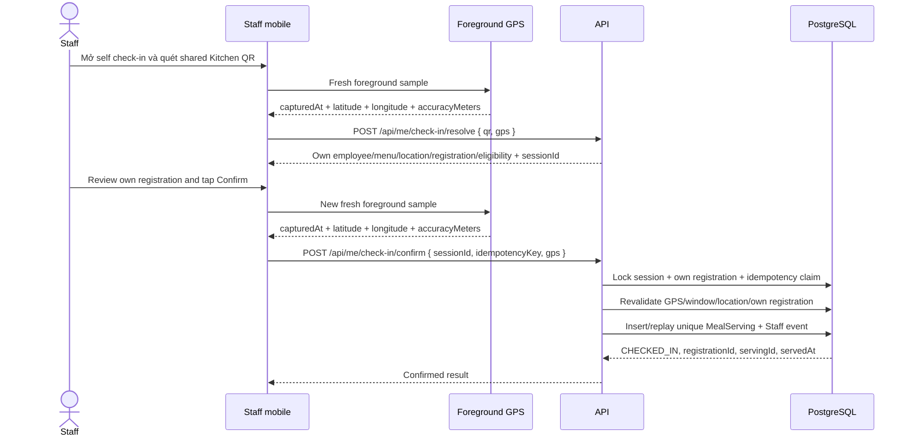

# IMeal v2 — Product Flows

## 1. Navigation model

IMeal v2 ưu tiên mobile cho Staff/Kitchen và Admin Web cho workflow quản trị.

### Mobile bottom navigation

Staff:

```text
Home | Tuần ăn | Thông báo | Tài khoản
```

Staff + Kitchen:

```text
Home | Tuần ăn | Check-in | Thông báo | Tài khoản
```

Kitchen-only:

```text
Dashboard | Shared QR | Tài khoản
```

Kitchen role không thay thế hoặc kế thừa Staff role. Nhân sự Kitchen chỉ đăng ký suất của chính mình khi Admin cấp thêm role `staff`.

### Admin Web

```text
Dashboard
Users & Staff/Kitchen Roles
Penalties
Serving Audit
Historical Delegation Audit (read-only)
Jobs / Health
```

## 2. App start and authentication



OTP request never reveals whether an address is unknown, disabled or not
allowlisted. Clear OTP values are never shown in logs, responses or persisted
records. A successful verification creates only a server-backed opaque session;
logout, expiry, disable or revocation invalidates it.

### Outcomes

| Condition                                           | Outcome                                                            |
| --------------------------------------------------- | ------------------------------------------------------------------ |
| Active allowlist-A email and valid OTP              | Create opaque session, load current permissions and open app       |
| Unknown, disabled, expired or non-allowlisted email | Same generic accepted/request or invalid-code response; no session |
| Wrong/expired/replayed code                         | `OTP_INVALID_OR_EXPIRED`; no session                               |
| Disabled account after a prior session              | `ACCOUNT_DISABLED`/session invalid; protected actions blocked      |
| API/worker/provider unavailable                     | Safe server/network recovery; no alternate login path              |

The only authentication bypass is `NODE_ENV=test` with `REQUIRE_AUTH=false` for
automated harness/controller tests. It is non-production, not a user login flow,
must not use production credentials or data, and is rejected by production
startup validation.

## 3. Staff Home

Home receives the VN-business-date day from the authoritative seven-day registration response; it renders backend menu description/location and registration lifecycle without inventing a weekday or serving projection.

The today card shows:

- `ACTIVE`, `CHECKED_IN`/served, `NO_SHOW`, `CANCELLED`, `UNREGISTERED`, or
  `NO_MENU` remain distinct localized lifecycle states.
- The published menu name/description and that day's location when available.
- The Staff self check-in action appears only when lifecycle is `ACTIVE`, the
  menu is complete/published, and the server allows current own check-in.
- A weekly count of `ACTIVE`, `CHECKED_IN`/served and `NO_SHOW` registrations
  uses the enabled published-menu denominator; canceled and unregistered days
  are excluded.

Suggested content:

```text
Xin chào, Minh

HÔM NAY
Cơm gà xối mỡ
✓ Bạn đã đăng ký
[ MỞ SELF CHECK-IN ]

TUẦN NÀY
<registered active/checked-in/no-show> / <enabled published days> ngày đã đăng ký
[ Quản lý tuần ăn ]

Thông báo gần đây
```

If today is already checked in:

```text
✓ Bạn đã check-in lúc 12:08
Serving: <servingId>
```

### 3.1 Staff history and penalties

`Tài khoản` links to meal history and penalties:

- History lists meal date, menu snapshot, own registration state, `CHECKED_IN`/
  serving time and penalty context. Retained owner/receiver fields are
  historical read-only data.
- Penalties show `open|paid|waived`, amount, reason and resolution note/time.
- Staff may view but cannot mutate penalty state; support/dispute contact is an informational next action.

## 4. Weekly menu and registration flow

### 4.1 Load week



`registrationWindow.nextWeekOpenAt` is the server-authoritative ISO UTC instant
for the next weekly opening; mobile schedules refresh from this value and does
not derive the Saturday boundary locally.

Weekly list example:

```text
17–21/08

✓ T2 · 17/08
  Cơm gà xối mỡ
  Đã khóa

✓ T3 · 18/08
  Bún bò Huế
  Có thể sửa đến 14:00 T2

□ T4 · 19/08
  Cơm sườn
  Có thể sửa đến 14:00 T3

[ Chọn cả tuần ]
[ Lưu thay đổi ]
```

### 4.2 Tick/untick and meal choice

- Tick editable day → local draft `registered=true`; normal service date uses `REGULAR`.
- On lunar day 1 or 15, including a leap month, Staff may choose `REGULAR` or `VEGETARIAN`; no other date exposes `VEGETARIAN`.
- Untick registered editable day → local draft `registered=false`; the existing `meal_choice` remains stored for history.
- Locked day does not toggle or change its meal choice.
- Weekly editability follows the server’s Monday–Sunday Vietnam window: before Saturday `17:00`, only the current week is eligible; at exactly Saturday `17:00`, next week becomes eligible without closing the current week until Sunday. The following Monday moves the former week outside the window and leaves the new next week closed until its Saturday `17:00`.
- A date outside the current or next week remains viewable but cannot mutate. The weekly restriction is separate from that date’s `cutoffAt`; clients use server `editable`, action flags, and reason arrays rather than deriving weekday rules.
- Day without published menu is disabled and explains why.
- `Chọn cả tuần` only affects currently editable/published days and uses `REGULAR` unless the Staff chooses otherwise on an eligible lunar date.
- Unticking a registration with a final serving/no-show or cancellation state
  is blocked by the authoritative server; retained delegation rows are
  historical and do not create an active prompt.
- The API is authoritative for all seven returned dates, including weekends, holidays, menu publication, location eligibility, cutoff and registration lifecycle; the client does not infer editability from weekday.
- `canActivate`, `canCancel`, and `canChangeMealChoice` are independent server flags. A day may remain visible with `menu=null` or an unavailable location while its local draft stays unchanged.
- Every activation/cancellation/change is retained as a local draft until the batch response reconciles it. Successful dates commit immediately; failed dates retain their requested draft and show every date-specific failure reason.
- When a post-save refresh fails, the committed provisional state remains visible with an explicit Retry action; an initial load failure shows Retry without masking the error behind a loading skeleton.

### 4.3 Save week

```mermaid
sequenceDiagram
    actor S as Staff
    participant M as Mobile
    participant API as NestJS
    participant DB as PostgreSQL

    S->>M: Bấm Lưu thay đổi
    M->>API: PUT weekly registration changes (status + meal choice)
    API->>API: Resolve VN server time
    API->>DB: Validate menu/cutoff/current state and meal-choice policy per date
    API->>DB: Apply valid changes; quarantine any retained historical delegation context
    DB-->>API: Authoritative day results, including stored meal choice
    API-->>M: Success/failure per day
    M->>M: Reconcile server state, retain failed drafts
```

Possible result:

```text
✓ Đã lưu 4 ngày
⚠ Thứ Ba không thể thay đổi vì đã qua 14:00
```

Do not display success before server confirmation.

Cutoff boundary is strict: request snapshot `< 14:00` is editable; exactly `14:00:00` returns `CUTOFF_PASSED`.
- Weekly boundary is strict: before Saturday `17:00`, the current week is eligible and the next week is closed; from exactly Saturday `17:00` through Sunday, both weeks are eligible subject to each date’s independent per-meal cutoff; on Monday, the former week is outside the window, the new current week is eligible, and the new next week remains closed until its Saturday `17:00`. The server returns `REGISTRATION_WEEK_NOT_OPEN` or `OUTSIDE_REGISTRATION_WINDOW` for blocked dates; `CUTOFF_PASSED` remains the independent per-meal result.

## 5. Staff self check-in flow

Staff checks in only their own registration by scanning the shared QR displayed
by Kitchen. Staff does not generate a QR and Kitchen does not scan employees.

### 5.1 Status and scan



The Kitchen QR has no employee identity and remains stable for the active
meal-date/location session. The server selects Kitchen's active roster
location; neither client selects a location or target user.

### 5.2 Resolve with a fresh foreground GPS sample



The sample shape is:

```json
{
  "qr": "<scanned-shared-qr>",
  "gps": {
    "capturedAt": "<UTC ISO instant>",
    "latitude": 10.77,
    "longitude": 106.69,
    "accuracyMeters": 12
  }
}
```

Coordinates are illustrative only and must not be copied into source control
or staging evidence. Resolve returns only the authenticated caller's normalized
own registration and, when eligible, an opaque signed `intentNonce` scoped to
caller/session/registration/location; it is nullable when `eligibility=false`.
An eligible resolve persists a `VALID` `ServingVerification` bound to that
nonce and scope. GPS is checked against the server-resolved roster location,
freshness, accuracy and geofence policy.

### 5.3 Explicit confirm with a second fresh GPS sample



Confirm is explicit: scanning and resolve never mark a meal received. The
server validates the non-empty `intentNonce` against the persisted `VALID`
`ServingVerification`, authenticated caller, check-in session, own registration
and location, then revalidates date/window, fresh GPS and own active
registration inside one transaction. Retrying the same caller/key/body replays
the committed result; a lost response is reconciled through
`GET /api/me/check-in`, not a guessed local success.

Public state is `CHECKED_IN`. The canonical outcome remains one immutable
`MealServing` with unique `registrationId`; `CheckInSession` and verification
metadata are additive context. No active delegation, proxy pickup,
multi-registration intent or Kitchen employee scanner exists in this flow.

If GPS is unavailable, denied, stale, inaccurate or outside the geofence, show
only **Retry**/**Refresh**. There is no manual-code, manual-coordinate,
background-tracking or alternate-location bypass. Raw coordinates are not
logged or retained as GPS history; only safe verification result/timestamp,
accuracy and location ID are retained.
## 6. Historical delegation / nhận hộ (retained only)

> The current self-check-in cutover is own-user only. Delegation request,
> accept, decline, revoke, proxy pickup and delegate selection are not active
> APIs or UI. Existing delegation tables, notifications and meal-serving
> context remain readable for historical compatibility/audit only. The retained
> design is not a current staging acceptance path.

## 6.1 Staff notification flow
## 6.6 Staff notification flow

Notification is created in the same transaction as the authoritative business change and
appears in the recipient's persisted inbox before any optional push delivery. The inbox item has
`{ id, kind, payload, copy: { vi: { title, body }, en: { title, body } }, readAt, createdAt }`;
IDs/cursors are UUIDs, dates are `YYYY-MM-DD`, and timestamps are UTC ISO strings. Detail and
read are owner-scoped; a foreign notification ID is indistinguishable from a missing one.

### Canonical event matrix

| Event                                         | When                                                                                     | Who receives it                                                                                 | Flow destination         |
| --------------------------------------------- | ---------------------------------------------------------------------------------------- | ----------------------------------------------------------------------------------------------- | ------------------------ |
| `REGISTRATION_OPENED`                         | First publish only; initializes missing daily revisions and marks weekly menu published. | Every active Staff user, independent of reminder opt-out.                                       | Calendar.                |
| `REGISTRATION_REMINDER`                       | Sunday 10:00 VN for next Monday's published menu; one per Staff/week.                    | Active Staff missing at least one enabled, non-holiday registration and with reminders enabled. | Calendar.                |
| `PICKUP_REMINDER`                             | Daily 11:30 VN for today's active unserved registrations.                                | Registration owner; one grouped item per owner/date when reminders enabled.                    | Current Staff check-in. |
| `DELEGATION_REQUESTED` **(Historical only)**  | Retained legacy delegation request.                                                       | Historical delegate record.                                                                     | Read-only history; no current action. |
| `DELEGATION_ACCEPTED` / `DELEGATION_DECLINED` **(Historical only)** | Retained legacy response.                               | Historical owner record.                                                                       | Read-only history; no current action. |
| `DELEGATION_REVOKED` **(Historical only)**    | Retained legacy revoke/cancellation record.                                               | Historical delegate record.                                                                     | Read-only history; no current action. |
| `PROXY_PICKUP_COMPLETED` **(Historical only)** | Retained legacy proxy serving record.                                                     | Historical owner record.                                                                        | Readable detail; no current action. |
| `NO_SHOW_PENALTY_CREATED`                     | No-show worker at 13:45 VN after the 13:30 service end.                                  | Registration owner.                                                                             | Readable detail, no CTA. |

Published-menu edits use `REGISTERED_MENU_CHANGED`, never `REGISTRATION_OPENED`. Admin
account-disable notification is not a current flow; it remains part of a future
account-disable subsystem rather than a dormant kind.

### Inbox and push flow

1. API or worker publisher writes the structured notification and
   `NOTIFICATION_CREATED` outbox event atomically. Dedupe replay does not reset read state.
2. Mobile requests `GET /api/notifications` with cursor pagination (limit 20 by default,
   bounded to 1–50), opens owner-scoped detail, then marks read after detail load succeeds.
   `unreadCount` drives the Notifications tab badge.
3. The worker claims due outbox rows every 15 seconds, creates per-device deliveries for
   non-revoked devices, and sends Expo Push best-effort. Transient failures retry after
   1/5/15 minutes; the fourth failed attempt is `FAILED`, permanent device/provider errors
   fail immediately and an unregistered device is revoked. A stale `PROCESSING` delivery
   older than five minutes is recoverable.
4. Push data is `imeal://notifications/<UUID>`. A validated tap opens the persisted
   NotificationDetail; a notification remains readable if push fails or is unavailable.

### Locale, reminder preference, and permission onboarding

Both `vi` and `en` title/body are stored at publish time, so the inbox always retains both
copies. A mobile language change updates the local UI immediately and best-effort PATCHes
`locale` through `/api/notifications/preferences`; if that PATCH fails, the local language
and inbox remain usable, while only the locale used for future push delivery stays at the
previous server value. Push chooses the stored copy using the server locale (default `vi`),
and dates in copy use `Asia/Ho_Chi_Minh`. The one `remindersEnabled`
preference (default `true`) opts out of both weekly registration and same-day
Staff check-in reminders; it does not suppress transactional menu or no-show
events. Retained delegation/proxy kinds are historical and are not emitted by
the current flow.

After first authenticated native login, show one contextual explainer. `Enable` is the only
action that invokes the OS prompt; `Not now` dismisses and records the one-time state.
After denial, do not auto-prompt; the Settings CTA opens OS settings. Web does no push work,
and a simulator explains that a physical device is required. Missing push configuration must
not disable inbox use. A separate profile system-notification status/Settings CTA is not the
reminder switch.

### Deep-link destinations

- Registration/menu (`REGISTRATION_OPENED`, `REGISTRATION_REMINDER`, `REGISTERED_MENU_CHANGED`) → Calendar, with an optional meal date/week handoff.
- `PICKUP_REMINDER` → current Staff self check-in.
- Retained delegation/proxy kinds → readable history only; no active Delegation destination.
- No-show and migrated legacy items remain readable without claiming an unavailable action.

## 7. Kitchen menu management

### 7.1 Weekly menu screen

Kitchen chooses week:

```text
← 17–21/08 →
Trạng thái: Nháp

T2 · 17/08
Tên món: [ Cơm gà xối mỡ ]
Mô tả:  [ ... ]
Ảnh:    [ upload ]

T3 · 18/08
Tên món: [ Bún bò Huế ]
...

[ Lưu nháp ] [ Công bố ]
```

Rules:

- One daily menu per date.
- Staff only sees published menu.
- Kitchen prepares/publishes the next week on the preceding Saturday–Sunday.
- First publish creates immutable revision 1 for each enabled daily menu.
- Kitchen can edit a published day only before 14:00 on the preceding day; every edit creates a revision and automatically notifies registered Staff.
- Cutoff-locked day is read-only/snapshotted.
- Publish validation identifies missing/invalid days rather than silently publishing broken data.
- Week starts Monday; every enabled Monday–Friday service date requires a valid menu, while holidays are explicitly disabled.
- Editing a published menu before cutoff creates a revision, preserves registrations and notifies registered Staff.
- Daily menu with active registrations cannot be unpublished/deleted.

## 8. Kitchen shared QR and aggregate dashboard

Kitchen owns the display surface, not employee scanning. The screen shows the
active meal date/location, one stable QR and aggregate progress:



`GET /api/kitchen/check-in/qr` requires an authenticated Kitchen principal
with `kitchen.serve`; the server selects that caller's active roster location
and lazily creates/reuses one stable day/location session. The QR contains no
employee identity, does not rotate per Staff and is active only during the
server-provided `activeFrom`/`expiresAt` window.

The dashboard response is aggregate-only:

```text
{
  date,
  location,
  window,
  lastUpdated,
  counts: {
    registered,
    checkedIn,
    pending,
    noShow,
    regular,
    vegetarian
  }
}
```

The UI renders the shared QR, menu/date, `Registered`, `Checked in`, `Pending`,
`No-show` after reconciliation, dietary totals and server `lastUpdated`. It
does not render a camera scanner, employee names, employee search, per-person
registration list, delegation/proxy detail or serving log.

Poll only while the app is foregrounded and the dashboard is focused, at
10-second intervals and immediately on re-entry. On a temporary error, retain
the last good snapshot indefinitely and mark it stale until a successful
refresh; never replace it with `0 / 0` or an invented empty state. Under healthy
polling, the visible snapshot normally converges within approximately 15
seconds. The current contract has no SSE/WebSocket dependency. Counts must
satisfy:
`checkedIn + pending + noShow = registered` and
`regular + vegetarian = registered`.

## 9. Staff scan, resolve and confirm



`GET /api/me/check-in` is the authoritative own-user status endpoint. Staff
uses it before or after the flow and after timeout/lost response. It returns
public state such as `UNREGISTERED`, `ACTIVE`, `CHECKED_IN`, `CANCELLED`,
`NO_SHOW` or `OUTSIDE_WINDOW` plus server action flags.

Resolve request:

```json
{
  "qr": "<scanned-shared-qr>",
  "gps": {
    "capturedAt": "<UTC ISO instant>",
    "latitude": 10.77,
    "longitude": 106.69,
    "accuracyMeters": 12
  }
}
```

The coordinates are an illustrative sample only; do not copy real coordinates
into source control or evidence. Resolve verifies the stable QR/session, current
window, active assignment and GPS policy, then returns only the authenticated
caller's normalized employee/menu/location/registration/eligibility. It does
not consume a registration or create `MealServing`.

Confirm sends a **new** fresh foreground GPS sample:

```json
{
  "sessionId": "<resolved-session-id>",
  "idempotencyKey": "<caller-generated-retry-key>",
  "gps": {
    "capturedAt": "<new-UTC ISO instant>",
    "latitude": 10.77,
    "longitude": 106.69,
    "accuracyMeters": 12
  }
}
```

Confirm revalidates authenticated caller, session/date/location/window,
freshness/accuracy/geofence and the caller's own active registration in one
transaction. It returns `CHECKED_IN` plus registration/serving IDs and
timestamp. Retrying the same caller/key/body replays the committed result;
different body for that key returns `IDEMPOTENCY_CONFLICT`. A lost response is
reconciled with `GET /api/me/check-in`, never guessed locally.

The active flow has no delegation, owner/delegate selection, multi-registration
intent, proxy pickup, Staff-generated QR, Kitchen employee resolve/confirm or
manual-code bypass. Existing delegation/pickup tables and old serving context
remain retained for history/compatibility only.

## 10. Check-in transaction and serving finality

The confirm transaction:

1. Locks the idempotency claim for `(authenticated caller, idempotencyKey)`.
2. Replays the committed result or rejects a different body for that key.
3. Locks the stable `CheckInSession` and caller-owned registration.
4. Revalidates date, session, active location, serving window, GPS policy,
   account status and registration state.
5. Inserts one immutable `MealServing` linked to the check-in session and
   inserts the Staff-owned canonical meal event.
6. Commits; only then does any aggregate refresh observe the new count.

`MealServing.registrationId` remains unique and is the sole serving outcome
source. `CheckInSession`, confirm request metadata and safe GPS verification
context are additive compatibility fields, not a second outcome table.
Successful confirm is final: no reversal/re-serve endpoint or UI exists. Raw
latitude/longitude is not logged or retained; only safe verification result,
timestamp, accuracy and location ID are retained.

## 11. Recovery and boundary states

| Condition | Staff/Kitchen behavior |
| --- | --- |
| Invalid/expired/wrong-location QR | Staff rescans the current shared QR; no manual code or fallback |
| Missing/no own registration | Show authoritative status; do not substitute another user |
| GPS denied/unavailable/stale/inaccurate/outside geofence | Retry/Refresh only; no background or manual coordinate bypass |
| Session/window closed | Show server window and retry during 10:30–13:30 |
| Already checked in | Reconcile with `GET /api/me/check-in`; do not create another serving |
| Confirm timeout/network/5xx or unknown outcome | Reconcile with `GET /api/me/check-in`; show checked-in only for authoritative `CHECKED_IN`. If still unknown, retry the same preserved body/key idempotently after reconciliation; an expired intent may still GET status before deciding whether confirm can retry |
| Temporary Kitchen dashboard error | Keep last aggregate snapshot indefinitely, mark stale until successful refresh; healthy polling normally converges within ~15 seconds |

Staff GPS collection stops when the check-in screen loses focus, leaves the
foreground, completes/cancels, or unmounts. Kitchen sends no GPS. Kitchen
dashboard remains readable outside the serving window but shows the server
window/state; the QR is not an employee authorization token.
Late resolve, confirm or status replies are ignored after a newer operation, a
focus/foreground transition, or a session-token change; they never overwrite the
current Staff check-in state.

## 12. End-of-day no-show

The transaction becomes eligible at **13:30** VN, after the serving window
ends; the normal scheduler first runs at **13:45** VN:

```text
ACTIVE registrations for date without valid meal_servings
    - cancelled/account-disabled rows
    = locked no-show candidates
```

For each candidate, the worker locks the registration first and re-checks
status, account, date, serving and server-time eligibility. It then creates or
reuses the unique penalty keyed by `Penalty.registrationId`, marks `NO_SHOW`
with `no_show_at`, and commits the penalty, audit, notification and dashboard
outbox event atomically. A failed candidate rolls back without partial side
effects; a retry is a no-op and never reopens `PAID` or `WAIVED`.

There is no active delegation status in the current flow. Retained historical
delegation rows do not replace a serving and do not authorize current check-in;
the canonical no-show decision remains registration-without-`MealServing`.

### Legacy snapshot cutover behavior

Registration create/reactivation resolves immutable menu and roster/location
facts server-side. Legacy rows missing required snapshot fields remain readable
for historical accounting but are never made current check-in-eligible:
registration update/reactivation returns `REGISTRATION_FAILED`, and the current
self check-in endpoints return the canonical own-user status/error without
falling back to a current location/menu.

The current route authority is:

- `GET /api/me/check-in` for Staff own-user status/reconciliation;
- `POST /api/me/check-in/resolve` with shared QR + fresh GPS; an eligible preview returns a signed `intentNonce`, with no consumption;
- `POST /api/me/check-in/confirm` with session ID + required signed `intentNonce` + idempotency key + fresh GPS;
- `GET /api/kitchen/check-in/qr` for Kitchen stable day/location QR; and
- `GET /api/kitchen/check-in/dashboard?date=YYYY-MM-DD` for aggregate counts.

Historical pickup/delegation routes are not active client endpoints. Kitchen
cannot add/replace an item, resolve a Staff member or confirm a Staff serving.

## 15. Admin flows

### Users / Staff-Kitchen Roles

- Search user.
- Show normalized allowlist email/profile identity, current account status and
  server-resolved IMeal roles/permissions.
- Manage `staff`/`kitchen` role assignments with actor audit; **Admin Web cannot grant or revoke `admin`**.
- Disable/enable IMeal account.
- Allowlist A operations require `allowlist.manage`. Existing single add/list/toggle
  operations remain available; the Admin Web bulk textarea submits at most 500
  email entries to `POST /v1/admin/allowlist/bulk` (also
  `POST /admin/allowlist/bulk`) with one shared state, effective-date range and
  reason; the server normalizes entries before deduplicating them.
- The batch is validated atomically, then upserted in one transaction. Existing
  same-email users may be linked, but no user or role is created. The result
  reports linked and unlinked addresses, and the operation emits only a safe
  aggregate audit.
- Manage only the four approved location records and their effective GPS
  policies; no seed action exists and real names/addresses/coordinates remain
  outside source control until organization approval/import.
- Preview and atomically commit roster imports that fix employee-to-location
  assignments; preserve effective assignment/location snapshots in history.
- Show redacted audit outcomes only; raw OTP/session/GPS evidence is not an
  operational dashboard.
- Admin-role lifecycle is handled outside Admin Web by audited server-side operations.
- Admin does not gain Kitchen serving permission implicitly.
- Assign/revoke `penalty.read`, `penalty.resolve` with audit.
- Disable flow must preview future registrations and any retained historical
  delegation rows, require Admin confirmation, cancel/quarantine them with
  `ACCOUNT_DISABLED`, exclude them from Kitchen totals and penalties, and
  preserve audit history. Historical delegation rows do not authorize current
  self check-in.

### Penalties

- Filter date/status/search.
- Resolve open → paid/waived.
- Waive requires reason.
- Export if needed.

### Audit

Search by user/date to see:

```text
Registration owner: A
Check-in actor: A
Meal date: 2026-09-30
Location: server-resolved location snapshot
Check-in state: CHECKED_IN
Serving ID: immutable MealServing identifier
Confirmed: 12:08:31
```

### Jobs / Health

- View menu-lock, no-show, notification and reconciliation runs. Retained
  delegation history is audit data, not an active expiry workflow.
- Show status, started/finished time, attempt, sanitized error and retry chain.
- Manual retry requires confirmation naming job/date/scope and records actor/request ID.

## 16. Required interaction states

| State                  | Requirement                                                                   |
| ---------------------- | ----------------------------------------------------------------------------- |
| Loading                | Never render false empty/unchecked state                                      |
| Draft                  | Preserve weekly registration inputs until server response                  |
| Validation             | Show date/person/action-specific message                                      |
| Pending                | Disable duplicate submit but keep context visible                             |
| Success                | State server-confirmed, include date/person/outcome                           |
| Error                  | Safe message + concrete retry/recovery                                        |
| Shared QR invalid      | Staff rescans current Kitchen QR; no manual-code fallback                     |
| GPS recovery           | Retry/Refresh only; no manual coordinates or background tracking             |
| Offline                | Distinguish OTP/session/API/provider connectivity failure                     |
| Destructive            | Role/waive/account-disable cleanup confirm where appropriate                  |
| Dashboard refresh      | Poll only while focused/foreground; retain last snapshot and mark stale       |
| Account disabled       | Block protected actions and explain that Admin controls account state         |
| Check-in conflict      | Reconcile own status and retry; never show local success before server result |
| Reconciliation race  | Ignore late authoritative replies after a newer flow generation, focus transition, or session-token change; only the current reconciliation updates the Staff check-in surface |
| Outside service window | Keep dashboard readable; disable Staff resolve/confirm with 10:30–13:30 copy |

## 17. Acceptance tests

- Weekly tick/untick before/at/after cutoff for mixed week states.
- Exact cutoff boundary: 13:59:59 accepted, 14:00:00 denied using server clock.
- Two concurrent weekly saves do not create duplicate registration.
- Kitchen `GET /api/kitchen/check-in/qr` returns/reuses one stable
  day/location QR without employee identity.
- Staff `GET /api/me/check-in` returns authoritative own status and action flags.
- Staff scans the shared QR and resolves with a fresh foreground GPS sample;
  resolve returns own normalized employee/menu/location/registration/eligibility
  and creates no serving.
- Staff confirm sends a second fresh foreground GPS sample and an idempotency
  key; success is `CHECKED_IN` and creates one unique `MealServing`.
- Same caller/key/body confirm retries replay the result; different body returns
  `IDEMPOTENCY_CONFLICT`; lost responses reconcile through status.
- Invalid/stale QR, missing registration, wrong location/window and all GPS
  failures produce the canonical safe error/recovery states.
- Kitchen dashboard `GET /api/kitchen/check-in/dashboard?date=YYYY-MM-DD`
  returns aggregate-only counts plus `lastUpdated`; it polls every 10 seconds
  only while focused/foregrounded, normally converges within approximately
  15 seconds, and retains a stale last-good snapshot indefinitely on refresh
  failure; no SSE requirement.
- Dashboard invariants hold: `checkedIn + pending + noShow = registered` and
  `regular + vegetarian = registered`; canceled/account-disabled rows are
  excluded.
- Concurrent confirms for one own registration create at most one
  `MealServing`; `MealServing.registrationId` remains unique.
- Historical pickup/delegation tables remain readable but no active proxy or
  delegation check-in, Kitchen employee scan, or old pickup endpoint is used.
- Disabled accounts cannot use protected API; disable still requires preview +
  confirmed cleanup and preserves admin/audit semantics.
- Menu revision preserves registration, sends persisted notification and cannot
  unpublish a registered day.
- No-show starts 13:45 after the 13:30 window, skips checked-in/served
  registrations, creates exactly one 50,000 VND penalty and never reopens
  paid/waived state.
