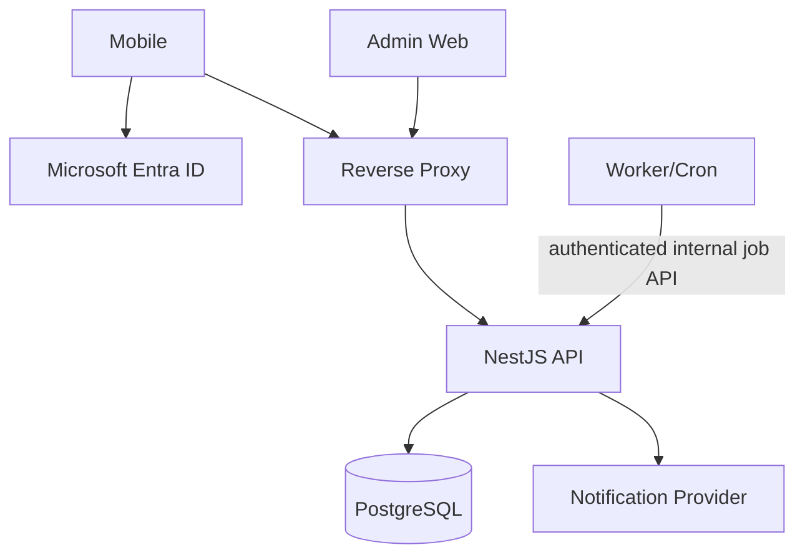
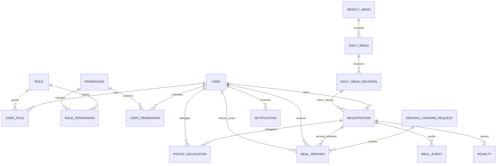

# IMeal v2 — Backend Structure

## 1. Backend overview

IMeal v2 dùng backend server-authoritative:

- Microsoft Entra ID quản lý identity.
- NestJS xác thực token và enforce business rules.
- PostgreSQL là source of truth duy nhất cho business data.
- Mobile/Admin Web không ghi database trực tiếp.
- Serving/check-in mutations go through the authenticated Kitchen API path.
- WebSocket/SSE phục vụ realtime dashboard sau database commit.



## 2. PostgreSQL table registry

| Table                      | Purpose/source of truth                                   |
| -------------------------- | --------------------------------------------------------- |
| `users`                    | IMeal user mapped to Entra identity                       |
| `roles`                    | Canonical roles                                           |
| `user_roles`               | User-role assignments + audit                             |
| `permissions`              | Canonical sensitive capability codes                      |
| `role_permissions`         | Default permission grants by role                         |
| `user_permissions`         | Exceptional direct grants/revocations + audit             |
| `weekly_menus`             | Weekly menu lifecycle                                     |
| `daily_menus`              | One fixed meal per date                                   |
| `daily_menu_revisions`     | Immutable menu content revisions for history/notification |
| `meal_days`                | Locked/snapshot operational day data                      |
| `registrations`            | One reserved meal per user/date, with a meal choice      |
| `pickup_delegations`       | A→B receive-on-behalf authorization                       |
| `serving_confirm_requests` | Request-level idempotency and result for batch confirm    |
| `meal_servings`            | Immutable final serving; at most one per registration     |
| `meal_events`              | Immutable meal lifecycle audit ledger                     |
| `penalties`                | No-show financial state                                   |
| `notifications`            | Persisted notification inbox                              |
| `push_devices`             | Device push token metadata if push enabled                |
| `job_runs`                 | Job execution history                                     |
| `audit_logs`               | Generic sensitive admin/audit actions                     |

## 3. Entity relationships



## 4. `users`

```text
users
──────────────────────────────
id                  UUID PK
entra_tenant_id     UUID/string NOT NULL
entra_object_id     UUID/string NOT NULL
display_name        text NOT NULL
email               text NULL
employee_code       text NULL
status              active | disabled
created_at          timestamptz
updated_at          timestamptz
last_login_at       timestamptz NULL

UNIQUE(entra_tenant_id, entra_object_id)
UNIQUE(employee_code) WHERE employee_code IS NOT NULL
```

Rules:

- First valid Entra login creates active Staff user.
- Safe profile fields may sync from Entra on login.
- Roles, employee code and IMeal status never come from mobile-provided values.

## 5. Roles

```text
roles
────────────
id
code UNIQUE     staff | kitchen | admin
```

Sensitive permissions are canonical codes assigned through audited role/permission mapping, including `penalty.read` and `penalty.resolve`. API authorization always evaluates permissions; it never special-cases Admin as a superuser. Canonical `admin` role is seeded with penalty/audit/job permissions, but not Kitchen pickup resolve/confirm.

```text
permissions
────────────────────────────
id
code UNIQUE     penalty.read | penalty.resolve | ...

role_permissions
────────────────────────────
role_id FK
permission_id FK
granted_at
UNIQUE(role_id, permission_id)

user_permissions
────────────────────────────
user_id FK
permission_id FK
effect          grant | revoke
assigned_by_user_id FK
assigned_at
revoked_at NULL
UNIQUE(user_id, permission_id) for active override
```

```text
user_roles
────────────────────────────
user_id FK
role_id FK
assigned_by_user_id FK NULL
assigned_at
revoked_at NULL

UNIQUE(user_id, role_id) for active assignment
```

Auto provisioning adds `staff`. Admin Web may manage `staff`/`kitchen` assignments with audit, but **cannot grant or revoke `admin`**. Admin-role lifecycle is performed only by an audited server-side operation bound to explicit Entra identity.

`staff` and `kitchen` are independent. Assigning `kitchen` never grants Staff registration/QR/delegation capabilities; a Kitchen employee who also eats must hold both roles.

### 5.1 Account disable transaction

1. Preview active roles plus every unserved registration and active delegation from the current business date onward.
2. Admin confirms the named account and affected commitment count.
3. In one transaction, lock the user/registration/delegation rows, set `users.status=disabled`, cancel each affected registration with `cancel_reason=account_disabled`, revoke `pending|accepted` delegations, and insert audit/notifications.
4. Already served rows remain historical and are not rewritten.
5. `account_disabled` cancellations are excluded from Kitchen preparation/dashboard totals and no-show/penalty selection.
6. If the preview became stale, return a conflict with a refreshed preview; never apply a partial cleanup.

## 6. Weekly and daily menus

### 6.1 `weekly_menus`

```text
id                  UUID PK
week_start_date     date UNIQUE
status              draft | published
created_by_user_id  FK
published_by_user_id FK NULL
created_at
updated_at
published_at NULL
revision             integer NOT NULL DEFAULT 1
```

### 6.2 `daily_menus`

```text
id                  UUID PK
weekly_menu_id      FK
meal_date           date UNIQUE
meal_name           text NULL
description         text NULL
image_url            text NULL
created_at
updated_at
updated_by_user_id  FK
revision            integer NOT NULL
is_service_date     boolean NOT NULL DEFAULT true

CHECK (
  (is_service_date = true AND meal_name IS NOT NULL)
  OR
  (is_service_date = false AND meal_name IS NULL)
)
```

```text
daily_menu_revisions
──────────────────────────────
id                  UUID PK
daily_menu_id       UUID FK
revision            integer NOT NULL
meal_name           text NOT NULL
description         text NULL
image_url            text NULL
created_by_user_id  UUID FK
created_at          timestamptz

UNIQUE(daily_menu_id, revision)
```

Invariant:

```text
enabled meal_date → exactly one daily menu row with one fixed meal
disabled meal_date → explicit daily menu row with is_service_date=false and no meal
```

- Ngày service bình thường chỉ có lựa chọn suất `REGULAR`.
- Ngày mùng 1 hoặc 15 âm lịch, kể cả tháng nhuận, cho phép `REGULAR` hoặc `VEGETARIAN`.
- Registration không lưu menu variant; chỉ lưu category chuẩn bị `meal_choice` cùng unique key `(user_id, meal_date)`.

- `week_start_date` is Monday; default enabled service dates are Monday–Friday.
- Publish requires every enabled service date to have a valid daily menu; holiday/non-service dates are explicitly disabled.
- Kitchen prepares/publishes the next week on the preceding Saturday–Sunday. First publish transactionally inserts immutable revision 1 for every enabled daily menu and sets it as current before registration opens.
- Editing a published menu before cutoff inserts an immutable revision, updates the daily menu current fields/revision, moves active registrations to the new `menu_revision_id`, and inserts notifications for registered Staff in the same transaction. Canceled registrations keep their prior revision for history.
- A daily menu with active registrations cannot be unpublished/deleted. At cutoff its content is copied to `meal_days` snapshot.
- `daily_menu_revisions` referenced by any registration use restrictive foreign keys and are never update/deleted; canceled history therefore remains renderable before or after cutoff.

## 7. `meal_days`

Operational/snapshot table:

```text
meal_date            date PK
menu_name_snapshot   text
menu_description_snapshot text NULL
menu_image_snapshot  text NULL
locked               boolean
locked_at            timestamptz NULL
service_start_at     timestamptz NOT NULL  # default 10:30 VN
service_end_at       timestamptz NOT NULL    # default 13:30 VN
prepared_count       integer NULL
created_at
updated_at
```

Purpose:

- Freeze historical meal display after cutoff/lock.
- Optional Kitchen prepared count/operations data.
- Registration remains source of truth for reservation count.
- Default service window is 10:30–13:30; no-show processing begins at 13:45.

## 8. `registrations`

```text
id              UUID PK
user_id         UUID FK users
meal_date       date NOT NULL
meal_choice     REGULAR | VEGETARIAN NOT NULL DEFAULT REGULAR
menu_revision_id UUID FK daily_menu_revisions NOT NULL
status          registered | canceled | no_show
registered_at   timestamptz
canceled_at     timestamptz NULL
cancel_reason   user_canceled | account_disabled NULL
canceled_by_user_id UUID FK NULL
no_show_at      timestamptz NULL
updated_at      timestamptz

UNIQUE(user_id, meal_date)
```

- Ngày bình thường chỉ được lưu `REGULAR`; mùng 1 hoặc 15 âm lịch (kể cả tháng nhuận) được lưu `REGULAR` hoặc `VEGETARIAN`.
- `meal_choice` là category chuẩn bị, không phải menu variant; `MealDay.mealType` tiếp tục điều khiển serving window.

Logical business state `SERVED` is derived from a valid `meal_servings` row and is intentionally not duplicated as the registration status.

### 8.1 Registration transitions

```text
missing → registered
canceled → registered     before cutoff
registered → canceled     before cutoff
registered → no_show      after service end AND no serving
```

If serving exists, registration is considered fulfilled regardless of `status=registered` storage state.

### 8.2 Weekly batch save

One API request contains requested dates and, for ACTIVE items, the requested `meal_choice`. Backend:

1. Capture server `now` once in VN business context.
2. Validate each date/menu/cutoff/current transition and the lunar meal-choice policy.
3. Use `INSERT ... ON CONFLICT`/equivalent ORM upsert for register/re-register and store the current immutable `menu_revision_id` and `meal_choice`.
4. Cancel only valid active registration.
5. When canceling, lock and revoke any `pending|accepted` delegation, append audit/events and create notifications in the same transaction.
6. Return result per requested date.

## 9. `pickup_delegations`

```text
id                  UUID PK
registration_id     UUID FK
owner_user_id       UUID FK
 delegate_user_id   UUID FK
status              pending | accepted | declined | revoked | consumed | expired
requested_at        timestamptz
responded_at        timestamptz NULL
accepted_at         timestamptz NULL
revoked_at          timestamptz NULL
consumed_at         timestamptz NULL
expired_at          timestamptz NULL
updated_at          timestamptz
```

Application/database constraints:

- `owner_user_id` must equal registration owner.
- owner != delegate.
- At most one `pending|accepted` delegation per registration.
- No delegation after serving.
- Delegate must be active user.
- Delegate cannot re-delegate because delegation API only allows registration owner to create.

A partial unique index enforces one active delegation per registration.

`active delegation` means `pending|accepted`. Registration cancellation atomically transitions it to `revoked`; cancel/accept/revoke/serve races lock the same registration/delegation rows and return a canonical conflict to the losing transaction.

## 10. Dynamic QR and pickup session

### 10.1 QR and pickup intent

QR identifies the presenting user **and a short-lived pickup intent**, not a new entitlement:

```text
imeal:v2:{presentingUserId}:{mealDate}:{pickupIntent}:{exp}:{nonce}:{sig}
```

`GET /me/pickup-options` first returns the presenter's currently eligible own/delegated items. If exactly one eligible item exists, mobile selects it automatically; with multiple eligible items, Staff selects the intended set. `POST /me/qr` then validates those registration IDs and returns a QR whose `pickupIntent` is a compact signed list/reference/hash for that validated selection.

TTL 5 seconds; allowed clock skew at most 2 seconds. Refresh reissues the QR for the same selected intent while the screen remains active; eligibility is still rechecked on resolve/confirm.

On resolve:

- Validate Kitchen caller and required `kitchen.serve` permission.
- Verify signature/expiry/date.
- Load presenting user.
- Load all currently eligible pickup items for the presenter (own active unserved registration + accepted unserved delegations).
- Revalidate that every registration in `pickupIntent` is currently eligible and belongs to the presenter pickup context.
- Do not silently substitute a different item set if the intent is stale; return authoritative conflict/re-resolve state.

### 10.2 Pickup session

Because Kitchen confirmation may take longer than 5 seconds, resolve returns a signed 30-second session:

```text
pickupSession
  presenter_user_id
  meal_date
  intended_registration_ids validated snapshot/reference
  issued_at
  expires_at
  nonce/session_id
```

`expires_at = issued_at + 30 seconds`. Kitchen confirms `intended_registration_ids` directly without re-selecting or editing them. Confirm always re-queries current DB state; a stale pickup session or Staff intent cannot override a revoke, serving, account status or registration change.

## 11. `meal_servings`

### 11.1 `serving_confirm_requests`

One pickup confirm request may create multiple serving rows, so idempotency is stored once at request level:

```text
id                    UUID PK
caller_user_id        UUID FK
idempotency_key       UUID/string
request_hash          text
status                processing | succeeded | rejected
result_payload        jsonb NULL
locked_until          timestamptz
created_at
finished_at           timestamptz NULL

UNIQUE(caller_user_id, idempotency_key)
```

Claim workflow:

1. In a short transaction, insert or lock by `(caller_user_id, idempotency_key)` and compare `request_hash`.
2. Existing `succeeded|rejected` returns `result_payload`; another hash returns `IDEMPOTENCY_CONFLICT`.
3. Existing unexpired `processing` returns retryable `REQUEST_IN_PROGRESS`; an expired lease may be recovered by the worker/API instance.
4. Main transaction locks the claim and all domain rows, validates every item, then either inserts every serving and updates claim to `succeeded`, or inserts zero servings and updates claim to deterministic `rejected`; result and domain writes commit atomically.
5. Transient infrastructure failure rolls back the main transaction, leaving the prior `processing` lease to expire/recover; it is not persisted as a deterministic domain rejection.

### 11.2 `meal_servings`

```text
id                    UUID PK
registration_id       UUID FK
owner_user_id         UUID FK
receiver_user_id      UUID FK
pickup_type           SELF | PROXY
served_by_user_id     UUID FK    # Kitchen actor
served_at              timestamptz
source                 QR | EMPLOYEE_CODE | other approved source
confirm_request_id     UUID FK serving_confirm_requests
created_at

UNIQUE(registration_id)
```

Canonical rule:

> A registration has at most one serving. Successful confirmation is final in core v2 and remains immutable evidence during the canonical 1-year retention window.

For `SELF`: receiver = owner.
For `PROXY`: receiver is delegate with accepted delegation at transaction time.

## 12. Serving transaction

Pseudo-flow:

```text
BEGIN

lock existing serving_confirm_request claim by caller + idempotency key
lock all registrations selected for serving in deterministic ID order
lock relevant active delegations

validate every selected registration
if any deterministic conflict:
    insert no serving
    update serving_confirm_request = rejected + authoritative result
    COMMIT
    return rejected result

for each registration:
    assert meal_date == business today
    assert server time is within 10:30–13:30
    assert owner and receiver accounts active
    assert registration active
    assert no serving exists

    if receiver == owner:
        pickup_type = SELF
    else:
        assert accepted delegation(owner → receiver)
        pickup_type = PROXY

    insert meal_serving
    insert SERVED meal_event
    if PROXY:
        mark delegation consumed
        insert persisted notification to owner

update serving_confirm_request = succeeded + authoritative result
COMMIT
```

The batch is all-or-nothing. Any deterministic item conflict commits a `rejected` request result with zero servings and returns `PICKUP_STATE_CHANGED`; Kitchen must resolve again before handing over meals. Successful servings and the `succeeded` result commit in the same transaction. Retrying returns the stored result without inserting another serving.

Post-commit:

- publish realtime Kitchen event;
- update/read dashboard from authoritative DB.

Do not emit “success” realtime event before commit.

## 13. Concurrency cases

### 13.1 Two Kitchen devices same registration

```text
Device A ─┐
          ├─ row lock + UNIQUE final serving
Device B ─┘
```

Exactly one inserts. The other returns `ALREADY_SERVED` with existing serving metadata.

### 13.2 Owner and delegate at different counters

Both target the same registration. Same lock/unique rule → exactly one receives the serving.

### 13.3 Revoke vs proxy serve

- Revoke locks/updates accepted delegation.
- Serving locks registration/delegation and revalidates.
- Whichever valid transaction commits first determines outcome; the second returns a conflict state.

### 13.4 Client retry after lost response

Same `idempotency_key` returns/recovers original result, not a duplicate serving.

## 14. `meal_events`

Immutable ledger:

```text
id                  UUID PK
registration_id     UUID FK
meal_date           date
event_type          SERVED | SERVED_PROXY | NO_SHOW | ...
owner_user_id       UUID FK
receiver_user_id    UUID FK NULL
actor_user_id       UUID FK NULL
source              text
metadata             jsonb
created_at           timestamptz
```

Never update/delete historical events during normal operations. Meal lifecycle/audit history is retained for **1 year**, after which the retention process may purge expired rows in dependency-safe order.

## 15. Kitchen dashboard queries

For date D:

```text
total_registered = registrations for D excluding canceled and ACCOUNT_DISABLED-quarantined rows
served_total      = registrations with a serving
remaining         = total_registered - served_total during the serving window
no_show_total     = registrations transitioned to no_show after reconciliation
```

At 200–300 rows/day, PostgreSQL direct aggregate queries are sufficient. Do not introduce denormalized counters unless profiling proves need.

Recommended indexes:

```text
registrations(meal_date, status)
meal_servings(registration_id)
meal_servings(served_at)
pickup_delegations(delegate_user_id, status)
pickup_delegations(registration_id, status)
```

## 16. Realtime architecture

- Initial GET returns snapshot and recent log.
- Kitchen clients subscribe to WebSocket/SSE channel by meal date.
- API publishes only after successful DB commit.
- Client reconnect fetches snapshot again.
- DB state wins over missed/duplicated realtime messages.

For single NestJS instance at baseline scale, no distributed broker is required.

## 17. `penalties`

```text
id                  UUID PK
registration_id     UUID FK UNIQUE
user_id             UUID FK   # registration owner
meal_date           date
amount_vnd          integer
status              open | paid | waived
reason              no_show
created_at
updated_at
resolved_at         timestamptz NULL
resolved_by_user_id UUID FK NULL
resolve_note        text NULL
```

Canonical amount is 50,000 VND for every no-show; exceptions use audited `waived` resolution.

No-show retry:

- Never create duplicate penalty due to `UNIQUE(registration_id)`.
- Never reopen `paid/waived`.

## 18. Notifications

```text
notifications
────────────────────────────
id
user_id
kind
payload jsonb
read_at NULL
created_at
```

Kinds include:

- delegation requested;
- accepted;
- declined;
- revoked;
- proxy meal served.
- registration canceled/delegation auto-revoked;
- published menu revised;
- account future commitments changed by Admin.

Persist notification in DB before/independent of push delivery. Push failure does not remove inbox event.

Expo Push is the default delivery provider. Device registration is optional per user/device, but the persisted inbox is mandatory:

```text
push_devices
────────────────────────────
id
user_id
platform
push_token
last_seen_at
revoked_at
```

## 19. `job_runs`

```text
id            UUID PK
type          menu_lock | delegation_expiry | no_show | notification_dispatch | reconcile | ...
status        running | succeeded | failed | partially_succeeded
started_at
finished_at NULL
attempt
source        scheduler | admin | recovery
summary       jsonb
error_code NULL
error_message NULL
retry_of_id NULL
```

No-show job starts at 13:45 VN:

1. Select active registrations for target date after service end.
2. Exclude valid servings and registrations canceled with `account_disabled`.
3. Transactionally re-check each candidate.
4. Mark no-show + create exactly one 50,000 VND penalty.
5. Record run summary.

## 20. Generic audit

`audit_logs` for sensitive non-meal actions:

- `staff`/`kitchen` role add/remove and server-side Admin-role lifecycle;
- account enable/disable;
- mandatory previewed future-registration cancellation/delegation revocation after disable;
- menu publish/locked changes;
- penalty resolve;
- admin job trigger.

Fields: actor, action, entity type/id, before/after safe metadata, timestamp, request ID.

## 21. Data ownership

- Entra owns identity authentication.
- PostgreSQL `users/user_roles` own IMeal authorization.
- PostgreSQL `permissions/role_permissions/user_permissions` own sensitive capability grants.
- Daily menu owns meal description for future dates; meal-day snapshot preserves historical display.
- Registration owns reservation intent.
- Serving owns actual handover evidence.
- Delegation owns authorization to receive on behalf of owner.
- Penalty owns financial resolution.
- Events/audit are append-oriented evidence.

## 22. Retention

Canonical history retention is **1 year** for meal lifecycle/business audit data, including menu revisions referenced by retained history, registrations, delegations, servings, penalties, notifications, `meal_events`, `job_runs` and `audit_logs`.

- Active user identity/authorization/configuration records are not age-purged solely because they are older than one year.
- Within the retention window, serving/audit evidence is immutable/append-oriented under normal operations.
- A scheduled retention cleanup must delete in foreign-key-safe order, be idempotent and record `job_runs`/audit evidence.

## 23. Security invariants

- Mobile cannot set `served_at`, role, penalty status or audit actor.
- Kitchen can serve only with the required `kitchen.serve` permission and all server-side pickup validation.
- Kitchen token without `kitchen` role cannot call serving API.
- Public user cannot create accepted delegation on behalf of B; B must call accept.
- Owner cannot delegate someone else's registration.
- QR signature/expiry is verified server-side.
- QR scan alone cannot mark serving.
- No serving if DB no longer considers owner/receiver eligible.
- Every protected API rejects `status=disabled` after server-side lookup.
- Multi-item serving never partially commits; successful confirm is final and no reversal endpoint exists.
- Resolve and confirm always enforce authentication, permission, QR/session, serving-window and database invariants.
- Worker has no independent business-write path; scheduled work calls authenticated internal job APIs/application services governed by the same domain invariants.

## 24. Clean-slate provisioning

1. Create a fresh PostgreSQL database from checked-in migrations.
2. Bootstrap the first Admin with an audited one-shot command and explicit Entra tenant/object ID; Admin Web never grants `admin`.
3. Auto-provision all other users from Entra with `staff` only; Admin Web may manage Staff/Kitchen assignments and allowed permissions.
4. Firebase legacy is removed from project dependency at re-development kickoff; import/retain no Firebase business history for v2 and never dual-write.
5. Seed only organization configuration and approved synthetic/UAT data.
6. Verify PostgreSQL backup/restore and application/schema rollback before production; rollback never targets Firebase.

## 25. Backend acceptance criteria

- Entra first-login auto provisioning works and never auto-grants Kitchen/Admin.
- Weekly registration duplicate/concurrency tests pass.
- One meal/date rule enforced.
- Staff-selected pickup intent + QR 5s/skew 2s resolve + 30s pickup session works without stale authorization bypass; one-item pickup adds no Staff selection step and Kitchen happy path adds no per-item ticking.
- Self/proxy concurrent/retried confirm creates at most one immutable final serving.
- Delegation revoke/serve race has one deterministic valid result.
- Cancel registration atomically revokes active delegation.
- Canceled registration history resolves its immutable menu revision even before cutoff.
- Multi-item confirm is all-or-nothing.
- Serving confirm is final and immutable; Kitchen has no item-edit or reversal operation.
- Disabled account is denied on every protected API.
- Realtime dashboard reconciles to DB.
- Serving resolve/confirm authorization remains network-neutral while enforcing Kitchen permission and all QR/session/window/database invariants.
- No-show/penalty retry is idempotent.
- One-year retention cleanup is dependency-safe/idempotent and does not mutate retained audit evidence.
- Backup/restore, application/schema rollback and clean-slate provisioning tested before production.
