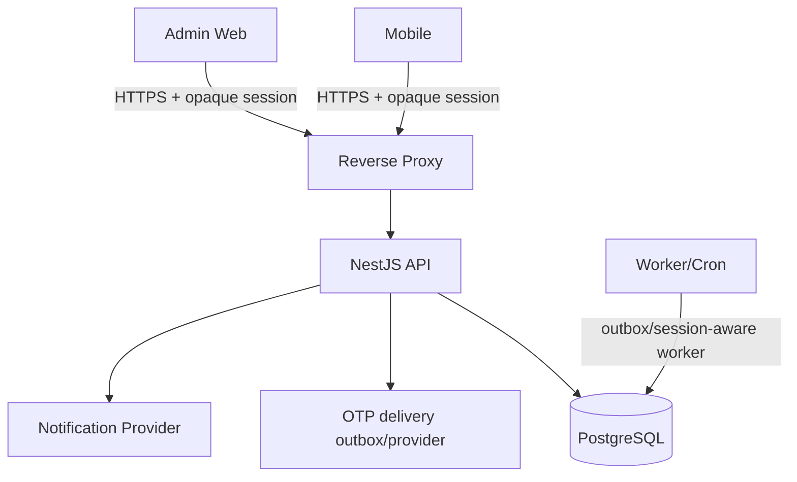
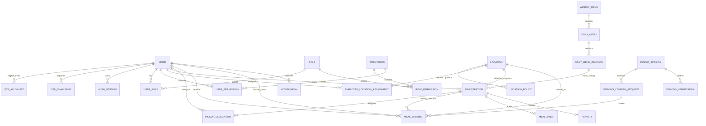

# IMeal v2 — Backend Structure

## 1. Backend overview

IMeal v2 dùng backend server-authoritative:

- Allowlist-A email OTP is the sole production authentication method.
- NestJS consumes/atomically verifies OTP challenges and resolves opaque
  PostgreSQL-backed sessions before enforcing business rules.
- PostgreSQL is the source of truth for identity, allowlist, account status,
  authorization, roster/location, registration and serving data.
- Mobile/Admin Web never write the database directly; serving/check-in mutations
  go through the authenticated Kitchen API path.
- WebSocket/SSE phục vụ realtime dashboard sau database commit.



| Table                          | Purpose/source of truth                                                   |
| ------------------------------ | ------------------------------------------------------------------------- |
| `users`                        | Canonical employee identity, status and profile                           |
| `otp_allowlist`                | Administrator-managed allowlist-A email eligibility                       |
| `otp_challenges`               | Hashed verifier, expiry, attempts and atomic-use state                    |
| `otp_delivery_outbox`          | Encrypted provider payload, claim/retry state and redacted delivery audit |
| `auth_sessions`                | One-way opaque session hash, expiry/revocation and minimized metadata     |
| `roles`                        | Canonical roles                                                            |
| `user_roles`                   | User-role assignments + audit                                             |
| `permissions`                  | Canonical sensitive capability codes                                       |
| `role_permissions`             | Default permission grants by role                                          |
| `user_permissions`             | Exceptional direct grants/revocations + audit                              |
| `locations`                    | Exactly four organization-approved operational location records            |
| `location_policies`            | Effective geofence/freshness/accuracy policy per location                 |
| `employee_location_assignments`| Effective roster assignment and immutable employee/location snapshots      |
| `roster_import_batches`        | Preview/commit result and idempotent import audit                          |
| `weekly_menus`                 | Weekly menu lifecycle                                                      |
| `daily_menus`                  | One fixed meal per date                                                    |
| `daily_menu_revisions`         | Immutable menu content revisions for history/notification                  |
| `meal_days`                    | Locked/snapshot operational day data                                       |
| `registrations`                | One reserved meal per user/date plus location/name/address snapshot        |
| `pickup_delegations`           | A→B receive-on-behalf authorization                                        |
| `pickup_sessions`              | Exact QR intent, presenter/GPS verification and 30-second session          |
| `serving_verifications`        | Safe presenter GPS verification result; no raw coordinate history          |
| `serving_confirm_requests`     | Request-level idempotency and result for batch confirm                     |
| `meal_servings`                | Immutable final serving; at most one per registration                      |
| `meal_events`                  | Immutable meal lifecycle audit ledger                                      |
| `penalties`                    | No-show financial state                                                    |
| `notifications`                | Persisted notification inbox                                               |
| `push_devices`                 | Device push token metadata if push enabled                                 |
| `job_runs`                     | Job execution history                                                      |
| `outbox_events`                | Transactional notification-created delivery work                          |
| `notification_deliveries`      | Per-notification/per-device delivery state and retry metadata              |
| `audit_logs`                   | Generic sensitive admin/audit actions                                      |

## 3. Entity relationships



## 4. `users`, allowlist and opaque sessions

```text
users
──────────────────────────────
id                  UUID PK
email               text NOT NULL, normalized
display_name        text NULL
employee_code       text NULL
status              active | disabled
created_at          timestamptz
updated_at          timestamptz
last_login_at       timestamptz NULL

UNIQUE(email)
UNIQUE(employee_code) WHERE employee_code IS NOT NULL
```

Production identity starts only when an administrator has imported an active
allowlist-A row for the normalized email. Email domain, profile text, employee
code supplied by a client, role claims and GPS never authorize a user.
Unknown/disabled/non-allowlisted request attempts remain indistinguishable.

```text
otp_allowlist
  id, normalized_email, user_id NULL, purpose=SESSION_LOGIN
  is_active, effective_from, effective_to, reason, audit_actor_id, timestamps

otp_challenges
  id, allowlist_id, verifier_hash, expires_at, attempt_count, max_attempts
  consumed_at NULL, client_hash NULL, created_at

auth_sessions
  id, user_id, token_hash UNIQUE, purpose=SESSION_LOGIN
  created_at, last_used_at, idle_expires_at, absolute_expires_at
  revoked_at NULL, revocation_reason NULL, device_hash/client_ip_hash/user_agent_hash
  created_by_audit_id
```

Only the clear OTP and opaque session token cross the HTTPS boundary. The
database stores the OTP verifier and session hash, never either secret. Every
protected request resolves current account status and permissions; logout,
disable, compromise, replay, explicit revocation and expiry invalidate sessions.

The only bypass is the non-production harness pair `NODE_ENV=test` and
`REQUIRE_AUTH=false`. It injects a synthetic principal for automated tests and
is rejected in production; it is not documented or supported as production auth.
## 5. Roles

```text
roles
────────────
id
code UNIQUE     staff | kitchen | admin
```

Sensitive permissions are canonical codes assigned through audited role/permission mapping, including `penalty.read` and `penalty.resolve`. API authorization always evaluates permissions; it never special-cases Admin as a superuser. Canonical `admin` role is seeded with penalty/audit/job permissions, but not Kitchen pickup resolve/confirm.

```text
permissions
────────────────────────────
id
code UNIQUE     penalty.read | penalty.resolve | ...

role_permissions
────────────────────────────
role_id FK
permission_id FK
granted_at
UNIQUE(role_id, permission_id)

user_permissions
────────────────────────────
user_id FK
permission_id FK
effect          grant | revoke
assigned_by_user_id FK
assigned_at
revoked_at NULL
UNIQUE(user_id, permission_id) for active override
```

```text
user_roles
────────────────────────────
user_id FK
role_id FK
assigned_by_user_id FK NULL
assigned_at
revoked_at NULL

UNIQUE(user_id, role_id) for active assignment
```

Allowlist import and roster commit never auto-grant roles. Admin Web may manage
`staff`/`kitchen` assignments with audit, but **cannot grant or revoke `admin`**.
Admin-role lifecycle is a separately audited server-side operation.

`staff` and `kitchen` are independent. Assigning `kitchen` never grants Staff registration/QR/delegation capabilities; a Kitchen employee who also eats must hold both roles.

### 5.1 Account disable transaction

1. Preview active roles plus every unserved registration and active delegation
   from the current business date onward.
2. Admin confirms the named account and affected commitment count.
3. In one transaction, lock the user/registration/delegation/session rows, set
   `users.status=disabled`, revoke every active `auth_session`, cancel each
   affected registration with `cancel_reason=account_disabled`, revoke
   `pending|accepted` delegations, and insert audit/notifications.
4. Already served rows remain historical and are not rewritten.
5. `account_disabled` cancellations are excluded from Kitchen preparation/dashboard totals and no-show/penalty selection.
6. If the preview became stale, return a conflict with a refreshed preview; never apply a partial cleanup.
### 5.2 Locations and fixed roster assignments

Exactly four real operational location records are in scope. Their names,
addresses, coordinates, scanner assignments and employee roster rows are
organization-owned inputs and are intentionally absent from source control.
Production is blocked until all four records and the approved roster import have
been completed through authorized Admin operations; no seed endpoint or
fabricated fixture is allowed.

```text
locations
  id, short_code UNIQUE, display_name, serving_point_name, address,
  time_zone=Asia/Ho_Chi_Minh, is_active, effective_from/to, audited metadata

location_policies
  id, location_id, latitude, longitude, geofence_radius_meters,
  max_fix_age_seconds, max_accuracy_meters, effective_from/to, is_active

employee_location_assignments
  id, user_id, location_id, employee_code, effective_from/to, is_active,
  imported_by, import_batch_id, audit timestamps
```

Roster import validates normalized email, name, employee code, active state,
role and location code before an atomic, repeatable commit. Location selection
is server-side; email domain, mobile coordinates, QR data and client role/status
claims cannot change an assignment. Registration creation/reactivation resolves
the effective assignment and stores immutable location, assignment, name and
address snapshots for history. Serving retains those snapshots and the
server-resolved location/verification context even after future roster/policy
changes.

Presenter GPS is an additional serving-time signal only. The API evaluates a
fresh foreground presenter fix against the effective policy and persists only
safe verification result, timestamp, accuracy and location ID. It does not
collect owner GPS for proxy pickup. GPS failure returns only safe `Retry` or
`Refresh`; Kitchen sends no GPS.


## 6. Weekly and daily menus

### 6.1 `weekly_menus`

```text
id                  UUID PK
week_start_date     date UNIQUE
status              draft | published
created_by_user_id  FK
published_by_user_id FK NULL
created_at
updated_at
published_at NULL
revision             integer NOT NULL DEFAULT 1
```

### 6.2 `daily_menus`

```text
id                  UUID PK
weekly_menu_id      FK
meal_date           date UNIQUE
meal_name           text NULL
description         text NULL
image_url            text NULL
created_at
updated_at
updated_by_user_id  FK
revision            integer NOT NULL
is_service_date     boolean NOT NULL DEFAULT true

CHECK (
  (is_service_date = true AND meal_name IS NOT NULL)
  OR
  (is_service_date = false AND meal_name IS NULL)
)
```

```text
daily_menu_revisions
──────────────────────────────
id                  UUID PK
daily_menu_id       UUID FK
revision            integer NOT NULL
meal_name           text NOT NULL
description         text NULL
image_url            text NULL
created_by_user_id  UUID FK
created_at          timestamptz

UNIQUE(daily_menu_id, revision)
```

Invariant:

```text
enabled meal_date → exactly one daily menu row with one fixed meal
disabled meal_date → explicit daily menu row with is_service_date=false and no meal
```

- Ngày service bình thường chỉ có lựa chọn suất `REGULAR`.
- Ngày mùng 1 hoặc 15 âm lịch, kể cả tháng nhuận, cho phép `REGULAR` hoặc `VEGETARIAN`.
- Registration không lưu menu variant; chỉ lưu category chuẩn bị `meal_choice` cùng unique key `(user_id, meal_date)`.

- `week_start_date` is Monday; default enabled service dates are Monday–Friday.
- Publish requires every enabled service date to have a valid daily menu; holiday/non-service dates are explicitly disabled.
- Kitchen prepares/publishes the next week on the preceding Saturday–Sunday. First publish transactionally inserts immutable revision 1 for every enabled daily menu and sets it as current before registration opens.
- Editing a published menu before cutoff inserts an immutable revision, updates the daily menu current fields/revision, moves active registrations to the new `menu_revision_id`, and inserts notifications for registered Staff in the same transaction. Canceled registrations keep their prior revision for history.
- A daily menu with active registrations cannot be unpublished/deleted. At cutoff its content is copied to `meal_days` snapshot.
- `daily_menu_revisions` referenced by any registration use restrictive foreign keys and are never update/deleted; canceled history therefore remains renderable before or after cutoff.

## 7. `meal_days`

Operational/snapshot table:

```text
meal_date            date PK
menu_name_snapshot   text
menu_description_snapshot text NULL
menu_image_snapshot  text NULL
locked               boolean
locked_at            timestamptz NULL
service_start_at     timestamptz NOT NULL  # default 10:30 VN
service_end_at       timestamptz NOT NULL    # default 13:30 VN
prepared_count       integer NULL
created_at
updated_at
```

Purpose:

- Freeze historical meal display after cutoff/lock.
- Optional Kitchen prepared count/operations data.
- Registration remains source of truth for reservation count.
- Default service window is 10:30–13:30; no-show processing begins at 13:45.

## 8. `registrations`

```text
id              UUID PK
user_id         UUID FK users
meal_date       date NOT NULL
meal_choice     REGULAR | VEGETARIAN NOT NULL DEFAULT REGULAR
menu_revision_id UUID FK daily_menu_revisions NOT NULL
service_location_id UUID FK locations NOT NULL
location_assignment_id UUID FK employee_location_assignments NOT NULL
owner_name_snapshot text NOT NULL
employee_code_snapshot text NOT NULL
location_name_snapshot text NOT NULL
location_address_snapshot text NOT NULL
status          registered | canceled | no_show
registered_at   timestamptz
canceled_at     timestamptz NULL
cancel_reason   user_canceled | account_disabled NULL
canceled_by_user_id UUID FK NULL
no_show_at      timestamptz NULL
updated_at      timestamptz

UNIQUE(user_id, meal_date)
```

- Ngày bình thường chỉ được lưu `REGULAR`; mùng 1 hoặc 15 âm lịch (kể cả tháng nhuận) được lưu `REGULAR` hoặc `VEGETARIAN`.
- `meal_choice` là category chuẩn bị, không phải menu variant; `MealDay.mealType` tiếp tục điều khiển serving window.

Logical business state `SERVED` is derived from a valid `meal_servings` row and is intentionally not duplicated as the registration status.

### 8.1 Registration transitions

```text
missing → registered
canceled → registered     before cutoff
registered → canceled     before cutoff
registered → no_show      after service end AND no serving
```

If serving exists, registration is considered fulfilled regardless of `status=registered` storage state.


One API request contains requested dates and, for ACTIVE items, the requested `meal_choice`. Backend:

1. Capture server `now` once in VN business context.
2. Validate each date/menu/cutoff/current transition and the lunar meal-choice policy.
3. Use `INSERT ... ON CONFLICT`/equivalent ORM upsert for register/re-register,
   resolve the effective employee-location assignment server-side, and store the
   current immutable `menu_revision_id`, `meal_choice`, location/assignment ID
   and owner/location snapshots.
4. Cancel only valid active registration.
5. When canceling, lock and revoke any `pending|accepted` delegation, append audit/events and create notifications in the same transaction.
6. Return result per requested date.

## 9. `pickup_delegations`

```text
id                  UUID PK
registration_id     UUID FK
owner_user_id       UUID FK
 delegate_user_id   UUID FK
status              pending | accepted | declined | revoked | consumed | expired
requested_at        timestamptz
responded_at        timestamptz NULL
accepted_at         timestamptz NULL
revoked_at          timestamptz NULL
consumed_at         timestamptz NULL
expired_at          timestamptz NULL
updated_at          timestamptz
```

Application/database constraints:

- `owner_user_id` must equal registration owner.
- owner != delegate.
- At most one `pending|accepted` delegation per registration.
- No delegation after serving.
- Delegate must be active user.
- Delegate cannot re-delegate because delegation API only allows registration owner to create.

A partial unique index enforces one active delegation per registration.

`active delegation` means `pending|accepted`. Registration cancellation atomically transitions it to `revoked`; cancel/accept/revoke/serve races lock the same registration/delegation rows and return a canonical conflict to the losing transaction.

## 10. Dynamic QR, presenter GPS and pickup session

### 10.1 QR and exact pickup intent

QR identifies the presenter and a short-lived exact pickup intent, not a new
entitlement:

```text
imeal:v2:{presenterUserId}:{mealDate}:{sortedRegistrationIds}:{exp}:{nonce}:{sig}
```

`GET /me/pickup-options` returns the presenter's eligible own/delegated items.
Exactly one item is auto-selected; multiple items require explicit selection on
the presenter device. `POST /me/qr` accepts only a sorted, unique, non-empty set
plus fresh presenter evidence and signs that exact set.

- TTL is exactly 5 seconds; accepted clock skew is at most 2 seconds.
- Refresh repeats the same exact set only after a fresh foreground presenter fix.
- Selection, focus, eligibility, delegation or GPS-state changes clear the QR.
- Wrong date, malformed order, invalid signature, expired/future-abnormal expiry
  and stale/ineligible intent are rejected without replacement.

### 10.2 Presenter-only GPS verification

The server resolves the employee's fixed effective roster location and policy.
Only a foreground presenter fix is evaluated for freshness, accuracy and
geofence. The result stores location ID, safe result, verification timestamp
and accuracy; raw coordinates are not retained as history. Owner GPS is never
collected merely because a delegation exists. Kitchen resolve/confirm sends no
GPS.

Unavailable, denied, stale, inaccurate and outside-geofence outcomes expose only
safe `Retry`/`Refresh` recovery. GPS never grants entitlement, chooses a site or
bypasses session, QR, delegation, registration, window or concurrency checks.

### 10.3 Pickup session

Because Kitchen confirmation may take longer than 5 seconds, resolve creates an
opaque 30-second session:

```text
pickup_session
  id, presenter_user_id, meal_date
  exact_sorted_registration_ids, intent_hash, qr_nonce
  serving_verification_id, location_id, issued_at, expires_at
```

Resolve accepts only QR plus an authenticated Kitchen session. It revalidates
the exact set and stores immutable presenter/location/verification context.
Confirm accepts only `pickupSessionId` and an idempotency key; Kitchen cannot
re-select, add or remove registrations. Confirm re-queries current database
state and fails the entire batch if any item, delegation, account, location,
verification, serving-window or session condition changed.
## 11. `meal_servings`

### 11.1 `serving_confirm_requests`

One pickup confirm request may create multiple serving rows, so idempotency is stored once at request level:

```text
id                    UUID PK
caller_user_id        UUID FK
idempotency_key       UUID/string
request_hash          text
status                processing | succeeded | rejected
result_payload        jsonb NULL
locked_until          timestamptz
created_at
finished_at           timestamptz NULL

UNIQUE(caller_user_id, idempotency_key)
```

Claim workflow:

1. In a short transaction, insert or lock by `(caller_user_id, idempotency_key)` and compare `request_hash`.
2. Existing `succeeded|rejected` returns `result_payload`; another hash returns `IDEMPOTENCY_CONFLICT`.
3. Existing unexpired `processing` returns retryable `REQUEST_IN_PROGRESS`; an expired lease may be recovered by the worker/API instance.
4. Main transaction locks the claim and all domain rows, validates every item, then either inserts every serving and updates claim to `succeeded`, or inserts zero servings and updates claim to deterministic `rejected`; result and domain writes commit atomically.
5. Transient infrastructure failure rolls back the main transaction, leaving the prior `processing` lease to expire/recover; it is not persisted as a deterministic domain rejection.

### 11.2 `meal_servings`

```text
id                    UUID PK
registration_id       UUID FK
owner_user_id         UUID FK
receiver_user_id      UUID FK
pickup_type           SELF | PROXY
served_by_user_id     UUID FK    # Kitchen actor
location_id           UUID FK
owner_name_snapshot   text
receiver_name_snapshot text
employee_code_snapshot text
location_name_snapshot text
location_address_snapshot text
delegation_id         UUID NULL
pickup_session_id     UUID FK
serving_verification_id UUID FK
served_at             timestamptz
source                QR
confirm_request_id    UUID FK serving_confirm_requests
created_at

UNIQUE(registration_id)
```

Serving is immutable evidence of owner, presenter/receiver, Kitchen actor,
pickup type, delegation, exact intent/session, effective location snapshot,
verification result and time. Raw coordinates, OTP values, session tokens and QR
payloads are not included in normal logs or operational dashboards.
## 12. Serving transaction

Pseudo-flow:

```text
BEGIN
  lock serving_confirm_request by caller + idempotency key
  compare request hash; replay same result or return IDEMPOTENCY_CONFLICT
  lock pickup session and exact registration/delegation rows in deterministic order
  verify session TTL, exact intent hash/nonce, presenter verification and location
  verify current actor/account permissions and 10:30–13:30 serving window
  verify every registration remains eligible and has no serving
  if any deterministic conflict:
      insert no serving
      update request = rejected + safe authoritative result
      COMMIT
      return rejected result
  insert every meal_serving with owner/receiver/Kitchen/location snapshots
  insert immutable SERVED meal_events
  mark accepted proxy delegations consumed
  update request = succeeded + result
COMMIT
```

The batch is all-or-nothing. A stale/ineligible item commits zero servings and
returns `PICKUP_STATE_CHANGED`; Kitchen must resolve again. Successful serving
is final, and the same idempotency key/body returns the stored result without a
duplicate serving. Realtime events are published only after commit.


## 13. Concurrency cases

### 13.1 Two Kitchen devices same registration

```text
Device A ─┐
          ├─ row lock + UNIQUE final serving
Device B ─┘
```

Exactly one inserts. The other returns `ALREADY_SERVED` with existing serving metadata.

### 13.2 Owner and delegate at different counters

Both target the same registration. Same lock/unique rule → exactly one receives the serving.

### 13.3 Revoke vs proxy serve

- Revoke locks/updates accepted delegation.
- Serving locks registration/delegation and revalidates.
- Whichever valid transaction commits first determines outcome; the second returns a conflict state.

### 13.4 Client retry after lost response

Same `idempotency_key` returns/recovers original result, not a duplicate serving.

## 14. `meal_events`

Immutable ledger:

```text
id                  UUID PK
registration_id     UUID FK
meal_date           date
event_type          SERVED | SERVED_PROXY | NO_SHOW | ...
owner_user_id       UUID FK
receiver_user_id    UUID FK NULL
actor_user_id       UUID FK NULL
source              text
metadata             jsonb
created_at           timestamptz
```

Never update/delete historical events during normal operations. Meal lifecycle/audit history is retained for **1 year**, after which the retention process may purge expired rows in dependency-safe order.

## 15. Kitchen dashboard queries

For date D:

```text
total_registered = registrations for D excluding canceled and ACCOUNT_DISABLED-quarantined rows
served_total      = registrations with a serving
remaining         = total_registered - served_total during the serving window
no_show_total     = registrations transitioned to no_show after reconciliation
```

At 200–300 rows/day, PostgreSQL direct aggregate queries are sufficient. Do not introduce denormalized counters unless profiling proves need.

Recommended indexes:

```text
registrations(meal_date, status)
meal_servings(registration_id)
meal_servings(served_at)
pickup_delegations(delegate_user_id, status)
pickup_delegations(registration_id, status)
```

## 16. Realtime architecture

- Initial GET returns snapshot and recent log.
- Kitchen clients subscribe to WebSocket/SSE channel by meal date.
- API publishes only after successful DB commit.
- Client reconnect fetches snapshot again.
- DB state wins over missed/duplicated realtime messages.

For single NestJS instance at baseline scale, no distributed broker is required.

## 17. `penalties`

```text
id                  UUID PK
registration_id     UUID FK UNIQUE
user_id             UUID FK   # registration owner
meal_date           date
amount_vnd          integer
status              open | paid | waived
reason              no_show
created_at
updated_at
resolved_at         timestamptz NULL
resolved_by_user_id UUID FK NULL
resolve_note        text NULL
```

Canonical amount is 50,000 VND for every no-show; exceptions use audited `waived` resolution.

No-show retry:

- Never create duplicate penalty due to `UNIQUE(registration_id)`.
- Never reopen `paid/waived`.

## 18. Notifications

The persisted inbox is authoritative. Notification creation is part of the business
transaction; push is optional/best effort and never the source of truth.

### 18.1 PostgreSQL models

```text
notifications
────────────────────────────────────────────
id                  UUID PK
user_id             UUID FK users
kind                NotificationKind
payload             jsonb strict kind-specific payload
title_vi/body_vi    text bilingual copy
title_en/body_en    text bilingual copy
read_at             timestamptz NULL
dedupe_key          text UNIQUE
created_at          timestamptz

INDEX(user_id, created_at DESC, id DESC)
INDEX(user_id, read_at, created_at DESC, id DESC)
```

Kinds are exactly `LEGACY_MESSAGE`, `REGISTRATION_OPENED`, `REGISTRATION_REMINDER`,
`PICKUP_REMINDER`, `DELEGATION_REQUESTED`, `DELEGATION_ACCEPTED`, `DELEGATION_DECLINED`,
`DELEGATION_REVOKED`, `PROXY_PICKUP_COMPLETED`, `REGISTERED_MENU_CHANGED`, and
`NO_SHOW_PENALTY_CREATED`. `LEGACY_MESSAGE` preserves migrated rows for read-only display;
new application publishers must not create it.

```text
push_devices
────────────────────────────────────────────
id                  UUID PK
user_id             UUID FK users
token               text UNIQUE             # ExpoPushToken[...] / ExponentPushToken[...]
platform            IOS | ANDROID | UNKNOWN
last_seen_at        timestamptz
revoked_at          timestamptz NULL
created_at          timestamptz

notification_deliveries
────────────────────────────────────────────
id                  UUID PK
notification_id     UUID FK notifications
push_device_id      UUID FK push_devices
status              PENDING | PROCESSING | SENT | FAILED
attempt_count       integer
next_attempt_at     timestamptz
last_error          sanitized text NULL
created_at/updated_at timestamptz

UNIQUE(notification_id, push_device_id)
INDEX(status, next_attempt_at)

outbox_events
────────────────────────────────────────────
id                  UUID PK
aggregate_type      text                  # NOTIFICATION
aggregate_id        UUID                  # notification id
event_type          text                  # NOTIFICATION_CREATED
payload             text/json
status              PENDING | PROCESSING | PROCESSED | FAILED
dedupe_key          text UNIQUE NULL      # notification-delivery:<notificationId>
attempt_count       integer
available_at        timestamptz
processed_at        timestamptz NULL
last_error          sanitized text NULL
created_at           timestamptz
```

`User.notificationLocale` defaults to `VI`; `User.remindersEnabled` defaults to `true`.
The reminder flag is one shared opt-out for weekly registration and same-day pickup
reminders, not for transactional event notification kinds.

### 18.2 Exact event matrix

| Kind | Trigger/timing | Recipient |
| ---- | -------------- | --------- |
| `REGISTRATION_OPENED` | First weekly-menu publish only; missing revisions initialized and `publishedAt` set. Repeat/concurrent publish no-op. | Every active Staff user, regardless of reminders. |
| `REGISTRATION_REMINDER` | Sunday 10:00 `Asia/Ho_Chi_Minh`, next Monday-start published menu, one/user/week. | Active Staff missing an enabled non-holiday `ACTIVE` registration and reminders enabled. |
| `PICKUP_REMINDER` | Daily 11:30 VN, today's `ACTIVE` unserved registrations. | Accepted delegate else owner; grouped by recipient/date, reminders enabled only. |
| `DELEGATION_REQUESTED` | Pending request created. | Delegate. |
| `DELEGATION_ACCEPTED` / `DELEGATION_DECLINED` | Delegate decision committed. | Registration owner. |
| `DELEGATION_REVOKED` | Owner revoke or registration cancellation auto-revokes active delegation. | Delegate; payload reason `OWNER_REVOKED` or `REGISTRATION_CANCELLED`. |
| `PROXY_PICKUP_COMPLETED` | Accepted delegated serving commits and pickup user differs from owner. | Owner only; self pickup emits no item. |
| `REGISTERED_MENU_CHANGED` | Actual tracked edit to already-published menu date (content, meal type, holiday, enabled). | Active registrants of that date; no-op emits none. |
| `NO_SHOW_PENALTY_CREATED` | No-show worker at 13:45 VN after service end 13:30. | Registration owner. |

First publish emits `REGISTRATION_OPENED`; an edit to an already-published registered date
emits `REGISTERED_MENU_CHANGED`, never another opened event. Admin account-disable
notification is future scope in the account-disable subsystem, not a dormant kind.

Payloads are strict and use UTC IDs/timestamps plus `YYYY-MM-DD` meal dates:
registration opened `{weekStart, weekEnd}`; registration reminder
`{weekStart, weekEnd, remainingMealDates}`; pickup reminder
`{mealDate, registrationIds, registrationCount}`; delegation lifecycle
`{delegationId, registrationId, mealDate, counterpartName}` plus revoked `reason`;
proxy completion `{servingId, registrationId, mealDate, delegateName}`; menu change
`{dailyMenuRevisionId, mealDate}`; no-show `{penaltyId, registrationId, mealDate, amount}`.
The pickup count equals the ID array length and revoked reason is enum constrained.

Owner-scoped API surface is `GET /api/notifications` (cursor/limit 1–50, default 20),
`GET /api/notifications/:id`, and `PATCH /api/notifications/:id/read`.
Preferences are `GET/PATCH /api/notifications/preferences`. Device registration is
`POST /api/notifications/push-devices` with `{ token, platform: ios|android }`; device
revocation is `DELETE /api/notifications/push-devices` with `{ token }` only.
Detail/read never cross user ownership; missing and foreign IDs use `NOTIFICATION_NOT_FOUND`.

### 18.3 Transactional publish and delivery

API publishers (menu, delegation, registration-cancellation, pickup) and worker publishers
(registration reminder, pickup reminder, no-show) render fixed bilingual copy and insert the
notification plus its `NOTIFICATION_CREATED` outbox row in the same transaction. Upsert by
global notification dedupe key is replay-safe and does not reset read/delivery state. Copy
dates use `Asia/Ho_Chi_Minh`; dispatch selects stored VI/EN copy from the owning user's
locale. Name fallback is name → email → neutral fallback; copy contains no QR/auth/session.

The worker dispatch cron runs every 15 seconds:

1. Stage 1 claims due `PENDING` `NOTIFICATION_CREATED` rows with
   `FOR UPDATE SKIP LOCKED`, creates one delivery for each non-revoked device, and marks
   the outbox row `PROCESSED`.
2. Stage 2 claims due `PENDING` deliveries and `PROCESSING` deliveries older than five
   minutes, sends Expo chunks with `sound=default`, Android channel `imeal-default`, and
   data `imeal://notifications/<notificationId>`.
3. Accepted tickets become `SENT`. Device-not-registered revokes that device; permanent
   `MessageTooBig`, `MismatchSenderId`, and `InvalidCredentials` errors become `FAILED`.
4. Network/HTTP 429/5xx/`MessageRateExceeded` failures retry after 1, 5, and 15 minutes;
   after the fourth failed attempt they become `FAILED`. Errors are sanitized and logs
   contain only notification/delivery IDs, attempt, provider code, and sanitized error.

Inbox delivery remains correct when push fails, no device is registered, or OS permission
is denied. Mobile's one-time contextual explainer prompts only from `Enable`; `Not now`
marks seen, denial never auto-prompts, and Settings is the recovery CTA. Web does no
push-specific work and simulators explain physical-device requirement. Push taps validate
`imeal://notifications/<UUID>` and open owner-scoped detail; registration/menu → Calendar,
pickup reminder → Pickup Intent, delegation → Delegation, while proxy-completion, no-show,
and legacy items remain readable with no CTA.

## 19. `job_runs`

```text
id            UUID PK
type          menu_lock | delegation_expiry | no_show | notification_dispatch | reconcile | ...
status        running | succeeded | failed | partially_succeeded
started_at
finished_at NULL
attempt
source        scheduler | admin | recovery
summary       jsonb
error_code NULL
error_message NULL
retry_of_id NULL
```

No-show job starts at 13:45 VN:

1. Select active registrations for target date after service end.
2. Exclude valid servings and registrations canceled with `account_disabled`.
3. Transactionally re-check each candidate.
4. Mark no-show + create exactly one 50,000 VND penalty.
5. Record run summary.

## 20. Generic audit

`audit_logs` for sensitive non-meal actions:

- `staff`/`kitchen` role add/remove and server-side Admin-role lifecycle;
- account enable/disable;
- mandatory previewed future-registration cancellation/delegation revocation after disable;
- menu publish/locked changes;
- penalty resolve;
- admin job trigger.

Fields: actor, action, entity type/id, before/after safe metadata, timestamp, request ID.

## 21. Data ownership

- Allowlist-A + OTP challenge state own production authentication eligibility.
- `auth_sessions` own opaque session hashes and revocation/expiry metadata.
- PostgreSQL `users/user_roles` own employee identity, current status and IMeal authorization.
- PostgreSQL `permissions/role_permissions/user_permissions` own sensitive capability grants.
- `locations/location_policies/employee_location_assignments` own the four approved
  locations, effective policies and fixed roster assignment.
- Registration owns reservation intent plus immutable effective
  location/assignment/name/address snapshots.
- Serving owns actual handover evidence, presenter/receiver, Kitchen actor,
  delegation, exact intent/session, location and safe verification snapshots.
- Daily menu owns meal description for future dates; meal-day snapshot preserves historical display.
- Delegation owns authorization to receive on behalf of owner.
- Penalty owns financial resolution; events/audit are append-oriented evidence.
- OTP verifiers are retained only through challenge expiry/consumption and never
  clear codes; provider payloads are encrypted and delivery logs are redacted.
- Session records retain only hashes/minimized metadata for the configured idle
  and absolute lifetime; revocation/audit reasons remain safe and bounded.
- GPS evidence retains safe verification result, location ID, timestamp and
  accuracy only for the approved dispute/audit period; raw coordinates are not
  operational history.

## 22. Retention

Canonical history retention is **1 year** for meal lifecycle/business audit data, including menu revisions referenced by retained history, registrations, delegations, servings, penalties, notifications, `meal_events`, `job_runs` and `audit_logs`.

- Active user identity/authorization/configuration records are not age-purged solely because they are older than one year.
- Within the retention window, serving/audit evidence is immutable/append-oriented under normal operations.
- A scheduled retention cleanup must delete in foreign-key-safe order, be idempotent and record `job_runs`/audit evidence.

## 23. Security invariants

- Mobile cannot set `served_at`, role, account status, location assignment,
  presenter/receiver, penalty status or audit actor.
- Kitchen can serve only with an active opaque session, `kitchen.serve`
  permission and all server-side pickup validation. Kitchen sends no GPS.
- Public callers cannot create accepted delegation on behalf of B; B must accept.
- Owner cannot delegate someone else's registration; no self-delegation, chain or
  delegate re-delegation.
- QR signature/expiry, exact sorted intent, 2-second skew and 30-second session
  are verified server-side.
- Presenter GPS is foreground-only and additional. It cannot grant entitlement,
  select a different location or bypass authentication, authorization,
  registration, delegation, window or concurrency checks.
- GPS failure exposes only safe Retry/Refresh. Raw coordinates and clear OTP,
  session, QR or provider payloads never appear in routine logs.
- No serving if DB no longer considers owner/receiver/account/location/evidence
  eligible. Every protected API rechecks current status and permissions.
- Multi-item serving never partially commits; successful confirm is final and no
  reversal endpoint exists. Same idempotency key/body cannot double-serve.
- Worker has no independent business-write path; scheduled work uses the same
  application invariants and records sanitized `job_runs`.
## 24. Clean-slate provisioning

1. Create a fresh PostgreSQL database from checked-in migrations.
2. Configure production with `AUTH_MODE=otp`, `REQUIRE_AUTH=true`, all
   API/worker OTP/session/provider/GPS/serving settings, and no harness bypass.
3. Import/approve exactly four real location records and the employee allowlist/
   roster through audited Admin operations. Do not fabricate names, addresses,
   coordinates, employees, scanner assignments or roster rows in source control.
4. Admin Web manages only approved `staff`/`kitchen` assignments, allowlist,
   location/policy and roster operations; it never grants `admin`.
5. Firebase legacy is removed from project dependency at re-development kickoff;
   import/retain no Firebase business history and never dual-write.
6. Verify PostgreSQL backup/restore, API/worker startup validation and
   application/schema rollback before production; rollback never targets Firebase.
## 25. Backend acceptance criteria

- Unknown/disabled/non-allowlisted OTP attempts are indistinguishable and never
  create a session; OTP is hashed, one-use, throttled, expiry-bound and redacted.
- Production accepts only allowlist-A OTP and opaque/hash-backed sessions;
  `NODE_ENV=test` + `REQUIRE_AUTH=false` is the only non-production harness bypass.
- Exactly four real locations and approved roster assignments are imported before
  production; no fabricated location/employee data exists in source control.
- Registration and serving history retain fixed location/assignment/name/address
  snapshots; client claims cannot change role, status or location.
- Presenter-only foreground GPS is evaluated at QR generate/refresh; owner GPS is
  not collected for proxy pickup; Kitchen resolve/confirm sends no GPS.
- GPS failures expose only Retry/Refresh. QR exact sorted intent, TTL 5, skew 2,
  resolved session 30 and 10:30–13:30 serving window are server-enforced.
- Stale/ineligible intent rejects without substitution; confirm cannot alter the
  resolved set. Delegation acceptance/no-chain/no-self and revoke/serve races are
  deterministic.
- Multi-item confirm is atomic and idempotent; duplicate/concurrent retry cannot
  double-serve. Successful serving is final and immutable.
- OTP/session/GPS evidence is minimized, access-controlled and audited; residual
  screenshot, compromised-device and GPS-spoofing risks are reduced, not removed.
- Weekly registration, menu, notification, no-show, backup/restore and
  migration/startup verification remain covered by their owning suites.
